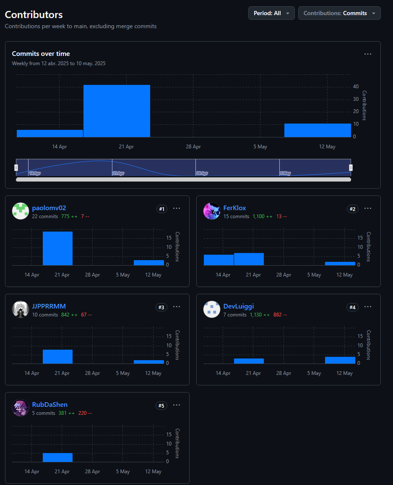
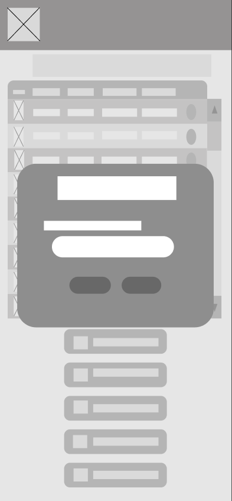
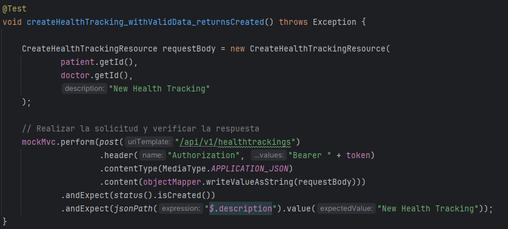

<p align="center">
  
</p>

span

<table align="center">
  <tr>
    <th>Integrantes</th>
    <th>Código</th>
  </tr>
  <tr>
    <td>Mallma Quispe, Ruben Elias</td>
    <td>U202214234</td>
  </tr>
  <tr>
    <td>Martinez Villanueva, Paolo Del Carmen</td>
    <td>U202010039</td>
  </tr>
  <tr>
    <td>Matos Fernandez, Christian Andre</td>
    <td>U202214162</td>
  </tr>
  <tr>
    <td>Paredes Zapata, Luiggi Gianfranco</td>
    <td>U202218996</td>
  </tr>
  <tr>
    <td>Ramos Mendoza, Juan Pablo</td>
    <td>U202019545</td>
  </tr>
</table>

<p align="center"><b>Abril 2025</b></p>

# Registro de versiones

<table>
  <thead>
    <tr>
        <th>Versión</th>
        <th>Fecha</th>
        <th>Autor</th>
        <th>Descripción de modificación</th>
    </tr>
  </thead>
  <tbody>
  <tr>
      <td><strong>TB1</strong></td>
      <td>26/04/2025</td>
      <td>
        <ul>
          <li>Mallma Quispe, Ruben Elias</li>
          <li>Martinez Villanueva, Paolo Del Carmen</li>
          <li>Matos Fernandez, Christian Andre</li>
          <li>Paredes Zapata, Luiggi Gianfranco</li>
          <li>Ramos Mendoza, Juan Pablo</li>
        </ul>
      </td>
      <td>
        Se ha incluido el avance de los siguientes capítulos:
        <ul>
          <li>Capítulo 1: Introducción</li>
          <li>Capítulo 2: Requirements Elicitation & Analysis</li>
          <li>Capítulo 3: Requirements Specification</li>
          <li>Capítulo 4: Product Design</li>
          <li>Capítulo 5: Product Implementation</li>
        </ul>
      </td>
  </tr>
  <tr>
      <td><strong>TB2</strong></td>
      <td>16/05/2025</td>
      <td>
        <ul>
          <li>Mallma Quispe, Ruben Elias</li>
          <li>Martinez Villanueva, Paolo Del Carmen</li>
          <li>Matos Fernandez, Christian Andre</li>
          <li>Paredes Zapata, Luiggi Gianfranco</li>
          <li>Ramos Mendoza, Juan Pablo</li>
        </ul>
      </td>
      <td>
        Se ha incluido el avance de los siguientes capítulos:
        <ul>
          <li>Capítulo 6: Product Verification & Validation</li>
          <li>Capítulo 7: DevOps Practices</li>
        </ul>
      </td>
  </tr>
  </tbody>
</table>

Link del Repositorio: [Repositorio](https://github.com/EQUIPO-B-Nombre/Project-Report)

# Project Report Collaboration Insights

En esta entrega para la TB1 cada uno de los integrantes realizo los siguientes puntos:

- Mallma Quispe, Ruben Elias: Capítulo 7: DevOps Practices
- Paredes Zapata, Luiggi Gianfranco: Capítulo 6: Product Verification & Validation
- Matos Fernandez, Christian Andre: Capítulo 6: Product Verification & Validation
- Ramos Mendoza, Juan Pablo: Capítulo 7: DevOps Practices
- Martinez Villanueva, Paolo Del Carmen: Capítulo 7: DevOps Practices


-----

En esta entrega para la TP1 cada uno de los integrantes realizo los siguientes puntos:

- Mallma Quispe, Ruben Elias: Capítulo 1 Introducción
- Paredes Zapata, Luiggi Gianfranco: Capítulo 2 Requirements Elicitation & Analysis
- Matos Fernandez, Christian Andre: Capítulo 3 Requirements Specification
- Ramos Mendoza, Juan Pablo: Capítulo 4 Product Design
- Martinez Villanueva, Paolo Del Carmen: Capítulo 5: Product Implementation




# Tabla de Contenido

[Registro de Versiones del Informe](#registro-de-versiones-del-informe)

[Project Report Collaboration Insights](#project-report-collaboration-insights)

[Contenido](#contenido)

[Tabla de contenidos](#tabla-de-contenidos)

[Student Outcome](#student-outcome)

[Parte I: As-Is Software Project](#parte-i-as-is-software-project)

[Capítulo I: Introducción](#capítulo-i-introducción)

- [1.1. Startup Profile](#11-startup-profile)
  - [1.1.1. Descripción de la Startup](#111-descripción-de-la-startup)
  - [1.1.2. Perfiles de integrantes del equipo](#112-perfiles-de-integrantes-del-equipo)
- [1.2. Solution Profile](#12-solution-profile)
  - [1.2.1. Antecedentes y problemática](#121-antecedentes-y-problemática)
  - [1.2.2. Lean UX Process](#122-lean-ux-process)
    - [1.2.2.1. Lean UX Problem Statements](#1221-lean-ux-problem-statements)
    - [1.2.2.2. Lean UX Assumptions](#1222-lean-ux-assumptions)
    - [1.2.2.3. Lean UX Hypothesis Statements](#1223-lean-ux-hypothesis-statements)
    - [1.2.2.4. Lean UX Canvas](#1224-lean-ux-canvas)
- [1.3. Segmentos objetivo](#13-segmentos-objetivo)

[Capítulo II: Requirements Elicitation & Analysis](#capítulo-ii-requirements-elicitation--analysis)

- [2.1. Competidores](#21-competidores)
  - [2.1.1. Análisis competitivo](#211-análisis-competitivo)
  - [2.1.2. Estrategias y tácticas frente a competidores](#212-estrategias-y-tácticas-frente-a-competidores)
- [2.2. Entrevistas](#22-entrevistas)
  - [2.2.1. Diseño de entrevistas](#221-diseño-de-entrevistas)
  - [2.2.2. Registro de entrevistas](#222-registro-de-entrevistas)
  - [2.2.3. Análisis de entrevistas](#223-análisis-de-entrevistas)
- [2.3. Needfinding](#23-needfinding)
  - [2.3.1. User Personas](#231-user-personas)
  - [2.3.2. User Task Matrix](#232-user-task-matrix)
  - [2.3.3. User Journey Mapping](#233-user-journey-mapping)
  - [2.3.4. Empathy Mapping](#234-empathy-mapping)
  - [2.3.5. As-is Scenario Mapping](#235-as-is-scenario-mapping)
- [2.4. Ubiquitous Language](#24-ubiquitous-language)

[Capítulo III: Requirements Specification](#capítulo-iii-requirements-specification)

- [3.1. To-Be Scenario Mapping](#31-to-be-scenario-mapping)
- [3.2. User Stories](#32-user-stories)
- [3.3. Product Backlog](#33-product-backlog)
- [3.4. Impact Mapping](#34-impact-mapping)

[Capítulo IV: Product Design](#capítulo-iv-product-design)

- [4.1. Style Guidelines](#41-style-guidelines)

  - [4.1.1. General Style Guidelines](#411-general-style-guidelines)
  - [4.1.2. Web Style Guidelines](#412-web-style-guidelines)
  - [4.1.3. Mobile Style Guidelines](#413-mobile-style-guidelines)
    - [4.1.3.1. iOS Mobile Style Guidelines](#4131-ios-mobile-style-guidelines)
    - [4.1.3.2. Android Mobile Style Guidelines](#4132-android-mobile-style-guidelines)
- [4.2. Information Architecture](#42-information-architecture)

  - [4.2.1. Organization Systems](#421-organization-systems)
  - [4.2.2. Labeling Systems](#422-labeling-systems)
  - [4.2.3. SEO Tags and Meta Tags](#423-seo-tags-and-meta-tags)
  - [4.2.4. Searching Systems](#424-searching-systems)
  - [4.2.5. Navigation Systems](#425-navigation-systems)
- [4.3. Landing Page UI Design](#43-landing-page-ui-design)

  - [4.3.1. Landing Page Wireframe](#431-landing-page-wireframe)
  - [4.3.2. Landing Page Mock-up](#432-landing-page-mock-up)
- [4.4. Mobile Applications UX/UI Design](#44-mobile-applications-uxui-design)

  - [4.4.1. Mobile Applications Wireframes](#441-mobile-applications-wireframes)
  - [4.4.2. Mobile Applications Wireflow Diagrams](#442-mobile-applications-wireflow-diagrams)
  - [4.4.3. Mobile Applications Mock-ups](#443-mobile-applications-mock-ups)
  - [4.4.4. Mobile Applications User Flow Diagrams](#444-mobile-applications-user-flow-diagrams)
- [4.5. Mobile Applications Prototyping](#45-mobile-applications-prototyping)

  - [4.5.1. Android Mobile Applications Prototyping](#451-android-mobile-applications-prototyping)
  - [4.5.2. iOS Mobile Applications Prototyping](#452-ios-mobile-applications-prototyping)
- [4.6. Web Applications UX/UI Design](#46-web-applications-uxui-design)

  - [4.6.1. Web Applications Wireframes](#461-web-applications-wireframes)
  - [4.6.2. Web Applications Wireflow Diagrams](#462-web-applications-wireflow-diagrams)
  - [4.6.3. Web Applications Mock-ups](#463-web-applications-mock-ups)
  - [4.6.4. Web Applications User Flow Diagrams](#464-web-applications-user-flow-diagrams)
- [4.7. Web Applications Prototyping](#47-web-applications-prototyping)
- [4.8. Domain-Driven Software Architecture](#48-domain-driven-software-architecture)

  - [4.8.1. Software Architecture Context Diagram](#481-software-architecture-context-diagram)
  - [4.8.2. Software Architecture Container Diagrams](#482-software-architecture-container-diagrams)
  - [4.8.3. Software Architecture Components Diagrams](#483-software-architecture-components-diagrams)
- [4.9. Software Object-Oriented Design](#49-software-object-oriented-design)

  - [4.9.1. Class Diagrams](#491-class-diagrams)
  - [4.9.2. Class Dictionary](#492-class-dictionary)
- [4.10. Database Design](#410-database-design)

  - [4.10.1. Relational/Non-Relational Database Diagram](#4101-relationalnon-relational-database-diagram)
- [Capítulo V: Product Implementation](#capítulo-v-product-implementation)

  - [5.1. Software Configuration Management](#51-software-configuration-management)

    - [5.1.1. Software Development Environment Configuration](#511-software-development-environment-configuration)
    - [5.1.2. Source Code Management](#512-source-code-management)
    - [5.1.3. Source Code Style Guide & Conventions](#513-source-code-style-guide--conventions)
    - [5.1.4. Software Deployment Configuration](#514-software-deployment-configuration)
  - [5.2. Product Implementation & Deployment](#52-product-implementation--deployment)

    - [5.2.1. Sprint Backlogs](#521-sprint-backlogs)
    - [5.2.2. Implemented Landing Page Evidence](#522-implemented-landing-page-evidence)
    - [5.2.3. Implemented Frontend-Web Application Evidence](#523-implemented-frontend-web-application-evidence)
    - [5.2.4. Implemented Native-Mobile Application Evidence](#524-implemented-native-mobile-application-evidence)
    - [5.2.5. Implemented RESTful API and/or Serverless Backend Evidence](#525-implemented-restful-api-andor-serverless-backend-evidence)
    - [5.2.6. RESTful API documentation](#526-restful-api-documentation)
    - [5.2.7. Team Collaboration Insights](#527-team-collaboration-insights)
  - [5.3. Video About-the-Product](#53-video-about-the-product)
  - [Conclusiones](#conclusiones)
- [Capítulo VI: Product Verification & Validation](#capítulo-vi-product-verification--validation)  
  - [6.1. Testing Suites & Validation](#61-testing-suites--validation)  
    - [6.1.1. Core Entities Unit Tests](#611-core-entities-unit-tests)  
    - [6.1.2. Core Integration Tests](#612-core-integration-tests)  
    - [6.1.3. Core Behavior-Driven Development](#613-core-behavior-driven-development)  
    - [6.1.4. Core System Tests](#614-core-system-tests)  
  - [6.2. Static Testing & Verification](#62-static-testing--verification)  
    - [6.2.1. Static Code Analysis](#621-static-code-analysis)  
      - [6.2.1.1. Coding Standard & Code Conventions](#6211-coding-standard--code-conventions)  
      - [6.2.1.2. Code Quality & Code Security](#6212-code-quality--code-security)  
    - [6.2.2. Reviews](#622-reviews)  
  - [6.3. Validation Interviews](#63-validation-interviews)  
    - [6.3.1. Diseño de Entrevistas](#631-diseño-de-entrevistas)  
    - [6.3.2. Registro de Entrevistas](#632-registro-de-entrevistas)  
    - [6.3.3. Evaluaciones según heurísticas](#633-evaluaciones-según-heurísticas)  
  - [6.4. Auditoría de Experiencias de Usuario](#64-auditoría-de-experiencias-de-usuario)  
    - [6.4.1. Auditoría Realizada](#641-auditoría-realizada)  
      - [6.4.1.1. Información del Grupo Auditado](#6411-información-del-grupo-auditado)  
      - [6.4.1.2. Cronograma de Auditoría Realizada](#6412-cronograma-de-auditoría-realizada)  
      - [6.4.1.3. Contenido de Auditoría Realizada](#6413-contenido-de-auditoría-realizada)  
    - [6.4.2. Auditoría Recibida](#642-auditoría-recibida)  
      - [6.4.2.1. Información del Grupo Auditor](#6421-información-del-grupo-auditor)  
      - [6.4.2.2. Cronograma de Auditoría Recibida](#6422-cronograma-de-auditoría-recibida)  
      - [6.4.2.3. Contenido de Auditoría Recibida](#6423-contenido-de-auditoría-recibida)  
      - [6.4.2.4. Resumen de Modificaciones para Subsanar Hallazgos](#6424-resumen-de-modificaciones-para-subsanar-hallazgos)  

- [Capítulo VII: DevOps Practices](#capítulo-vii-devops-practices)  
  - [7.1. Continuous Integration](#71-continuous-integration)  
    - [7.1.1. Tools and Practices](#711-tools-and-practices)  
    - [7.1.2. Build & Test Suite Pipeline Components](#712-build--test-suite-pipeline-components)  
  - [7.2. Continuous Delivery](#72-continuous-delivery)  
    - [7.2.1. Tools and Practices](#721-tools-and-practices)  
    - [7.2.2. Stages Deployment Pipeline Components](#722-stages-deployment-pipeline-components)  
  - [7.3. Continuous Deployment](#73-continuous-deployment)  
    - [7.3.1. Tools and Practices](#731-tools-and-practices)  
    - [7.3.2. Production Deployment Pipeline Components](#732-production-deployment-pipeline-components)  
  - [7.4. Continuous Monitoring](#74-continuous-monitoring)  
    - [7.4.1. Tools and Practices](#741-tools-and-practices)  
    - [7.4.2. Monitoring Pipeline Components](#742-monitoring-pipeline-components)  
    - [7.4.3. Alerting Pipeline Components](#743-alerting-pipeline-components)  
    - [7.4.4. Notification Pipeline Components](#744-notification-pipeline-components)  

- [Capítulo VI: Product Verification & Validation](#capítulo-vi-product-verification--validation)  
  - [6.1. Testing Suites & Validation](#61-testing-suites--validation)  
    - [6.1.1. Core Entities Unit Tests](#611-core-entities-unit-tests)  
    - [6.1.2. Core Integration Tests](#612-core-integration-tests)  
    - [6.1.3. Core Behavior-Driven Development](#613-core-behavior-driven-development)  
    - [6.1.4. Core System Tests](#614-core-system-tests)  
  - [6.2. Static Testing & Verification](#62-static-testing--verification)  
    - [6.2.1. Static Code Analysis](#621-static-code-analysis)  
      - [6.2.1.1. Coding Standard & Code Conventions](#6211-coding-standard--code-conventions)  
      - [6.2.1.2. Code Quality & Code Security](#6212-code-quality--code-security)  
    - [6.2.2. Reviews](#622-reviews)  
  - [6.3. Validation Interviews](#63-validation-interviews)  
    - [6.3.1. Diseño de Entrevistas](#631-diseño-de-entrevistas)  
    - [6.3.2. Registro de Entrevistas](#632-registro-de-entrevistas)  
    - [6.3.3. Evaluaciones según heurísticas](#633-evaluaciones-según-heurísticas)  
  - [6.4. Auditoría de Experiencias de Usuario](#64-auditoría-de-experiencias-de-usuario)  
    - [6.4.1. Auditoría Realizada](#641-auditoría-realizada)  
      - [6.4.1.1. Información del Grupo Auditado](#6411-información-del-grupo-auditado)  
      - [6.4.1.2. Cronograma de Auditoría Realizada](#6412-cronograma-de-auditoría-realizada)  
      - [6.4.1.3. Contenido de Auditoría Realizada](#6413-contenido-de-auditoría-realizada)  
    - [6.4.2. Auditoría Recibida](#642-auditoría-recibida)  
      - [6.4.2.1. Información del Grupo Auditor](#6421-información-del-grupo-auditor)  
      - [6.4.2.2. Cronograma de Auditoría Recibida](#6422-cronograma-de-auditoría-recibida)  
      - [6.4.2.3. Contenido de Auditoría Recibida](#6423-contenido-de-auditoría-recibida)  
      - [6.4.2.4. Resumen de Modificaciones para Subsanar Hallazgos](#6424-resumen-de-modificaciones-para-subsanar-hallazgos)  

- [Capítulo VII: DevOps Practices](#capítulo-vii-devops-practices)  
  - [7.1. Continuous Integration](#71-continuous-integration)  
    - [7.1.1. Tools and Practices](#711-tools-and-practices)  
    - [7.1.2. Build & Test Suite Pipeline Components](#712-build--test-suite-pipeline-components)  
  - [7.2. Continuous Delivery](#72-continuous-delivery)  
    - [7.2.1. Tools and Practices](#721-tools-and-practices)  
    - [7.2.2. Stages Deployment Pipeline Components](#722-stages-deployment-pipeline-components)  
  - [7.3. Continuous Deployment](#73-continuous-deployment)  
    - [7.3.1. Tools and Practices](#731-tools-and-practices)  
    - [7.3.2. Production Deployment Pipeline Components](#732-production-deployment-pipeline-components)  
  - [7.4. Continuous Monitoring](#74-continuous-monitoring)  
    - [7.4.1. Tools and Practices](#741-tools-and-practices)  
    - [7.4.2. Monitoring Pipeline Components](#742-monitoring-pipeline-components)  
    - [7.4.3. Alerting Pipeline Components](#743-alerting-pipeline-components)  
    - [7.4.4. Notification Pipeline Components](#744-notification-pipeline-components)

- [Part III: Experiment-Driven Lifecycle](#part-iii-experiment-driven-lifecycle)  

- [Capítulo VIII: Experiment-Driven Development](#capítulo-viii-experiment-driven-development)  
  - [8.1. Experiment Planning](#81-experiment-planning)  
    - [8.1.1. As-Is Summary](#811-as-is-summary)  
    - [8.1.2. Raw Material: Assumptions, Knowledge Gaps, Ideas, Claims](#812-raw-material-assumptions-knowledge-gaps-ideas-claims)  
    - [8.1.3. Experiment-Ready Questions](#813-experiment-ready-questions)  
    - [8.1.4. Question Backlog](#814-question-backlog)  
    - [8.1.5. Experiment Cards](#815-experiment-cards)  
  - [8.2. Experiment Design](#82-experiment-design)  
    - [8.2.1. Hypotheses](#821-hypotheses)  
    - [8.2.2. Measures](#822-measures)  
    - [8.2.3. Conditions](#823-conditions)  
    - [8.2.4. Scale Calculations and Decisions](#824-scale-calculations-and-decisions)  
    - [8.2.5. Methods Selection](#825-methods-selection)  
    - [8.2.6. Data Analytics: Goals, KPIs and Metrics Selection](#826-data-analytics-goals-kpis-and-metrics-selection)  
    - [8.2.7. Web and Mobile Tracking Plan](#827-web-and-mobile-tracking-plan)  
  - [8.3. Experimentation](#83-experimentation)  
    - [8.3.1. To-Be User Stories](#831-to-be-user-stories)  
    - [8.3.2. To-Be Product Backlog](#832-to-be-product-backlog)  
    - [8.3.3. Pipeline-supported, Experiment-Driven To-Be Software Platform Lifecycle](#833-pipeline-supported-experiment-driven-to-be-software-platform-lifecycle)  
      - [8.3.3.1. To-Be Sprint Backlogs](#8331-to-be-sprint-backlogs)  
      - [8.3.3.2. Implemented To-Be Landing Page Evidence](#8332-implemented-to-be-landing-page-evidence)  
      - [8.3.3.3. Implemented To-Be Frontend-Web Application Evidence](#8333-implemented-to-be-frontend-web-application-evidence)  
      - [8.3.3.4. Implemented To-Be Native-Mobile Application Evidence](#8334-implemented-to-be-native-mobile-application-evidence)  
      - [8.3.3.5. Implemented To-Be RESTful API and/or Serverless Backend Evidence](#8335-implemented-to-be-restful-api-andor-serverless-backend-evidence)  
      - [8.3.3.6. Team Collaboration Insights](#8336-team-collaboration-insights)  
    - [8.3.4. To-Be Validation Interviews](#834-to-be-validation-interviews)  
      - [8.3.4.1. Diseño de Entrevistas](#8341-diseño-de-entrevistas)  
      - [8.3.4.2. Registro de Entrevistas](#8342-registro-de-entrevistas)  
  - [8.4. Experiment Aftermath & Analysis](#84-experiment-aftermath--analysis)  
    - [8.4.1. Analysis and Interpretation of Results](#841-analysis-and-interpretation-of-results)  
    - [8.4.2. Re-scored and Re-prioritized Question Backlog](#842-re-scored-and-re-prioritized-question-backlog)  
  - [8.5. Continuous Learning](#85-continuous-learning)  
    - [8.5.1. Shareback Session Artifacts: Learning Workflow](#851-shareback-session-artifacts-learning-workflow)  
  - [8.6. To-Be Software Platform Pre-launch](#86-to-be-software-platform-pre-launch)  
    - [8.6.1. About-the-Product Intro Video](#861-about-the-product-intro-video)


[Conclusiones y recomendaciones](#conclusiones-y-recomendaciones)

[Bibliografía](#bibliografía)

[Anexos](#anexos)

# Student Outcome

ABET – EAC - Student Outcome 4: La capacidad de reconocer responsabilidades éticas y
profesionales en situaciones de ingeniería y hacer juicios informados, que deben
considerar el impacto de las soluciones de ingeniería en contextos globales, económicos,
ambientales y sociales.

<table>
  <tr>
    <th>Criterio específico</th>
    <th>Acciones realizadas</th>
    <th>Conclusiones</th>
  </tr>
  <tr>
    <td><strong>4.c.1 Reconoce responsabilidad ética y profesional en situaciones de ingeniería de software</strong></td>
    <td>Matos Fernandez, Christian Andre

TB1: Durante el desarrollo de OnContigo, asumí un enfoque responsable al implementar las funcionalidades de la sección de perfil y consultas, garantizando la protección de la privacidad y el manejo adecuado de la información personal de los usuarios.

TP1: En el desarrollo de OnContigo, trabajé de manera responsable asegurándome de que las funciones implementadas en la sección de perfil y consultas respetaran la privacidad y el correcto manejo de la información de los usuarios.

TB2: Durante el análisis estático y las revisiones de código, asumí una responsabilidad ética al seguir buenas prácticas y estándares. Me aseguré de que el código sea seguro y mantenible, priorizando siempre la calidad y el bienestar de los usuarios.

TF1: Durante el desarrollo de OnContigo, asumí un enfoque responsable al implementar las funcionalidades de la sección de perfil y consultas, cuidando especialmente la privacidad y el manejo adecuado de la información personal de los usuarios. Estas decisiones fueron respaldadas por los hallazgos obtenidos en entrevistas con usuarios, donde identificamos preocupaciones clave relacionadas con la confidencialidad y la seguridad de sus datos, lo que nos permitió validar la importancia de estas medidas.

Martinez Villanueva, Paolo Del Carmen

TB1: Durante esta entrega, asumí responsabilidad ética y profesional en la definición de la problemática, el análisis de usuarios y la especificación de requisitos, asegurando que la solución propuesta respondiera a necesidades reales con enfoque en la accesibilidad, equidad y privacidad. Al diseñar la arquitectura, los prototipos y el backlog, prioricé prácticas responsables que promovieran la sostenibilidad del sistema y el bienestar de los usuarios. Asimismo, en la configuración del entorno de desarrollo, control de versiones y despliegue, apliqué criterios técnicos que garantizan la calidad, trazabilidad y confiabilidad del software en un entorno colaborativo.

TP1: Durante el desarrollo del proyecto, he investigado y aplicado principios éticos y profesionales, asegurando que el software respete la privacidad de los usuarios, promueva la equidad en el acceso y minimice riesgos potenciales derivados de su uso.

TB2: Para esta entrega me enfoqué en demostrar responsabilidad profesional al diseñar un experimento riguroso que respeta la integridad de los datos, garantizar la privacidad de los usuarios y asegurar que las decisiones tomadas estén basadas en evidencia confiable y transparente. Se priorizó la ética en la recolección y análisis de datos, aplicando buenas prácticas experimentales.

TF1: Durante el trabajo final, asumí responsabilidad ética y profesional en la definición y priorización de las historias de usuario, asegurando la privacidad y seguridad en la plataforma. Participé en la implementación de la solución web, móvil y backend, aplicando buenas prácticas de desarrollo responsable. En el diseño y realización de las entrevistas de validación, respeté la confidencialidad y analicé los resultados con rigor y transparencia. Además, promoví el aprendizaje continuo y la colaboración dentro del equipo durante todo el ciclo experimental y el pre-lanzamiento del producto.

Ramos Mendoza, Juan Pablo

TB1: Para esta primera entrega, identifiqué el problema principal a enfocarnos como base en el desarrollo de nuestro proyecto, manteniendo mis responsabilidades en el grupo para un correcto desarrollo de las aplicaciones

TP1: Para esta primera entrega he revisado las herramientas y técnicas para desarrollar wireframes y mockups al expandir el proyecto original con una aplicación móvil, además de repasar junto con mis compañeros los temas vistos previamente sobre la arquitectura de software y style guidelines.

TB2: Para esta entrega, me enfoqué en realizar mis deberes de forma temprana, considerando los avances de mis compañeros para mantener un buen informe, además de presentar buenas prácticas al momento de realizar las entrevistas de manera formal y concisa, sin guiar a los entrevistados a respuestas cerradas.

TF1: Como entrega final, me aseguré de revisar que tanto el proyecto en sí como el informe del trabajo se encuentren en el mejor estado posible y mantengan los estándares pedidos en el enunciado y rúbrica.

Paredes Zapata, Luiggi Gianfranco

TB1: Durante el desarrollo de OnContigo, asumí la responsabilidad ética de garantizar que la información presentada en el capítulo de introducción fuera precisa y relevante, evitando cualquier sesgo o información engañosa. Esto incluyó investigar y presentar datos verificados sobre el cáncer y su tratamiento, así como las necesidades de los pacientes y médicos.

TP1: Durante el desarrollo del proyecto, implementé la metodología Core Behavior-Driven Development y Core System Tests con Cucumber y Selenium, asegurándome de que las decisiones de desarrollo fueran éticamente responsables, con especial énfasis en la privacidad, la seguridad de los datos y la transparencia de la información. Estos principios guiaron mi enfoque hacia la creación de una aplicación que no solo cumpla con los estándares técnicos, sino que también garantice el respeto por la privacidad de los usuarios y sus derechos. <br><br>

TB2: Reconocí la importancia de aplicar principios éticos y profesionales al identificar diversos problemas en la plataforma evaluada, tales como la falta de accesibilidad y una usabilidad limitada para usuarios con discapacidad visual (imágenes sin contraste suficiente y carencia de texto alternativo). Proporcioné recomendaciones específicas para asegurar una experiencia inclusiva, demostrando un claro compromiso con la responsabilidad ética y profesional en la ingeniería de software.

TF1: Durante el desarrollo de OnContigo, reconocí mi responsabilidad ética al manejar datos médicos sensibles, implementando medidas de seguridad robustas y siguiendo principios de privacidad por diseño. Como estudiante de ingeniería de software, comprendo que mi trabajo impacta directamente la confianza de pacientes vulnerables y la integridad del sistema de salud, por lo que cada decisión técnica debe ser evaluada no solo por su funcionalidad, sino por sus implicaciones éticas y profesionales.

Mallma Quispe, Ruben Elias

TB1: En el desarrollo de OnContigo, asumí la responsabilidad ética de garantizar que la información presentada en el capítulo de introducción fuera precisa y relevante, evitando cualquier sesgo o información engañosa. Esto incluyó investigar y presentar datos verificados sobre el cáncer y su tratamiento, así como las necesidades de los pacientes y médicos.

TP1: Participé en la elaboración de entrevistas y el desarrollo del capítulo correspondiente. Esto me permitió fortalecer mis habilidades de investigación y aplicar conceptos clave sobre necesidades de usuario y estructura funcional para plataformas digitales. 

TB2: En la arquitectura DevOps descrita, asumi la responsabilidad ética de entregar software seguro y confiable: cada commit pasa por análisis de vulnerabilidades, pruebas automatizadas y revisiones que previenen la introducción de fallos críticos. Además, los "gates" de calidad (como la cobertura mínima y la protección de ramas) refuerzan la obligación profesional de mantener la integridad del sistema y proteger los datos de los usuarios.

TF1: Finalmente, en el trabajo final, asumí la responsabilidad ética de garantizar que la información presentada en el capítulo de introducción fuera precisa y relevante, evitando cualquier sesgo o información engañosa. Esto incluyó investigar y presentar datos verificados sobre el cáncer y su tratamiento, así como las necesidades de los pacientes y médicos. Además, al participar en la elaboración de entrevistas y el desarrollo del capítulo correspondiente, fortalecí mis habilidades de investigación y apliqué conceptos clave sobre necesidades de usuario y estructura funcional para plataformas digitales. Estas acciones reflejan mi compromiso con la ética profesional en ingeniería de software.
</td>
<td>El equipo logró actualizar y aplicar conocimientos fundamentales durante el desarrollo del entregable TB1, fortaleciendo su formación profesional a través de actividades como la investigación de metodologías Lean UX, la elaboración de entrevistas, el análisis de usuarios, el diseño de hipótesis y la definición de requerimientos funcionales. Estas acciones permitieron comprender mejor las necesidades del usuario final y cómo diseñar soluciones digitales que respondan a esas necesidades. El trabajo colaborativo, la estructuración de contenidos por capítulos y el enfoque constante en la experiencia del usuario nos permitieron consolidar una base sólida para el desarrollo del proyecto, alineado a estándares profesionales y buenas prácticas de ingeniería de software. </td>
  </tr>
  <tr>
    <td><strong>4.c.2 Emite juicios informados considerando el impacto de las soluciones de ingeniería de software en contextos globales, económicos, ambientales y sociales</strong></td>
    <td>Matos Fernandez, Christian Andre

TB1: A lo largo del desarrollo, procuré que cada decisión técnica estuviera alineada con mejorar la experiencia tanto de pacientes como de médicos. Me aseguré de priorizar aspectos como la seguridad, la accesibilidad y la utilidad real de la aplicación como acompañamiento durante el tratamiento contra el cáncer.

TP1: Durante el desarrollo, tomé decisiones considerando cómo las funcionalidades impactarían en la experiencia de pacientes y médicos, priorizando que la app fuera segura, accesible y de apoyo real en el proceso de tratamiento oncológico.

TB2: Al evaluar la calidad y seguridad del código, consideré cómo las decisiones técnicas afectan el rendimiento, los costos y el impacto ambiental. Esto me permitió emitir juicios informados con una visión global y socialmente responsable.

TF1: Durante el desarrollo, me enfoqué en que cada decisión técnica contribuyera positivamente a la experiencia de pacientes y médicos. Priorizamos la seguridad, la accesibilidad y la utilidad real de la aplicación como soporte en el tratamiento oncológico. Estas prioridades fueron validadas a través de entrevistas, donde los usuarios destacaron la importancia de contar con una herramienta confiable, fácil de usar y que realmente les ofreciera acompañamiento en su proceso de atención médica.

Martinez Villanueva, Paolo Del Carmen

TB1: Durante esta entrega, emití juicios informados considerando el impacto de la solución en distintos contextos. En la definición del problema, análisis de competidores y entrevistas, tomé en cuenta realidades sociales y económicas diversas. Al diseñar la arquitectura, los prototipos y los flujos de usuario, prioricé decisiones que favorezcan la accesibilidad, la sostenibilidad técnica y la adaptabilidad a distintos entornos globales.

TP1: He evaluado junto al equipo los posibles impactos sociales, económicos y ambientales de nuestra solución, priorizando decisiones de diseño que favorezcan la sostenibilidad, accesibilidad y adaptabilidad del software a diferentes realidades globales.

TB2: He elaborado un diseño experimental orientado a tomar decisiones fundamentadas sobre el comportamiento de los usuarios, seleccionando métricas y KPIs alineados con metas de impacto real. Consideré cómo los resultados influyen en la mejora del sistema desde una perspectiva accesible, sostenible y centrada en el usuario.

TF1: Durante el trabajo final, evalué el impacto social, económico y ambiental de nuestra solución, tomando decisiones informadas que priorizaron la sostenibilidad, accesibilidad y adaptabilidad del software a diferentes contextos globales. Consideré cómo las funcionalidades y el diseño afectan a diversos usuarios, buscando un equilibrio entre eficiencia técnica y responsabilidad social. Esta perspectiva me permitió emitir juicios fundamentados para mejorar la solución con un enfoque integral y consciente de su entorno.

Ramos Mendoza, Juan Pablo

TB1: Me enfoqué en mis conocimientos anteriores para la creación de una buena base para la cuál se pudiera realizar un buen trabajo de forma grupal a través de los modelos canvas y entrevistas que he realizado, encontrando el problema y la mejor forma de solucionarlo usando una solución de ingeniería de software.

TP1: Tomé consideración en cada momento del desarrollo y uso de wireframes y mockups en todo momento para asegurar una base de gran utilidad durante el desarrollo de nuestra aplicación, además de seguir un buen orden durante el desarrollo de las entrevistas, permitiendo obtener resultados que sirvieron de base para nuestro proyecto de nuestros usuarios objetivo.

TB2: Mantuve el uso de buenas prácticas al momento de revisar el código, asegurando que mis compañeros siguieran una buena estructura.

TF1: Al haber realizado las entrevistas de validación, he podido confirmar que los avances realizados por nuestro programa realmente tendrían un efecto positivo para estos grupos tan delicados e importantes de la sociedad que serían las personas que requieren de tratamientos muy delicados, y los médicos que realizan dichos tratamientos.

Paredes Zapata, Luiggi Gianfranco

TB1: En esta entrega, me enfoqué en aplicar principios éticos y profesionales al diseñar la arquitectura del software, asegurando que las decisiones tomadas consideraran el impacto global y social de las soluciones implementadas. Utilicé Core Behavior-Driven Development para garantizar que las decisiones tecnológicas fueran responsables y conscientes de los impactos económicos, sociales y ambientales, priorizando la adaptabilidad para todas las personas ya que nos enfocamos en el sector salud.<br><br>

TP1: Durante el desarrollo de la aplicación, evalué el impacto global y social de las soluciones implementadas, tomando decisiones informadas sobre el uso de tecnologías que favorecieran la accesibilidad y sostenibilidad. A través de Core Behavior-Driven Development, garantizamos que las decisiones tecnológicas fueran conscientes de los impactos económicos, sociales y ambientales, priorizando la adaptabilidad y accesibilidad en diversas realidades.<br><br>

TB2: Al realizar la auditoría UX, identifiqué cómo diversas deficiencias, como la responsividad inadecuada y problemas visuales en la interfaz, afectaban directamente a diferentes grupos de usuarios. Al proponer soluciones como la implementación de descripciones claras y mejoras en accesibilidad, consideré el impacto social, económico y global, reconociendo que una plataforma intuitiva y accesible contribuye positivamente al entorno digital inclusivo y a la satisfacción de usuarios diversos.

TF1: Al diseñar OnContigo, evalué cómo una plataforma de salud digital puede democratizar el acceso médico en contextos socioeconómicos diversos, reducir costos del sistema de salud, y minimizar el impacto ambiental al disminuir desplazamientos innecesarios. Reconozco que las soluciones tecnológicas en salud deben balancear eficiencia económica con equidad social, considerando que la brecha digital puede excluir poblaciones vulnerables, por lo que mis decisiones de diseño priorizaron accesibilidad y adaptabilidad cultural global.

Mallma Quispe, Ruben Elias

TB1: Investigué y presenté información relevante sobre el cáncer y su tratamiento, asegurando que el contenido del capítulo de introducción fuera preciso y útil para los usuarios. Esto incluyó considerar el impacto social de la enfermedad y cómo OnContigo puede contribuir a mejorar la calidad de vida de pacientes y médicos.

TP1: Identifiqué la importancia de mantenerme actualizado en metodologías ágiles y herramientas tecnológicas para mejorar mis competencias y aportar soluciones efectivas en el proyecto y en mi futuro profesional. 

TB2: Las decisiones del pipeline consideran su efecto global, económico y social: el despliegue canary limita el riesgo para la base de usuarios mundial, mientras que el monitoreo continuo permite reaccionar rápidamente para minimizar pérdidas operativas. Asimismo, la medición de métricas de eficiencia (latencia, uso de CPU) fomenta soluciones más sostenibles, y los post-mortems documentan lecciones que guían mejoras con un enfoque inclusivo y responsable en futuras iteraciones.

TF1: Para la entrega  final, investigué y presenté información relevante sobre el cáncer y su tratamiento, asegurando que el contenido del capítulo de introducción fuera preciso y útil para los usuarios. Esto incluyó considerar el impacto social de la enfermedad y cómo OnContigo puede contribuir a mejorar la calidad de vida de pacientes y médicos. Además, al participar en la elaboración de entrevistas y el desarrollo del capítulo correspondiente, fortalecí mis habilidades de investigación y apliqué conceptos clave sobre necesidades de usuario y estructura funcional para plataformas digitales. Estas acciones reflejan mi compromiso con la ética profesional en ingeniería de software.

</td>
<td>El equipo logró actualizar y aplicar conocimientos fundamentales durante el desarrollo del entregable TB1, fortaleciendo su formación profesional a través de actividades como la investigación de metodologías Lean UX, la elaboración de entrevistas, el análisis de usuarios, el diseño de hipótesis y la definición de requerimientos funcionales. Estas acciones permitieron comprender mejor las necesidades del usuario final y cómo diseñar soluciones digitales que respondan a esas necesidades. El trabajo colaborativo, la estructuración de contenidos por capítulos y el enfoque constante en la experiencia del usuario nos permitieron consolidar una base sólida para el desarrollo del proyecto, alineado a estándares profesionales y buenas prácticas de ingeniería de software. </td>
  </tr>
</table>


# Capítulo 1: Introducción

## 1.1. Startup Profile

### 1.1.1. Descripción de la Startup

OnContigo es una aplicación creada por alumnos de ingeniería de software de la Universidad Peruana de Ciencias Aplicadas (UPC), con el objetivo de ofrecer apoyo y organización tanto a pacientes oncológicos como a médicos oncólogos en el sector de la salud peruano. Reconocemos las complejidades y desafíos que enfrentan estos dos grupos en el proceso de tratamiento del cáncer, por lo que consideramos darle la importancia debida

OnContigo ofrece una plataforma integral que facilita la gestión de pacientes y la organización de su información. Los médicos pueden administrar eficientemente la información y los horarios de una gran cantidad de pacientes, así como asignar medicamentos y procedimientos de manera efectiva. Además, nuestro calendario integrado proporciona recordatorios específicos para cada paciente, incluyendo citas médicas y procedimientos importantes, y facilita la comunicación directa entre médicos y pacientes.

Otro punto relevante de OnContigo es que proporciona un espacio seguro y comprensivo para que los pacientes oncológicos y sus familias gestionen su tratamiento y bienestar. Los pacientes pueden registrar los medicamentos que toman y acceder a información detallada sobre ellos, incluyendo los efectos secundarios. Además, nuestro calendario ofrece recordatorios de citas médicas, procedimientos y la duración de los medicamentos. También facilitamos la búsqueda y el contacto con médicos oncólogos y otros recursos importantes.

- Misión: Nuestra misión es mejorar la calidad de vida y el proceso de tratamiento para pacientes oncológicos y médicos oncólogos en el Perú. Nos esforzamos por ser un aliado confiable en su viaje, proporcionando herramientas tecnológicas innovadoras que simplifiquen la gestión de la atención médica y promuevan una mayor conexión entre pacientes y profesionales de la salud.
- Visión: Nuestra visión es convertirnos en la plataforma líder en el sector peruano de la salud, reconocida por nuestro compromiso con la excelencia en el apoyo a pacientes oncológicos y médicos oncólogos. Buscamos transformar positivamente la experiencia de tratamiento del cáncer al proporcionar soluciones integrales, accesibles y centradas en las necesidades de nuestros usuarios.

### 1.1.2. Perfiles de integrantes del equipo

<table>
  <tr>
    <th>Miembro del equipo</th>
    <th>Descripción</th>
    <th>Codigo de usuario</th>
  </tr>
  <tr>
    <td></td>
    <td>Mi nombre es Christian Andre Matos Fernandez y actualmente curso el séptimo ciclo de la carrera de Ingeniería de Software. Tengo experiencia en desarrollo web y móvil, y a lo largo de mi formación he trabajado con una variedad de lenguajes y tecnologías que me han permitido adaptarme a diferentes tipos de proyectos. Utilizo Python y C++ para resolver problemas algorítmicos y de lógica, Java para aplicaciones estructuradas, JavaScript y TypeScript junto con Vue para el desarrollo frontend dinámico, .NET para servicios backend, y Kotlin para aplicaciones móviles.</td>
    <td>U202214162</td>
  </tr>
  <tr>
    <td></td>
    <td>Mi nombre es Paolo Del Carmen Martinez Villanueva con código de estudiante u202010039, soy estudiante de la carrera de Ingeniería de Software. Cuento con conocimientos en lenguajes de programación como C++, C#, JavaScript, Python, HTML y CSS. Como miembro del equipo me comprometo a apoyar y colaborar con mis compañeros durante la realización del proyecto para poder brindar una solución de calidad innovadora.
</td>
    <td>U202010039</td>
  </tr>
  <tr>
    <td></td>
    <td>Me llamo Juan Pablo Ramos, me encuentro actualmente en el sexto ciclo de Ing. de Software, con un ciclo estudiado en el extranjero debido a intercambio universitario. Tengo conocimientos en C++, javascript para el desarrollo de páginas web y estoy empezando a usar Python para el desarrollo de algoritmos. En trabajos grupales me comprometo a realizar mis deberes lo antes posible y mantener un orden y horario en nuestras actividades..</td>
    <td>U202019545</td>
  </tr>
  <tr>
    <td></td>
    <td>Mi nombre es Luiggi Paredes, estoy cursando el séptimo ciclo de la carrera de Ingeniería de Software. Soy un apasionado de la tecnología y me especializo en backend pero también manejo algunos frameworks de frontend como Angular y Astro. Me considero una persona proactiva, responsable y ambiciosa.
</td>
    <td>U202218996</td>
  </tr>
  <tr>
    <td></td>
    <td>Tengo 19 años, estudiante de séptimo ciclo estudiando la carrera de ingeniería de software. Soy creativo, activo, afable e ingenioso. Me gusta programar y hacer mis proyectos exitosamente. Actualmente estoy desarrollando un videojuego, y me ha enseñado muchas cosas las cuáles nunca pensé observar en mi carrera e ingeniería como tal. </td>
    <td>U202214234</td>
  </tr>
</table>

## 1.2. Solution Profile

### 1.2.1. Antecedentes y problemática

**What - ¿Cuál es el problema?**
El problema es la falta de eficiencia y calidad en el cuidado oncológico en Perú, especialmente en la gestión de citas, seguimiento de tratamientos y comunicación médico-paciente.

**When - ¿Cuándo sucede el problema?**
El problema ocurre de manera continua debido a las limitaciones en las herramientas y procesos utilizados en el ámbito oncológico.

**Where - ¿Dónde surge el problema?**
El problema surge en el sector de la salud oncológica en Perú, donde los oncólogos y los pacientes enfrentan dificultades para gestionar citas, seguimiento de tratamientos y comunicación médico-paciente.

**Who - ¿Quiénes son afectados por el problema?**
Los oncólogos, los pacientes con cáncer y sus familiares son los principales afectados por el problema. También puede afectar a otros profesionales de la salud involucrados en el tratamiento oncológico.

**Why - ¿Cuál es la causa del problema?**
La causa del problema radica en la falta de herramientas tecnológicas adecuadas y procesos eficientes para la gestión de citas, seguimiento de tratamientos y comunicación médico-paciente en el ámbito oncológico en Perú.

**How - ¿Cómo se llevan a cabo los hechos?**
Los oncólogos y los pacientes a menudo utilizan métodos tradicionales y manuales para gestionar citas y seguimiento de tratamientos, lo que puede ser ineficiente y propenso a errores. La comunicación entre médicos y pacientes a veces es limitada debido a la falta de herramientas adecuadas.

**How much - ¿Cuál es la magnitud del problema?**
El problema tiene una gran magnitud, ya que afecta tanto a los oncólogos como a los pacientes con cáncer en Perú. La falta de eficiencia y calidad en el cuidado oncológico puede tener un impacto significativo en la salud y el bienestar de los pacientes, así como en la carga de trabajo y el estrés de los profesionales de la salud.<br><br>

### 1.2.2. Lean UX Process

#### 1.2.2.1. Lean UX Problem Statements

El tratamiento y atención de los pacientes con cáncer es bastante agotador y agobiante, siendo la falta de información, organización y claridad del tratamiento en sí un factor que incrementa la ansiedad y estrés en los pacientes y en sus familiares.

Además de esto, los médicos oncólogos deben tratar a una gran cantidad de clientes con horarios y tratamientos muy delicados y específicos, causando problemas para ellos también.

Con el problema de la falta de información sobre medicamentos y tratamientos y de la falta de organización accesible para los pacientes, sus familiares y los médicos, podemos plantear la siguiente pregunta: **¿qué herramientas podríamos brindar para mejorar el acceso de información y organización de los pacientes oncológicos y sus médicos tratantes para reducir el estrés causado por esta situación tan delicada?**

#### 1.2.2.2. Lean UX Assumptions

**Features:**

- Uso y acceso sencillo a las herramientas
- Aplicación web de uso gratuito
- Información principal e importante sobre los diferentes tratamientos y medicamentos oncológicos del paciente
- Herramientas organizativas y planificadoras para los pacientes y médicos
- Contacto con los pacientes o médicos y laboratorios especializados.

**Business Assumptions:**

- Creemos que los pacientes oncológicos valoran el acceso fácil y rápido a información detallada sobre sus tratamientos, incluyendo procedimientos, efectos secundarios y cuidados posteriores.
- Creemos que los familiares de los pacientes oncológicos se beneficiarían de una mayor comprensión de los tratamientos y de la especialización de los médicos tratantes, lo que les proporcionaría un sentido de seguridad y reduciría su ansiedad sobre el bienestar del paciente.
- Creemos que la organización eficiente de citas, fechas de tratamientos y otros datos relacionados con el tratamiento oncológico es crucial para mejorar la experiencia de los pacientes, sus familiares y los médicos tratantes, y una aplicación puede ser una herramienta efectiva para lograr esto.

**Business Outcomes:**

- Los usuarios experimentaran mayor comodidad al tener acceso fácil a toda la información relevante sobre los tratamientos, mediante el uso continuo de la aplicación.
- Además, los usuarios podrán obtener la mejor información y herramientas organizativas disponibles.
- Dado que el estado mental desempeña un papel crucial en el tratamiento de cualquier individuo, mejorar este aspecto a través de la aplicación.

**User Benefits:**

- La implementación de esta aplicación promovería una mayor seguridad y comodidad durante la estancia hospitalaria de los pacientes con cáncer.
- Contribuiría a reducir el estrés experimentado por los pacientes y sus familiares
- Facilitará una mejor organización para los médicos tratantes en la gestión de sus múltiples casos.

#### 1.2.2.3. Lean UX Hypothesis Statements

**Hypothesis 1:**

Creemos que la implementación de esta aplicación (con calendarios y alarmas personalizables) para los tratamientos, podría reducir significativamente el estrés de los pacientes oncológicos, sus familiares y los oncólogos, al disminuir la preocupación por olvidar o confundir fechas importantes. Será considerado un éxito cuando, en entrevistas posteriores, al menos el 70% de los usuarios reporten una mejora en su estado emocional.

**Hypothesis 2:**

Creemos que al proporcionar información detallada sobre los medicamentos utilizados durante los tratamientos oncológicos, incluyendo sus posibles efectos secundarios y advertencias, ayudaría a los pacientes y a sus familiares a estar preparados para cualquier eventualidad. Consideraremos un éxito cuando, en entrevistas posteriores, al menos el 60% de los encuestados respondan de manera positiva sobre si la información es de fácil acceso o útil.

**Hypothesis 3:**

Creemos que los oncólogos como médicos encargados del cuidado de pacientes con cáncer mejorarán su organización al gestionar el tratamiento de múltiples pacientes, así como otras fechas relevantes. Consideraremos que hemos alcanzado nuestro objetivo cuando, de los médicos entrevistados que utilizan el sistema, al menos el 70% reporten una reducción en la cantidad de errores organizativos entre sus pacientes.

#### 1.2.2.4. Lean UX Canvas


## 1.3. Segmentos objetivo

Dentro del marco de nuestra propuesta innovadora, hemos detectado segmentos fundamentales que están vinculados al ámbito problemático que abordamos.

- Médicos Oncólogos:
  Este grupo incluye a profesionales médicos especializados en el tratamiento del cáncer, que trabajan en hospitales, clínicas oncológicas y consultorios privados en el Perú. Además, es importante destacar que estos médicos se enfrentan a una carga de trabajo intensa, con la necesidad de gestionar la información y los horarios de numerosos pacientes en un entorno altamente exigente.
- Pacientes Oncológicos y Sus Familiares:
  Este grupo abarca a personas de todas las edades que han sido diagnosticadas con cáncer, así como a sus familiares y cuidadores que están involucrados en su proceso de tratamiento y recuperación. Todos comparten la necesidad de acceder a recursos y herramientas que faciliten la gestión de su enfermedad y mejoren su calidad de vida durante el tratamiento.

# Capítulo II: Requirements Elicitation & Analysis

## 2.1. Competidores

### 2.1.1. Análisis competitivo

<table>
  <tr>
    <th colspan="6" valign="top"><b>Análisis Competitivo</b></th>
  </tr>
  <tr>
    <td colspan="1" rowspan="2" valign="top">¿Por qué llevar a cabo este Análisis?</td>
    <td colspan="5" valign="top">Este análisis nos ayudará a comprender mejor a nuestra competencia para así ver las debilidades y fortalezas de nuestra aplicación web. Esto nos permitirá desarrollar diversas estrategias para mejorar nuestro producto.</td>
  </tr>
  <tr></tr>
  <tr>
    <td colspan="2" valign="top"></td>
    <td colspan="1" valign="top"><p>OncorApp</p><p></p><p></p></td>
    <td colspan="1" valign="top"><p>Outcome4Me</p> <p></p><p></p><p></p></td>
    <td colspan="1" valign="top"><p>My Cancer Coach</p><p></p></td>
    <td colspan="1" valign="top"><p>Oncontigo</p></td>
  </tr>
  <tr>
    <td colspan="1" rowspan="2" valign="top"><p></p><p></p><p></p><p></p><p></p><p></p><p></p><p></p><p></p><p></p><p></p><p></p><p></p><p></p><p></p><p>Perfil</p></td>
    <td colspan="1" valign="top">Overview</td>
    <td colspan="1" valign="top">Aplicación móvil que ofrece información y consejos de cuidado emocional, nutricional y físico para pacientes que padecen cáncer.</td>
    <td colspan="1" valign="top">Aplicación que brinda apoyo personalizado a pacientes con cáncer.</td>
    <td colspan="1" valign="top">Aplicación que permite a los médicos monitorear sus pacientes mediante encuestas diarias.</td>
    <td colspan="1" valign="top">Aplicativo de ayuda y organización para
   pacientes oncológicos y médicos oncólogos.</td>
  </tr>
  <tr>
    <td colspan="1" valign="top">¿Qué valor ofrece a los clientes?</td>
    <td colspan="1" valign="top"><p>Brinda consejos y ejercicios para la salud física como mental para los pacientes que aún están en tratamiento.</p><p></p></td>
    <td colspan="1" valign="top"><p>Ofrece un seguimiento de la salud del paciente y recomienda clínicas para realizar los tratamientos y exámenes adecuados.</p></td>
    <td colspan="1" valign="top"><p>Ofrece herramientas y recursos para que los monitoreen su salud de forma continua.</p></td>
    <td colspan="1" valign="top"><p>Ofrece diversos servicios que ayudan tanto a los pacientes y médicos como: Calendarios, asignación de medicamentos</p></td>
  </tr>
  <tr>
    <td colspan="1" rowspan="2" valign="top"><p></p><p></p><p></p><p></p><p></p><p></p><p></p><p></p><p></p><p></p><p></p><p>Perfil de Marketing</p></td>
    <td colspan="1" valign="top">Mercado objetivo</td>
    <td colspan="1" valign="top"><p>- Personas que empiezan o aún están en tratamiento.</p></td>
    <td colspan="1" valign="top"><p>- Personas que buscan tratamiento o que ya empezaron a realizar sus exámenes.</p><p></td>
    <td colspan="1" valign="top"><p>- Pacientes que padecen de cáncer que requieren ayuda a lo largo de su tratamiento.</p></td>
    <td colspan="1" valign="top"><p>- Médicos y pacientes que quieran tener una comunicación directa entre ambos.</p></td>
  </tr>
  <tr>
    <td colspan="1" valign="top">Estrategias de marketing</td>
    <td colspan="1" valign="top"><p>Promoción en su sitio web</p></td>
    <td colspan="1" valign="top"><p>Realizan Webinars y videos para promocionar su app en su sitio web</p></td>
    <td colspan="1" valign="top"><p>Incluyen una prueba gratis de la aplicación para que los usuarios después cambien de plan.</p></td>
    <td colspan="1" valign="top">Los servicios que brinda son: Calendario, creación de citas, recetar medicamentes,  registrar tratamientos y chat directo entre médico y paciente.</td>
  </tr>
  <tr>
    <td colspan="1" rowspan="3" valign="top"><p></p><p></p><p></p><p></p><p></p><p></p><p></p><p>Perfil de Producto</p></td>
    <td colspan="1" valign="top">Productos & Servicios</td>
    <td colspan="1" valign="top"><p>- Brinda consejos sobre la nutrición para los pacientes. Puedes obtener informacion importante sobre los tratamientos</p><p>- Recomienda ejercicios para la salud mental y fisica.</p></td>
    <td colspan="1" valign="top"><p>- Ayuda a monitorear al paciente y brinda información útil sobre el tipo de cáncer que padezca</p><p>- Brinda las ubicaciones de clínicas recomendadas en base al tipo de tratamiento requerido.</p></td>
    <td colspan="1" valign="top"><p>- Monitoreo continuo mediante preguntas personalizadas</p><p>- Consejos y recursos acerca de nutrición, ejercicio y manejo del estrés.</p><p></p></td>
    <td colspan="1" valign="top"><p>Los servicios que brinda son: Calendario, creación de citas, recetar medicamentes,  registrar tratamientos y chat directo entre médico y paciente.</p></td>
  </tr>
  <tr>
    <td colspan="1" valign="top">Precios y costos</td>
    <td colspan="1" valign="top">Es totalmente gratuita.</td>
    <td colspan="1" valign="top">Es de uso gratuito y sin restricciones</td>
    <td colspan="1" valign="top">Cuenta con suscripciones y contenido de paga. También hay una suscripción gratuita.</td>
    <td colspan="1" valign="top"><p>Nuestra plataforma contará con planes como: Free, Premium y Pro Service.</p></td>
  </tr>
  <tr>
    <td colspan="1" valign="top">Canales de distribución </td>
    <td colspan="1" valign="top">Solo aplicación móvil (Google PlayStore y App Store)</td>
    <td colspan="1" valign="top">Solo aplicación móvil (Google Playstore y App Store) y Aplicación Web (Desde su sitio oficial)</td>
    <td colspan="1" valign="top"><p>Solo aplicación móvil (Google Playstore y App Store)</p></td>
    <td colspan="1" valign="top">Landing Page que redirige a la Web Application</td>
  </tr>
  <tr>
    <td colspan="1" rowspan="4" valign="top"><p></p><p></p><p></p><p></p><p></p><p></p><p></p><p></p><p></p><p></p><p></p><p></p><p></p><p></p><p></p><p></p><p></p><p></p><p></p><p></p><p></p><p></p><p></p><p></p><p></p><p>Análisis SWOT</p></td>
    <td colspan="1" valign="top">Fortalezas</td>
    <td colspan="1" valign="top">
      <p>- Ser parte de una asociación cientifica.</p>
      <p>- Poseer con una variedad de información respaldada científicamente.</p>
    </td>
    <td colspan="1" valign="top">
      <p>- Cuenta con ayuda de especialistas en el tema.</p>
      <p>- Posee una gran cantidad de información de las clínicas que recomieda.</p>
      <p>- Cuenta con los aportes de la comunidad.</p>
    </td>
    <td colspan="1" valign="top">
      <p>- Posee una gran variedad de herramientas de ayuda.</p>
      <p>- Gestión de sítomas incluído. Información útil acerca de los tratamientos.</p>
    </td>
    <td colspan="1" valign="top">
      <p>- Las herramientas que proporciona son muy útiles ya que facilita la comunicación entre médico y paciente</p>
      <p>- Además cuenta con un calendario interactivo para organizar las citas.</p>
    </td>
  </tr>
  <tr>
    <td colspan="1" valign="top">Debilidades</td>
    <td colspan="1" valign="top">
      <p>- Carece de interaccion directa con el usuario</p>
      <p>- Es un producto que no puede mantenerse por si mismo si es gratis.</p>
    </td>
    <td colspan="1" valign="top">
      <p>- Solo se limitan a atender a unos ciertos tipos de cáncer.</p>
    </td>
    <td colspan="1" valign="top">
      <p>- Falta un medio para comunicarse con un médico directamente..</p>
    </td>
    <td colspan="1" valign="top">
      <p>- No tiene la característica de realizar videollamadas de consulta dentro de la plataforma.</p>
      <p></p>
    </td>
  </tr>
  <tr>
    <td colspan="1" valign="top">Oportunidades</td>
    <td colspan="1" valign="top">
      <p>- Muy pocas aplicaciones le dan la misma importancia a la salud mental y fisica.</p>
    </td>
    <td colspan="1" valign="top">
      <p>- Cuentan con inversionistas grandes como instituciones relacionadas al área de la Oncología.</p>
    </td>
    <td colspan="1" valign="top">
      <p>- Puede ser un buen complemento  necesario en los hospitales debido al buen recibimiento.</p>
    </td>
    <td colspan="1" valign="top">
      <p>- Hay pocas plataformas que ofrecen herramientas que faciliten la comunicación entre médico-paciente</p>
    </td>
  </tr>
  <tr>
    <td colspan="1" valign="top">Amenazas</td>
    <td colspan="1" valign="top">
      <p>-Surgimiento de otras aplicaciones multiplataformas (Web).</p>
    </td>
    <td colspan="1" valign="top">
      <p>- Muchas personas padecen de otros tipos de cáncer que la aplicación no puede atender.</p>
    </td>
    <td colspan="1" valign="top">
      <p>- Surgimiento de otras aplicaciones multiplataformas (Web).</p>
    </td>
    <td colspan="1" valign="top">
      <p>- Aplicaciones de mensajería instantanea tradicionales: Whatsapp y Telegram.</p>
      <p>- Aplicaciones de recordatorio: Google Calendar.</p>
    </td>
  </tr>
</table>

### 2.1.2. Estrategias y tácticas frente a competidores

**Estrategias:**

**Desarrollo de una Interfaz de Usuario Intuitiva y Amigable:** <br>
**Estrategia:** Mejorar la interacción del usuario mediante una interfaz intuitiva y amigable, para contrarrestar la falta de interacción directa con el usuario identificada como una debilidad.<br>
**Táctica:** Realizar pruebas de usabilidad y obtener retroalimentación de los usuarios para iterar en el diseño de la interfaz y mejorar la experiencia del usuario.

**Modelo de Negocio Sostenible:** <br>
**Estrategia:** Explorar modelos de negocio que garanticen la sostenibilidad financiera a largo plazo, considerando la limitación de mantener la aplicación gratuita identificada como una debilidad.<br>
**Táctica:** Investigar la viabilidad de ofrecer servicios premium o suscripciones pagas con funciones adicionales y beneficios exclusivos.

**Tácticas:**

**Mejorar la Comunicación Médico-Paciente:**<br>
**Estrategia:** Mejorar la comunicación directa entre médicos y pacientes, que actualmente falta en la aplicación, para satisfacer mejor las necesidades de los usuarios.<br>
**Táctica:** Desarrollar una función de mensajería o chat en tiempo real dentro de la aplicación que permita a los usuarios comunicarse fácilmente con sus médicos para consultas y seguimiento.

**Aprovechar la Escasez de Plataformas de Comunicación Médico-Paciente:**<br>
**Estrategia:** Capitalizar la oportunidad identificada en la falta de plataformas que faciliten la comunicación entre médicos y pacientes.<br>
**Táctica:** Promocionar activamente la función de comunicación médico-paciente de la aplicación a través de campañas de marketing dirigidas.

**Invertir en Marketing y Promoción:**<br>
**Estrategia:** Incrementar las estrategias de marketing y promoción, como webinars y videos, para aumentar la visibilidad y la adopción de la aplicación.<br>
**Táctica:** Colaborar con médicos en el campo de la oncología para promover la aplicación y organizar eventos de lanzamiento y charlas informativas.

## 2.2. Entrevistas

### 2.2.1. Diseño de entrevistas

### PREGUNTAS GENERALES

#### Información Demográfica

<ul>
<li>¿Podría decirme su edad y distrito de residencia?</li>
<li>¿Cuál es su estado civil y composición familiar (número de hijos, personas a cargo, etc.)?</li>
<li>¿A qué se dedica actualmente? (Estudiante, profesión, jubilado, etc.)</li>
</ul>

#### Hábitos y Preferencias Digitales

<ul>
<li>¿Qué dispositivos digitales utiliza con más frecuencia (smartphone, tablet, computadora, etc.)?</li>
<li>¿Cuáles son sus aplicaciones o servicios en línea favoritos y por qué?</li>
<li>¿Cómo prefiere comunicarse digitalmente con profesionales de la salud o servicios médicos (correo electrónico, mensajes de texto, llamadas, videoconferencias)?</li>
</ul>

#### Objetivos y Frustraciones

<ul>
<li>¿Cuáles son sus principales objetivos al buscar una aplicación relacionada con la salud o el cuidado oncológico?</li>
<li>¿Ha experimentado frustraciones o dificultades al usar aplicaciones o servicios en línea de salud? Por favor, descríbalas.</li>
</ul>

#### Experiencia Personal

<ul>
<li>Relacionado con su salud o la gestión del cuidado oncológico, ¿podría compartir alguna experiencia positiva o negativa que haya tenido?</li>
<li>¿Qué características considera indispensables en una aplicación de salud?</li>
</ul>

#### Expectativas y Necesidades Específicas

<ul>
<li>En términos de ayuda y organización para el cuidado oncológico, ¿qué es lo que más valora o necesitaría?</li>
<li>¿Cómo cree que una aplicación podría mejorar su experiencia o la gestión del cuidado oncológico?</li>
</ul>

### PREGUNTAS ESPECÍFICAS PARA MÉDICOS ONCÓLOGOS

#### Gestión de Pacientes

<ul>
<li>¿Cuál es su método actual para organizar la información y los horarios de sus pacientes?</li>
<li>¿Qué desafíos enfrenta al asignar y hacer seguimiento de los medicamentos y procedimientos para sus pacientes?</li>
</ul>

#### Comunicación y Recordatorios

<ul>
<li>¿Cómo se comunica actualmente con sus pacientes para recordatorios o información importante?</li>
<li>¿Qué funcionalidades considera clave en una aplicación para mejorar la comunicación con sus pacientes?</li>
</ul>

#### Herramientas Digitales

<ul>
<li>¿Utiliza actualmente alguna herramienta o software de gestión de pacientes? Si es así, ¿qué le gusta y qué le falta a estas herramientas?</li>
</ul>

### PREGUNTAS ESPECÍFICAS PARA PACIENTES ONCOLÓGICOS Y SUS FAMILIARES

#### Gestión de la Información Médica

<ul>
<li>¿Cómo lleva registro de los medicamentos, citas y procedimientos actualmente?</li>
<li>¿Cuáles son las principales fuentes de información que utiliza para obtener información sobre su cáncer y su tratamiento?</li>
<li>¿Qué recursos y servicios de apoyo le han sido útiles durante el tratamiento y recuperación?</li>
<li>¿Ha tenido dificultades para entender o recordar las indicaciones médicas y los detalles de los medicamentos?</li>
</ul>

#### Comunicación con Profesionales de la Salud

<ul>
<li>¿Qué tan fácil o difícil ha sido para usted comunicarse con su médico oncólogo o encontrar nuevos especialistas cuando lo necesita?</li>
<li>¿Qué características valoraría en una aplicación que le facilite el contacto con profesionales de la salud o servicios de apoyo oncológico?</li>
</ul>

#### Experiencias y Mejoras

<ul>
<li>¿Qué información te hubiera gustado tener cuando usted o su familiar pasó por el proceso de tratamiento oncológico?</li>
<li>¿Qué recomendaciones tiene para mejorar la experiencia de los pacientes con cáncer en el sistema de atención médica?</li>
<li>Basándose en su experiencia, ¿qué aspectos cree que podrían mejorar en la gestión del cuidado oncológico a través de una aplicación?</li>
<li>¿Cómo cree que una aplicación podría ayudarle a sentirse más apoyado y menos abrumado en su proceso de cuidado oncológico?</li>
</ul>

### 2.2.2. Registro de entrevistas

**Enlace al video: [Registro de entrevistas.mp4](https://upcedupe-my.sharepoint.com/:v:/g/personal/u202120347_upc_edu_pe/EeiGu0IcJhRClMfqP0iZWf0BpbnCvsxxMBspt8jwCPMvrg?e=DT4ljF&nav=eyJyZWZlcnJhbEluZm8iOnsicmVmZXJyYWxBcHAiOiJTdHJlYW1XZWJBcHAiLCJyZWZlcnJhbFZpZXciOiJTaGFyZURpYWxvZy1MaW5rIiwicmVmZXJyYWxBcHBQbGF0Zm9ybSI6IldlYiIsInJlZmVycmFsTW9kZSI6InZpZXcifX0%3D)** <br>
**Duración total:** 1:15:17

**Entrevistado N°1:** Diego Cancho Colla <br>
**Segmento objetivo:** Paciente oncológicos y sus familiares <br>
 <br>
**Sexo:** Masculino <br>
**Edad:** 21 años <br>
**Ubicación en la que vive:** Villa Salvador <br>
**Acerca de la entrevista:** Estudiante Ing de software de la UPC <br>
**Estado y Composición familiar:** Soltero y actualmente vive con sus padres, hermanos y su Abuelo <br>
**Instante en el que inicia:** 0:20 <br>
**Duración:** 14:21 <br>
**Resumen:** <br>
Se destaca la importancia de la certificación y confianza en los profesionales de la salud, así como la necesidad de respuestas rápidas y actualizadas. El impacto emocional del cáncer en el paciente y su familia resalta la necesidad de apoyo psicológico. Además, se demanda una mayor personalización, incluyendo recordatorios específicos y acceso a información confiable sobre restricciones alimentarias. La simplicidad y facilidad de uso son esenciales, junto con una comunicación efectiva y regular entre pacientes y profesionales de la salud, incluido el reporte de estado de paciente. También se resalta la importancia de la seguridad y confidencialidad de la información médica, garantizando que la aplicación y servicio de salud sean seguros y protejan la privacidad de los usuarios. <br> <br>

**Entrevistado N°2:** Raymundo Sernaque <br>

**Segmento objetivo:** Médico Oncólogo <br>

 <br>

**Sexo:** Masculino
**Edad:** 45 años <br>
**Acerca del entrevistado:** Médico radiólogo, jefe de la división de oncología en Resocentro, jefe de radiología del Hospital Nacional de Neoplásicas <br>
**Instante en el que inicia:** 14:21 <br>
**Duración:** 8:22 <br>
**Resumen:** <br>
El doctor explica un énfasis en una aplicación que sea de fácil uso y con información clara y útil sobre los medicamentos, tratamientos, etc. de los pacientes que presente información bibliográfica para demostrar su validez. Para los pacientes, el doctor explicó que una aplicación sobre los procesos de tratamiento oncológico debe tener a los pacientes como precedencia y mayor enfoque, con la información sobre sus medicamentos y la opción de declarar citas rápidamente siendo de gran importancia. <br>
Con respecto a las herramientas que utiliza actualmente, los programas que brinda Resocentro son de gran ayuda ya que son altamente editables en respecto a la ubicación de la información sobre cada paciente, pero muchas de las ventajas que presenta actualmente solo aparecieron luego de muchas actualizaciones. Además de esto, no presenta formas de comunicarse con los pacientes, los médicos deben buscar el número del paciente en cada informe y luego utilizar herramientas externas para su comunicación, por lo que el doctor muestra interés en que nuestra aplicación permita el contacto directo a los pacientes a través de un solo botón. <br>

**Entrevistado N°3:** Verónica Mendoza Ibarra <br>
**Segmento objetivo:** Pariente de paciente oncológico <br>
 <br>
**Sexo:** Femenino <br>
**Edad:** 51 años <br>
**Acerca de la entrevistada:** Profesora de contabilidad en la UPC
**Instante en el que inicia:** 22:43 <br>
**Duración:** 10:26 <br>
**Resumen:** <br>
La entrevistada explica que, a pesar de la falta de problemas para comunicarse con los médicos principales, esto se hacía por métodos externos a una aplicación dedicada a la salud. Además, hubo mucho problema para encontrar especialistas a parte de los médicos tratantes principales. La profesora muestra un gran interés en una aplicación que sirva para controlar y organizar la gran cantidad de información presentada por los tratamientos y medicamentos, los cuales causaron mucho estrés y confusión durante el tratamiento del familiar. La información adicional, como de los efectos secundarios de medicamentos, fue obtenida por páginas web, pero tuvo que buscar páginas de calidad ya que herramientas como Google muestran muchas páginas de baja fidelidad. <br>
El aplicativo de la clínica donde el paciente fue internado fue de gran ayuda a la hora de recordatorios, pero este no se encontraba disponible durante la mayor parte del tratamiento y no presentaba más funcionalidades además de esta. <br>
Finalmente, la entrevistada considera que una aplicación que sea rápida y de fácil uso, que permita el contacto directo con médicos y presente información de los tratamientos que el paciente está llevando hubiera sido de gran ayuda y le hubiera permitido evitar grandes momentos de estrés. <br>

**Entrevistado N°4:** Manuel Luis Ramos Silva <br>
**Segmento objetivo:** Pariente de paciente oncológico <br>
 <br>
**Sexo:** Masculino <br>
**Edad:** 52 años <br>
**Acerca de la entrevistada:** Asistente médico en Resocentro
**Instante en el que inicia:** 33:08 <br>
**Duración:** 17:41 <br>
**Resumen:** El entrevistado menciona un gran interés e importancia sobre la comunicación directa con los médicos, explicando que la falta de esta usualmente se daba por la falta de conocimiento sobre la disponibilidad de los doctores. Además, el entrevistado repitió varias veces lo valioso que es la información durante el tratamiento del paciente, como el estado en el que se encuentra, la información sobre efectos negativos de los medicamentos y cómo impactan al paciente, los estados de disponibilidad de los médicos explicado anteriormente y las fechas aproximadas de duración de las etapas del tratamiento. <br>
El entrevistado menciona la gran falta de aplicaciones centradas en el tratamiento oncológico como uno de los mayores problemas, ya que el aplicativo de la clínica solo tenía funcionalidades básicas y fallaba varias veces al inicio del tratamiento. La aplicación de la clínica tampoco mostraba el estado de los medicamentos presentes dentro de la clínica, por lo que ocurrían mayores problemas al no conocer si es que se debería buscar lugares externos para conseguir los medicamentos requeridos. <br>
El entrevistado explica que el estrés generado por la falta de conocimiento podría haber sido eliminado si es que se tuviera acceso directo a la información real del estado del pariente, ya que él solo podía buscar información por internet que no mostraba el estado real del pariente mientras no podría darle compañía debido a la pandemia. <br>

**Entrevistado N°5 :** Rafael Ramirez <br>
**Segmento objetivo :** Médico Oncólogo <br>
 <br>
**Sexo:** Masculino
**Edad:** 34 años
**Acerca de la entrevistada:** Médico Radiólogo en Oncosalud <br>
**Instante en el que inicia:** 50:57
**Duración:** 14:48
**Resumen:** Una de las funcionalidades principales que el doctor menciona que una aplicación de salud que funcione entre los pacientes y médicos es que debería ser similar a una red social en el sentido que varios médicos puedan comunicarse entre sí sobre la información de un paciente, que los pacientes puedan reservar tiempos específicos para llamadas o videollamadas con los médicos y que puedan revisar los tiempos en los que los médicos estén utilizando el aplicativo. Además, el doctor resalta la importancia de que los pacientes puedan registrar información propia de los medicamentos y tratamientos que han recibido, como reacciones adversas a ciertos medicamentos para mostrarle a los médicos o incluso una línea de tiempo de los tratamientos recibidos por el paciente para que los médicos tratantes se encuentren actualizados. <br>
El doctor menciona que las herramientas actuales que utiliza son de las clínicas en sí, pero toda comunicación con los pacientes es o con herramientas externas como llamadas telefónicas o a través de correos, con los pacientes requiriendo enviar correos a la cuenta de la empresa en sí para que luego sea enviado a los médicos. <br>
Finalmente, el doctor vuelve a resaltar la importancia de que los datos como tratamientos anteriores y futuros que el paciente haya tenido y tendrá debería ser de fácil acceso para los médicos. <br>

**Entrevistado N°6 :** Karina Rojas <br>
**Segmento objetivo :** Médico Oncólogo <br>
 <br>
**Edad:** 52 años
**Acerca de la entrevistada:** Médica oncóloga especializada en hematología
**Instante en el que inicia:** 1:05:40 <br>
**Duración:** 9:37 <br>
**Resumen:** La doctora muestra un gran interés en que los pacientes oncológicos obtuvieran alertas y recordatorios de sus tratamientos y citas y en mejorar la facilidad en la que ellos pueden ingresar a dichas citas y tratamientos, usando como ejemplo que un médico simplemente encargue un análisis de sangre al paciente y que dicho paciente pueda obtener el análisis simplemente mostrando la cita del doctor. La doctora menciona que los pacientes oncológicos no presentan mucho apoyo actualmente, con la aplicación que utiliza al momento presentando una falta de opciones especiales en los pagos y citas para pacientes oncológicos. <br>
La doctora también menciona que, actualmente, su única forma de tomar notas para todos los pacientes a quienes trata es con un cuaderno y con su asistente, quien se encarga de realizar llamadas como recordatorios y con quien comparte el cuaderno, causando mucho estrés por su parte al no conocer exactamente si es que los pacientes han recibido sus recordatorios o, incluso, si es que ambas tienen la misma información anotada, por lo que considera que una aplicación enfocada a la organización de los médicos oncólogos con comunicaciones directas a los pacientes ayudaría bastante en su trabajo. <br>
Finalmente, menciona la importancia en que los pacientes puedan ver un cronograma de las fechas mostradas por los médicos, además de permitirle a los doctores un poco de privacidad, al realizar la comunicación entre ellos con los pacientes a través de la aplicación, ya que actualmente, usando los números personales, la comunicación convierte “el teléfono personal a uno no personal” al ser usado para contactar a todos los pacientes. <br>

### 2.2.3. Análisis de entrevistas

Gracias a las entrevistas realizadas, se pueden identificar los siguientes puntos: <br>

- De forma técnica, un uso fácil y rápido de la aplicación es de vital importancia, con énfasis en la facilidad de identificar las opciones de la aplicación. Además, podemos apreciar que los entrevistados piden una buena y sencilla comunicación entre los médicos tratantes y los pacientes, sin interrumpir la privacidad de ambos grupos.
- La calidad de la información es mencionada varias veces por los entrevistados, con referencias bibliográficas sobre la información de las medicinas y tratamientos siendo un beneficio que una aplicación como la nuestra debería presentar. La información también debería ser bastante clara en la forma que es presentada, con las notas de los medicamentos y tratamientos y otras notas escritas por los médicos en sí presentando la información de una forma directa.
- Los entrevistados del grupo de pacientes y parientes de pacientes mostraron gran énfasis en que, si una aplicación como OnContigo hubiera existido mientras ocurría el tratamiento oncológico completo, su estrés hubiera sido mínimo, principalmente por la información encontrada en la aplicación y sus herramientas organizativas.
- Los médicos entrevistados, por otra parte, creen que una buena comunicación directa y una organización entre tantos pacientes reduciría en gran parte su estrés y les permitiría una mejor experiencia en el cuidado de tantos pacientes a la vez.
- Los médicos entrevistados también mostraron un enfoque en la organización de tratamientos y medicamentos recibidos anteriormente por sus pacientes para evitar problemas futuros, como las reacciones alérgicas.

## 2.3. Needfinding

### 2.3.1. User Personas

En esta sección, se presentan personajes ficticios, uno para cada segmento objetivo. La información empleada en la elaboración de los User personas proviene de entrevistas previas realizadas a cada segmento objetivo. El propósito de estas entrevistas fue comprender mejor a las personas a las que está dirigida la aplicación. Entre la información extraída de las entrevistas se incluyen datos demográficos, metas, motivaciones, frustraciones, marcas relacionadas con el tema de la aplicación, canales digitales más utilizados, entre otros. La creación de esta sección se llevó a cabo utilizando la plataforma UXPressia.

Segmento objetivo: Pacientes y familiares


Segmento objetivo: Oncólogos


### 2.3.2. User Task Matrix

<table>
  <tr>
    <th>Tareas</th>
    <th>Paciente: Frecuencia</th>
    <th>Paciente: Importancia</th>
    <th>Doctor: Frecuencia</th>
    <th>Doctor: Importancia</th>
  </tr>
  <tr>
    <td>Buscar información sobre el cáncer</td>
    <td>Alta</td>
    <td>Alta</td>
    <td>Media</td>
    <td>Alta</td>
  </tr>
  <tr>
    <td>Gestionar citas médicas</td>
    <td>Alta</td>
    <td>Alta</td>
    <td>Alta</td>
    <td>Alta</td>
  </tr>
  <tr>
    <td>Comunicarse con especialistas</td>
    <td>Alta</td>
    <td>Alta</td>
    <td>Alta</td>
    <td>Alta</td>
  </tr>
  <tr>
    <td>Registrar y monitorear medicamentos</td>
    <td>Alta</td>
    <td>Alta</td>
    <td>Alta</td>
    <td>Alta</td>
  </tr>
   <tr>
    <td>Seguimiento del progreso del paciente	</td>
    <td>Media</td>
    <td>Alta</td>
    <td>Alta</td>
    <td>Alta</td>
  </tr>
   <tr>
    <td>Coordinar con otros especialistas	</td>
    <td>Baja</td>
    <td>Media</td>
    <td>Alta</td>
    <td>Alta</td>
  </tr>
   <tr>
    <td>Gestionar pagos y citas especiales</td>
    <td>Media</td>
    <td>Media</td>
    <td>Media</td>
    <td>Media</td>
  </tr>
   <tr>
    <td>Buscar apoyo psicológico	</td>
    <td>Media</td>
    <td>Alta</td>
    <td>Baja</td>
    <td>Alta</td>
  </tr>
   <tr>
    <td>Revisar tratamientos anteriores	</td>
    <td>Baja</td>
    <td>Alta</td>
    <td>Alta</td>
    <td>Alta</td>
  </tr>
   <tr>
    <td>Acceder a recordatorios de tratamientos	</td>
    <td>Alta</td>
    <td>Alta</td>
    <td>Alta</td>
    <td>Alta</td>
  </tr>
  <!-- Agrega más filas según sea necesario -->
</table>

### 2.3.3. User Journey Mapping

En el proceso de desarrollo de OnContigo, realizamos un detallado user journey mapping para comprender las experiencias y necesidades tanto de pacientes oncológicos como de médicos oncólogos. Exploramos cada etapa, desde el diagnóstico hasta el tratamiento continuo, identificando obstáculos y oportunidades de mejora. Este enfoque nos permitió diseñar una aplicación que se integra de manera efectiva en la vida diaria de los usuarios, mejorando la calidad de la atención médica en el sector de la salud peruano.
Segmento objetivo: Pacientes y familiares


Segmento objetivo: Oncólogos

Link de UXPressia: https://uxpressia.com/w/mDdvz/m/196Tw


### 2.3.4. Empathy Mapping

En esta parte, se exhibirán los Empathy maps basados en los user personas creados, considerando los dos segmentos objetivos. La utilización de estos mapas de empatía será beneficiosa, ya que nos permitirá comprender con mayor profundidad a nuestros clientes, lo que a su vez nos posibilitará mejorar diversos aspectos de la aplicación.

Segmento objetivo: Pacientes y familiares


Segmento objetivo: Oncólogos


### 2.3.5. As-is Scenario Mapping

**Segmento:Pacientes**


**Segmento:Doctor Oncologo**


## 2.4. Ubiquitous Language

Esta es la parte donde se explicará el Ubiquitous Language. Este término hace referencia a un lenguaje común entre los desarrolladores y el dominio. En esta ocasión se va presentar un glosario con conceptos y términos comunes que se emplean en el ámbito de la oncología.

1. **Tumor:** Una masa anormal de tejido que puede ser benigna o maligna.
2. **Cáncer:** Un término general para enfermedades caracterizadas por el crecimiento descontrolado de células anormales que pueden invadir tejidos y propagarse a otras partes del cuerpo.
3. **Metástasis:** La propagación del cáncer desde su sitio original a otro órgano del cuerpo.
4. **Quimioterapia:** un tratamiento que utiliza medicamentos para destruir células cancerosas mediante el uso de fármacos.
5. **Radioterapia:** Tratamiento que usa altas dosis de radiación para destruir células cancerosas.
6. **Oncólogo:** Médico especializado en el diagnóstico y tratamiento del cáncer.
7. **Biopsia:** Extracción de tejido para realizar exámenes bajo un microscopio con el fin de diagnósticar el cáncer.
8. **Cuidados paliativos:** Atención médica que se centra en proporcionar alivio del dolor y otros síntomas de una enfermedad grave, como el cáncer.

# Capítulo III: Requirements Specification

## 3.1. To-Be Scenario Mapping

**Segmento#1**: Pacientes Oncologicos


**Segmento#2**: Médicos Oncologicos


## 3.2. User Stories

<table>
  <tr>
    <th>Epic/StoryID</th>
    <th>Título</th>
    <th>Descripción</th>
    <th>Criterios de aceptación</th>
    <th>Epic ID</th>
  </tr>
  <tr>
    <td>EP01</td>
    <td>Gestión de cuenta de usuarios</td>
    <td>Como usuario general Quiero acceder con mi cuenta Para ingresar a la plataforma</td>
    <td>Acceso a la Cuenta: El usuario debe poder acceder a su cuenta utilizando sus credenciales de inicio de sesión.<br>
    Autenticación Exitosa: Tras ingresar las credenciales correctas, el sistema debe autenticar al usuario de manera exitosa y redirigirlo a la página principal o a la sección correspondiente.<br>
    Credenciales Válidas: Si el usuario ingresa credenciales inválidas, el sistema debe mostrar un mensaje de error claro indicando que las credenciales son incorrectas.<br>
    Validación de Campos: El sistema debe validar el formato correcto de la dirección de correo electrónico y verificar la existencia del usuario en la base de datos si se utiliza como método de inicio de sesión.</td>
    <td>EP01</td>
  </tr>
  <tr>
    <td>EP02</td>
    <td>Gestión de perfil</td>
    <td>Como usuario general Quiero realizar cambios en mi perfil Para actualizar mis datos personales</td>
    <td>Edición de Datos: El usuario debe poder editar sus datos personales, como nombre, dirección de correo electrónico y contraseña.<br>
    Validación de Datos: El sistema debe validar los nuevos datos para asegurar que cumplen con los formatos y restricciones necesarios.<br>
    Confirmación de Cambios: El sistema debe proporcionar una confirmación visual o mensaje cuando los cambios en el perfil se hayan guardado correctamente.</td>
    <td>EP02</td>
  </tr>
   <tr>
    <td>EP03</td>
    <td>Herramientas organizativas</td>
    <td>Como usuario general
Quiero acceder a las herramientas organizativas de OnContigo
Para mantener un orden con los tratamientos y medicamentos.</td>
    <td>Acceso a Herramientas: El usuario debe tener acceso a herramientas que le permitan organizar sus tratamientos y medicamentos.<br>
Interfaz Intuitiva: Las herramientas deben ser fáciles de usar y acceder, con una interfaz clara y comprensible.<br>
Funcionalidad Completa: Las herramientas deben permitir al usuario añadir, editar y eliminar información de tratamientos y medicamentos de manera eficiente.</td>
    <td>EP03</td>
  </tr>
   <tr>
    <td>EP04</td>
    <td>Contacto para usuarios mediante la Landing Page
</td>
    <td>Como usuario general
Quiero que la Landing Page me muestra una forma de contacto
Para poder contactar con OnContigo
</td>
    <td>Visibilidad del Contacto: La información de contacto debe ser claramente visible en la landing page.<br>
Formulario de Contacto Funcional: Un formulario de contacto debe estar disponible y funcionar correctamente, enviando las consultas de los usuarios al equipo de soporte o administrativo.<br>
Respuesta Automática: Tras enviar una consulta, el usuario debe recibir una respuesta automática confirmando la recepción de su mensaje.</td>
    <td>EP04</td>
  </tr>
   <tr>
    <td>EP05</td>
    <td>Contacto entre médico y paciente mediante la Web Application
</td>
    <td>Como usuario general
Quiero formas de comunicarme con mi paciente o médico
Para poder establecer una buena comunicación</td>
    <td>Acceso a Comunicación: Médicos y pacientes deben poder comunicarse entre sí mediante la plataforma.<br>
Funciones de Mensajería: Deben existir funciones de mensajería directa, preferiblemente con soporte para adjuntos y registros médicos.<br>
Notificaciones: Ambos, médicos y pacientes, deben recibir notificaciones de nuevos mensajes o respuestas.</td>
    <td>EP05</td>
  </tr>
    <tr>
    <td>EP06</td>
    <td>Consultas virtuales
</td>
    <td>Como usuario general
Quiero realizar consultas virtuales con mis pacientes
Para poder darles esa facilidad.</td>
    <td>Herramientas de Videoconferencia: Integración de herramientas de videoconferencia que permitan consultas virtuales en tiempo real.<br>
Calendario de Citas: Integración con un calendario para programar y visualizar citas virtuales.<br>
Acceso Seguro: Asegurar que las consultas virtuales sean seguras y privadas, cumpliendo con las normativas de privacidad y protección de datos.</td>
    <td>EP06</td>
  </tr>  <tr>
    <td>EP07</td>
    <td>Gestión de información médica para pacientes</td>
    <td>Como paciente
Quiero tener acceso a con mayor detalle mi información médica
Para estar informado</td>
<td></td>
<td>EP07</td>
</table>

## 3.3. Product Backlog


<table border="1">
    <tr>
        <th>#Orden</th>
        <th>User Story Id</th>
        <th>Título</th>
        <th>Description</th>
        <th>Story Points (1/2/3/5/8)</th>
    </tr>
    <tr>
        <td>1</td>
        <td>EP03-US08</td>
        <td>Acceso al calendario</td>
        <td>Como usuario general<br>Quiero acceder a la herramienta de calendario<br>Para revisar las fechas importantes del tratamiento</td>
        <td>5</td>
    </tr>
    <tr>
        <td>2</td>
        <td>EP03-US09</td>
        <td>Registrar fecha de cita</td>
        <td>Como usuario<br>Quiero registrar una fecha y hora de cita en el calendario<br>Para mantener un orden y registro de las citas con médicos</td>
        <td>3</td>
    </tr>
    <tr>
        <td>3</td>
        <td>EP03-US10</td>
        <td>Registrar fecha de procedimiento</td>
        <td>Como usuario<br>Quiero registrar una fecha y hora de procedimiento médico en el calendario<br>Para mantener un orden y registro de los procedimientos médicos realizados</td>
        <td>3</td>
    </tr>
    <tr>
        <td>4</td>
        <td>EP03-US11</td>
        <td>Registrar periodo de tratamiento</td>
        <td>Como usuario médico<br>Quiero registrar el periodo estimado de la etapa de un tratamiento de un paciente<br>Para informar a los pacientes y sus parientes la duración de un tratamiento</td>
        <td>3</td>
    </tr>
    <tr>
        <td>5</td>
        <td>EP03-US12</td>
        <td>Registrar horario de medicamentos</td>
        <td>Como usuario médico.<br>Quiero registrar el horario de medicamentos.<br>Para que mis pacientes sepan a qué hora deben tomar sus medicamentos.</td>
        <td>3</td>
    </tr>
    <tr>
        <td>6</td>
        <td>EP07-US19</td>
        <td>Revisar consultas</td>
        <td>Como paciente<br>Quiero acceder fácilmente a un registro de consultas médicas pasadas y futuras<br>Para hacer seguimiento a mi historial médico.</td>
        <td>3</td>
    </tr>
    <tr>
        <td>7</td>
        <td>EP07-US20</td>
        <td>Ver lista de medicamentos</td>
        <td>Como paciente<br>Quiero tener acceso a una lista detalla de medicamentos<br>Para seguir correctamente las indicaciones médicas.</td>
        <td>3</td>
    </tr>
    <tr>
        <td>8</td>
        <td>EP07-US21</td>
        <td>Revisar tratamientos</td>
        <td>Como paciente<br>Quiero revisar los tratamientos que me han realizado<br>Para tener mayor conocimiento de mi condición médica.</td>
        <td>3</td>
    </tr>
    <tr>
        <td>9</td>
        <td>EP05-US14</td>
        <td>Aviso de notificación</td>
        <td>Como paciente<br>Quiero visualizar mis notificaciones<br>Para mantenerme informado por mi doctor.</td>
        <td>3</td>
    </tr>
    <tr>
        <td>10</td>
        <td>EP05-US15</td>
        <td>Alarmas para pacientes</td>
        <td>Como usuario médico<br>Quiero gestionar alarmas para mis pacientes<br>Para hacerles recordar sus actividades</td>
        <td>5</td>
    </tr>
    <tr>
        <td>11</td>
        <td>EP01-US01</td>
        <td>Registrar cuenta</td>
        <td>Como usuario general  <br>Quiero registrar una cuenta<br>Para  acceder a la aplicación OnContigo</td>
        <td>5</td>
    </tr>
    <tr>
        <td>12</td>
        <td>EP01-US02</td>
        <td>Iniciar sesión</td>
        <td>Como usuario general <br>Quiero iniciar sesión en mi cuenta<br>Para acceder a las funciones de la aplicación</td>
        <td>3</td>
    </tr>
    <tr>
        <td>13</td>
        <td>EP05-US16</td>
        <td>Chat con pacientes</td>
        <td>Como usuario médico <br>Quiero establecer una comunicación con mis pacientes<br>Para tener una conversación en tiempo real con ellos</td>
        <td>5</td>
    </tr>
    <tr>
        <td>14</td>
        <td>EP05-US17</td>
        <td>Chat con médicos</td>
        <td>Como usuario paciente o pariente<br>Quiero establecer una comunicación con mi médico<br>Para tener una conversación en tiempo real con ellos</td>
        <td>5</td>
    </tr>
    <tr>
        <td>15</td>
        <td>EP06-US18</td>
        <td>Sesión virtual</td>
        <td>Como médico Quiero poder brindar consultas virtuales <br>Para poder darles esa posibilidad a mis pacientes.</td>
        <td>3</td>
    </tr>
    <tr>
        <td>16</td>
        <td>EP01-US04</td>
        <td>Recuperación de cuenta</td>
        <td>Como usuario general<br>Quiero tener la opción de recuperar mi cuenta<br>Para no perder mis datos ya registrados</td>
        <td>3</td>
    </tr>
    <tr>
        <td>17</td>
        <td>EP02-US06</td>
        <td>Cambio de contraseña</td>
        <td>Como usuario general<br>Quiero cambiar la contraseña asociado a mi cuenta<br>Para mantener la seguridad de mi cuenta</td>
        <td>3</td>
    </tr>
    <tr>
        <td>18</td>
        <td>EP02-US07</td>
        <td>Actualizar foto de perfil</td>
        <td>Como usuario general<br>Quiero cambiar mi foto de perfil<br>Para mantener mi perfil actualizado</td>
        <td>3</td>
    </tr>
    <tr>
        <td>19</td>
        <td>EP02-US05</td>
        <td>Cambio de número telefónico </td>
        <td>Como usuario general<br>Quiero cambiar el número de teléfono asociado a mi cuenta<br>Para que puedan contactarse conmigo</td>
        <td>2</td>
    </tr>
    <tr>
        <td>20</td>
        <td>EP01-US03</td>
        <td>Cierre de sesión</td>
        <td>Como usuario general<br>Quiero cerrar mi cuenta al terminar de usar el aplicativo<br>Para evitar que otras personas accedan a mi cuenta</td>
        <td>2</td>
    </tr>
    <tr>
        <td>21</td>
        <td>EP04-US13</td>
        <td>Contactar con OnContigo</td>
        <td>Como usuario general<br>Quiero visualizar una forma de contacto en el footer de la Landing Page.<br>Para poder comunicarme con OnContigo.</td>
        <td>5</td>
    </tr>
    <tr>
        <td>22</td>
        <td>EP08-US22</td>
        <td>Visualizar Landing Page</td>
        <td>Como usuario general <br>Quiero visualizar toda la landing page<br>Para conocer la startup</td>
        <td>8</td>
    </tr>
</table>

## 3.4. Impact Mapping

En esta sección, se ha llevado a cabo la creación del impact mapping, partiendo de las metas comerciales establecidas para cada user persona. Se han identificado los impactos deseados, los entregables necesarios y se han relacionado con las historias de usuario correspondientes.
Segmento objetivo: Pacientes y familiares

**Segmento#1**: Pacientes Oncologicos


**Segmento#2**: Médicos Oncologicos


# Capítulo IV: Product Design

## 4.1. Style Guidelines

### 4.1.1. General Style Guidelines

<table><tr><th valign="bottom"><b>Aspecto</b></th><th valign="bottom"><b>Directrices</b></th></tr>
<tr><td valign="top"><b>Nombre de la aplicación</b></td><td valign="top">OnContigo</td></tr>
<tr><td rowspan="2" valign="top"><b>Identidad Visual</b></td><td valign="top"><p>La identidad visual de la aplicación se caracteriza por un símbolo delicado en forma de corazón o abrazo en tonos suaves, que transmite sensaciones de calma, esperanza y confianza. </p><p>Además, se utilizan colores vibrantes como el rojo para simbolizar la vitalidad y la fuerza de la vida, especialmente relacionados con la palabra "onco" de oncología. La palabra "contigo" se destaca en azul para transmitir una sensación de confianza, seguridad y serenidad, recordando el apoyo y la compañía de alguien cercano en momentos difíciles.</p></td></tr>
<tr><td valign="top"></td></tr>
<tr><td valign="top"><b>Diseño de la Interfaz</b></td><td valign="top"><p>La interfaz de la aplicación se ha diseñado con el objetivo de asegurar una navegación sencilla y accesible para usuarios de todas las edades y niveles de habilidad tecnológica. </p><p>Se ha implementado una estructura de menú lógica que facilita la ubicación de funciones y una navegación clara y fluida. Las funciones relacionadas se agrupan para simplificar la experiencia del usuario y garantizar una interacción intuitiva con la aplicación.</p></td></tr>
<tr><td valign="top"><b>Diseño de Usuario (UX)</b></td><td valign="top"><p>Asegura una navegación clara y fluida mediante una estructura de menú lógica y concisa. </p><p>El contenido proporciona información precisa y actualizada, incluyendo detalles sobre los efectos secundarios con consejos para minimizar su impacto. Se presentan citas de fuentes confiables y testimonios para inspirar y brindar apoyo emocional.</p></td></tr>
<tr><td valign="top"><b>Funcionalidad</b></td><td valign="top"><p>La aplicación ofrece diversas funcionalidades, como:</p><p>- Búsqueda de oncólogos para facilitar la ubicación de especialistas</p><p>- Herramientas de planificación para organizar citas y tratamientos</p><p>- Funciones de recordatorio y notificación para ayudar a los usuarios a mantenerse al día con sus compromisos médicos.</p></td></tr>
<tr><td valign="top"><b>Comunicación</b></td><td valign="top">Se incluyen capacidades de chat y correo electrónico para una comunicación directa y rápida, así como un formulario de contacto para recibir comentarios y sugerencias de los usuarios, permitiendo una mejora continua del servicio.</td></tr>
<tr><td valign="top"><b>Diseño Responsivo</b></td><td valign="top">La aplicación asegura compatibilidad con dispositivos móviles para una experiencia óptima en smartphones y tabletas.</td></tr>
<tr><td valign="top"><b>Seguridad y Privacidad</b></td><td valign="top">Se implementan medidas de protección para garantizar la seguridad de los datos sensibles de los usuarios, cumpliendo rigurosamente con las regulaciones de privacidad vigentes para asegurar la confidencialidad de la información del usuario.</td></tr>
<tr><td valign="top"><b>Actualizaciones y Mantenimiento</b></td><td valign="top">Se realizan actualizaciones periódicas de las bases de datos principales para mantener la información relevante y precisa, y se responde de manera oportuna a los problemas informados por los usuarios para garantizar una experiencia continua y sin interrupciones.</td></tr>
<tr><td valign="top"><b>Promoción</b></td><td valign="top">Se desarrollan estrategias de marketing digital, incluyendo publicidades en redes sociales, para aumentar la visibilidad y el alcance de la aplicación, y se establecen colaboraciones estratégicas con organizaciones oncológicas para proporcionar recursos adicionales y apoyo a los usuarios.</td></tr>
</table>

</ul>

### 4.1.2. Web Style Guidelines

<table><tr><th valign="bottom"><b>Aspecto</b></th><th valign="bottom"><b>Directrices</b></th></tr></tr>
<tr><td valign="top"><b>Tipografía</b></td><td valign="top">Se seleccionarán fuentes legibles y profesionales, priorizando la legibilidad sobre la llamatividad. Se optará por fuentes Sans Serif para una apariencia moderna y legible.</td></tr>
<tr><td valign="top"><b>Colores</b></td><td valign="top">Se utilizarán colores suaves y reconfortantes, como azul, rojo y rosa asociados con la tranquilidad, la empatía y el bienestar.</td></tr>
<tr><td valign="top"><b>Espaciado y Diseño</b></td><td valign="top">Se mantendrá un diseño limpio y simple, con espaciado uniforme para crear equilibrio visual y márgenes amplios para evitar que el contenido se sienta abarrotado. El espaciado será de entre 1.5 y 2 veces el tamaño de la fuente para mejorar la legibilidad y comodidad visual.</td></tr>
</table>
   </ul>

### 4.1.3. Mobile Style Guidelines

<table><tr><th valign="bottom"><b>Aspecto</b></th><th valign="bottom"><b>Directrices</b></th></tr></tr>
<tr><td valign="top"><b>Tipografía</b></td><td valign="top">Fuente legible y de fácil lectura (Roboto para Android, San Francisco para iOS). </td></tr>
<tr><td valign="top"><b>Iconos</b></td><td valign="top">Iconos claros y reconocibles, se deben usar imágenes que den una idea clara de la función que realizan.</td></tr>
<tr><td valign="top"><b>Botones</b></td><td valign="top">Botones de llamada a la acción (CTA) con colores contrastantes y bordes definidos. Usando los colores predominantes de la paleta de colores para mantener nuestra identidad visual.</td></tr>
<tr><td valign="top"><b>Navegación </b></td><td valign="top">Barras de navegación inferiores en Android y barras de navegación superiores en iOS para seguir los estándares de ambos.</td></tr>
<tr><td valign="top"><b>Botones </b></td><td valign="top">Botones de llamada a la acción (CTA) con colores contrastantes y bordes definidos. Usando los colores predominantes de la paleta de colores para mantener nuestra identidad visual.</td></tr>
<tr><td valign="top"><b>Navegación </b></td><td valign="top">Barras de navegación inferiores en Android y barras de navegación superiores en iOS para seguir los estándares de ambos.</td></tr>
<tr><td valign="top"><b>Tarjetas/Cards</b></td><td valign="top">Se usan tarjetas para presentar información de manera atractiva y con más información e interactividad.</td></tr>
<tr><td valign="top"><b>Formularios</b></td><td valign="top">Formularios intuitivos con etiquetas claras para mostrar claramente la información a llenarse en cada campo.</td></tr>
<tr><td valign="top"><b>Animaciones </b></td><td valign="top">Animaciones sutiles y rápidas para mejorar la experiencia y llenar la pantalla de tal forma que la vista siga la información más importante (por ejemplo: al cambiar de pantalla, en lugar de simplemente cambiar directamente, se mostraría la pantalla deslizándose).</td></tr>
<tr><td valign="top"><b>Compatibilidad con Dispositivos Móviles </b></td><td valign="top">Compatibilidad con diferentes tamaños y resoluciones con la legibilidad y claridad siendo lo más importante.</td></tr>
<tr><td valign="top"><b>Compatibilidad con Plataformas </b></td><td valign="top">Se adaptan elementos de diseño según las directrices de Android (Material Design) y iOS (Human Interface Guidelines). </td></tr>
</table>

## 4.2. Information Architecture

### 4.2.1. Organization Systems

A continuación, explicaremos en qué grupos de información se aplicaron los distintos tipos de
organización visual para los dos segmentos de OnContigo: pacientes y doctores oncologos, así como también en cuales se utiliza algún tipo de categorización.

#### Segmento: Pacientes

##### Jerárquica

- **Información de Tratamiento**: Organizada por tipos de tratamiento (quimioterapia, radioterapia, etc.), cada sección desglosa los tratamientos actuales, pendientes y completados.
- **Medicamentos**: Listado de medicamentos que el paciente debe tomar, organizado por horarios y dosis.

##### Secuencial

- **Programación de Citas**: Paso a paso desde la selección del especialista hasta la confirmación de la cita.
- **Guía de Cuidados Post-Tratamiento**: Instrucciones secuenciales para el cuidado en casa después de cada tipo de tratamiento.
- **Checklist de Síntomas**: Lista de comprobación que los pacientes pueden seguir para monitorizar su estado entre citas.

#### Segmento: Doctores Oncólogos

##### Jerárquica

- **Panel de Pacientes**: Vista que organiza a los pacientes por urgencia o próxima cita, con detalles expandibles para cada uno.
- **Agenda Diaria**: Organizada por horarios, con cada sesión de tratamiento o consulta y su duración estimada.

##### Secuencial

- **Proceso de Diagnóstico**: Etapas para el diagnóstico de un nuevo paciente, desde la recopilación de información hasta la planificación del tratamiento.
- **Seguimiento de Tratamiento**: Pasos para el seguimiento regular del progreso del tratamiento, con recordatorios y alertas programadas.
- **Educación Continua**: Cursos y materiales de formación presentados en un formato secuencial para el desarrollo profesional continuo.

### 4.2.2. Labeling Systems

A continuación, se mostrará el sistema de etiquetado que permitirá a nuestros visitantes recibir la información que nuestra Landing page ofrece a través de una sola palabra. Contamos con cuatro “headings” con fuente sans-serif ubicadas en la parte superior del Landing page:
<ul>
<li>**Members:** Sección donde el cliente podra ver los integrantes de nuestro equipo de desarrollo.
<li>**About us:** Sección dónde el cliente podrá ver nuestra misión, visión, quienes somos y qué hacemos.
<li>**Services:** Sección enfocada en listar y detallar los servicios que ofrecemos.
<li>**Plans:** Sección dónde se detalla cuales son los planes de OnContigo
<li>**Testimonials:** Seccion donde se muestra los testimonios de clientes satisfechos
</ul>

### 4.2.3. SEO Tags and Meta Tags

A continuación, se mostrarán los SEO Tags y Meta Tags utilizados en el Landing Page con el propósito
de aumentar su visibilidad en los motores de búsqueda

#### Estructura del Documento

`<!DOCTYPE html>`: Declara el documento como HTML5.

`<html lang="en">`: Define el idioma de la página como inglés.

#### Codificación de Caracteres

`<meta charset="UTF-8">`: Establece la codificación de caracteres para el documento a UTF-8, soportando la mayoría de los caracteres de idiomas escritos.

#### Compatibilidad con Navegadores

`<meta http-equiv="X-UA-Compatible" content="IE=edge">`: Asegura que Internet Explorer utilice la última versión de su motor de renderizado.

#### Visualización en Dispositivos Móviles

`<meta name="viewport" content="width=device-width, initial-scale=1.0">`: Define cómo se visualiza la página en dispositivos móviles, ajustando el ancho de la página al ancho del dispositivo y la escala inicial a 1.

#### Descripción de la Página

`<meta name="description" content="...">`: Proporciona una descripción concisa de la página, crucial para los resultados de los motores de búsqueda.

#### Palabras Clave

`<meta name="keywords" content="...">`: Enumera palabras clave relevantes para el contenido de la página, aunque su impacto en el SEO moderno es limitado.

#### Autoría

`<meta name="author" content="Los Ramos">`: Declara a "Los Ramos" como el autor del contenido del sitio web.

#### Favicon

`<link rel="icon" href="img/oncontigologo.png">`: Especifica un ícono para la página, que se muestra en la pestaña del navegador.

#### Estilos Externos

`<link rel="stylesheet" href="styles.css">`: Vincula un archivo de hoja de estilos CSS externo para formatear la página web.

#### Preconexión con Dominios Externos

`<link rel="preconnect" href="https://fonts.googleapis.com">`: Optimiza el rendimiento de carga estableciendo una conexión temprana con Google Fonts.

`<link rel="preconnect" href="https://fonts.gstatic.com" crossorigin>`: Similar al anterior, con el atributo `crossorigin` para recursos que serán utilizados en un contexto CORS.

#### Importación de Fuentes Externas

`<link href="https://fonts.googleapis.com/css2?family=League+Spartan:wght@100..900&display=swap" rel="stylesheet">`: Importa la familia de fuentes "League Spartan" desde Google Fonts.

#### Título de la Página

`<title>OnContigo</title>`: Define el título de la página, visible en la pestaña del navegador y utilizado por los motores de búsqueda en los resultados.


### 4.2.4. Searching Systems

A continuación, se mostrarán los sistemas de búsqueda implementados para ayudar a nuestros
usuarios a encontrar la información que están buscando.
Para el Landing Page, no se ha implementado un sistema de búsqueda, ya que la información esta segmentada y enlaza con el menú principal. Por esto mismo, podrán buscar toda la información necesaria para poder identificar lo más importante de nuestra solución, como a que nos dedicamos o cuales son nuestros servicios o principalmente podrán buscar los contactos para que puedan comunicarse con nosotros.

### 4.2.5. Navigation Systems

A continuación, se mostrarán los sistemas de navegación que le permitirán a nuestros usuarios moverse a través de las distintas piezas de contenido o información.
Como se mencionó anteriormente en el Labeling Systems, contamos con cuatro “headings” en el Landing Page entre los cuales tenemos a About us, Members, Our Services, Plans y Testimonials. Estas secciones son ubicadas como un menú global horizontal a lo largo de la parte superior del Landing page, se dividió la información en estas cuatro secciones con la finalidad de que el cliente no estuviera recorriendo hacia abajo, a través de la barra de desplazamiento vertical, la inmensidad de información disponible. Esto le facilitaría movilizarse a través de nuestro contenido. Por supuesto, la estrategia es que revise primero el Home, dónde se encuentra la información más relevante y la que llamará más su atención, y luego viaje a través del resto del menú de izquierda a derecha
En caso de las herramientas de navegación para las aplicaciones, todas los enlaces importantes se encuentran dentro de las páginas principales para permitir un acceso fácil a cualquiera de las funcionalidades de los programas.

## 4.3. Landing Page UI Design

### 4.3.1. Landing Page Wireframe

**Landing Page desktop**<br>
Se presenta la landing page vista desde el desktop browser. Donde se muestran la mision,vision,integrantes,caracteristicas,planes, testimonios y por ultimo el footer.<br>
<br>
**Landing pages Mobile**<br>
Se presenta la landing page vista desde el mobile web browser. Incluye el diseño desktop browser, pero adaptados a las dimensiones del dispositivo móvil.
<br>
<br>
<br>
<br>
<br>
<br>
<br>
<br>

### 4.3.2. Landing Page Mock-up

**Landing Page para desktop Web browser**<br>
El wireframe de la vista desktop web browser de la landing page tuvo su utilidad para partir de un esquema definido y al elaborar la landing page mock up, la cual cuenta con los mismo contenidos previos mostrados.<br>
<br>

**Landing Page para Mobile Web browser**<br>
Desde la vista de un user mobile web browser codse logra ver el contenido de la landing page. Se evidencia la tipografia,colores e imagenes añadidas y adaptadas al margen de los dispositivos mobiles.
<br>
<br>
<br>
<br>
<br>
<br>
<br>
<br>

</ul>

## 4.4. Mobile Applications UX/UI Design

### 4.4.1. Mobile Applications Wireframes

**Iniciar Sesión**

El usuario escribe sus datos en esta sección para poder acceder a la aplicación.


**Pantalla Principal - Doctor**

La pantalla inicial para los médicos mostrando las opciones principales.


**Calendario - Doctor**

En esta pantalla se muestra la herramienta de calendario para los médicos, mostrando sus pacientes y las horas y días que tienen citas con ellos.


**Lista de Pacientes**

Pantalla para los doctores que muestra una lista de todos sus pacientes, con botones para agregar más pacientes, ver detalles, etc.


**Chat - Doctor a Paciente**

Pantalla para los doctores que muestra una pequeña lista de sus pacientes y un chat privado con cada uno de ellos.


**Detalles de Tratamiento - Doctor**

Pantalla con detalles del tratamiento y de los procedimientos de un paciente seleccionado.


**Agregar Alarma - Doctor**

Pantalla con opciones para modificar y agregar alarmas y recordatorios para sus pacientes.


**Detalles del Paciente**

Pantalla para el doctor con los detalles de un paciente seleccionado.


**Eliminar Paciente**

Opción para el doctor para eliminar un paciente, usado al final de un tratamiento completo.


**Agregar Paciente**

Opción para el doctor para agregar un paciente nuevo escribiendo su DNI, con lo que el sistema lo agrega automáticamente.



**Listado de Medicamentos para Paciente - Doctor**

Muestra los medicamentos que un paciente toma, con opciones para agregar o eliminarlos.


**Agregar Nueva Cita**

Pantalla para los doctores para agregar una cita en un horario específico en el calendario.


**Pantalla Principal - Paciente**

Pantalla principal de los pacientes, mostrando los detalles más importantes para ellos y con acceso sencillo a las opciones.


**Chat - Paciente a Doctor**

Pantalla de chat entre el paciente y un médico.


**Calendario - Paciente**

Pantalla que muestra el calendario del paciente, mostrando las fechas y horas de procedimientos y citas con su médico.


**Detalles de Doctor**

Pantalla que muestra los detalles del doctor para el paciente, con una opción para acceder directamente al chat.


### 4.4.2. Mobile Applications Wireflow Diagrams


### 4.4.3. Mobile Applications Mock-ups

**Iniciar Sesión**

El usuario escribe sus datos en esta sección para poder acceder a la aplicación.


**Pantalla Principal - Doctor**

La pantalla inicial para los médicos mostrando las opciones principales.


**Calendario - Doctor**

En esta pantalla se muestra la herramienta de calendario para los médicos, mostrando sus pacientes y las horas y días que tienen citas con ellos.


**Lista de Pacientes**

Pantalla para los doctores que muestra una lista de todos sus pacientes, con botones para agregar más pacientes, ver detalles, etc.


**Chat - Doctor a Paciente**

Pantalla para los doctores que muestra una pequeña lista de sus pacientes y un chat privado con cada uno de ellos.


**Detalles de Tratamiento - Doctor**

Pantalla con detalles del tratamiento y de los procedimientos de un paciente seleccionado.


**Agregar Alarma - Doctor**

Pantalla con opciones para modificar y agregar alarmas y recordatorios para sus pacientes.


**Detalles del Paciente**

Pantalla para el doctor con los detalles de un paciente seleccionado.


**Eliminar Paciente**

Opción para el doctor para eliminar un paciente, usado al final de un tratamiento completo.


**Agregar Paciente**

Opción para el doctor para agregar un paciente nuevo escribiendo su DNI, con lo que el sistema lo agrega automáticamente.


**Listado de Medicamentos para Paciente - Doctor**

Muestra los medicamentos que un paciente toma, con opciones para agregar o eliminarlos.


**Agregar Nueva Cita**

Pantalla para los doctores para agregar una cita en un horario específico en el calendario.


**Pantalla Principal - Paciente**

Pantalla principal de los pacientes, mostrando los detalles más importantes para ellos y con acceso sencillo a las opciones.


**Chat - Paciente a Doctor**

Pantalla de chat entre el paciente y un médico.


**Calendario - Paciente**

Pantalla que muestra el calendario del paciente, mostrando las fechas y horas de procedimientos y citas con su médico.


**Detalles de Doctor**

Pantalla que muestra los detalles del doctor para el paciente, con una opción para acceder directamente al chat.


### 4.4.4. Mobile Applications User Flow Diagrams


## 4.5. Mobile Applications Prototyping

Enlace al video demostrativo: https://upcedupe-my.sharepoint.com/:v:/g/personal/u202019545_upc_edu_pe/EanFVYtvxLhDp1akPn4EJe4BWyXOjF2ypqqk3B2PduYEDQ?nav=eyJyZWZlcnJhbEluZm8iOnsicmVmZXJyYWxBcHAiOiJPbmVEcml2ZUZvckJ1c2luZXNzIiwicmVmZXJyYWxBcHBQbGF0Zm9ybSI6IldlYiIsInJlZmVycmFsTW9kZSI6InZpZXciLCJyZWZlcnJhbFZpZXciOiJNeUZpbGVzTGlua0NvcHkifX0&e=f30Dt1

## 4.6. Web Applications UX/UI Design

### 4.6.1. Web Applications Wireframes

**Web application para desktop Web browser**

Enlace del [Figma](https://www.figma.com/file/9fLXXyhFtxOwF2iFs8gBdM/Oncontigo-Mockups?type=design&node-id=23%3A12&mode=design&t=YK7yfbwo7EOjQ6o1-1)

**Iniciar sesión**<br>
La siguiente imagen evidencia el wireframe de la sección de " inicio de sesion" desde la vista de desktop web browser. En ella, los usuario podra registrarse brindando sus credenciales necesarias para acceder a la aplicación.<br>

<br>

**Menu Doctores**<br>
La siguiente imagen muestra el wireframe de la seccion de "Menu de doctores" desde la vista de desktops web browser. En ella, el usuario medico podra acceder desde ahi a la lsita de pacientes y al calendario.<br>

<br>

**Lista de Pacientes**<br>
La siguiente imagen muestra el wireframe de la seccion de "Medico Alarma" . En ella el medico podra establecer una nota y la hora que se le envie la notificacion a su paciente.<br>

<br>

**Agregar Paciente**<br>
La imagen muestra la seccion "agregar paciente".En ella el medico puede registrar los datos de su paciente solo colocando su Dni.<br>

<br>

**Eliminar Paciente**<br>
La imagen se muestra la seccion " Eliminar Paciente". En ella el medico podra eliminar pacientes de su lista una ves ya seleccionado.<br>

<br>

**Tratamiento/Procedimeinto**<br>
La imagen muestra la seccion "Tratamiento/Procedimiento".En esta seccion el medico podra acceder a elejir y añadir los tratamiento y/o procedimientos que esta siguiendo su paciente.<br>

<br>

**Recetar Medicamento** <br>
La imagen muestra la seccion "Recetar medicamento". En ella el medico una vez presionado el boton correcto le mostrara para que añada, quite o describa el medicamento que deba optar el paciente<br>

<br>

**Chat Medico**<br>
La imagen muestra la seccion "Chat del medico". En ella el medico podra acceder a una comunicacion privada con su paciente.<br>

<br>

**Medico alarma**<br>
La imagen muestra la seccion "Medico Alarma". En ella el usuario medico podra acceder a una funcion de notificacion a su paciente con los medicament,tratamiento,procedimiento y proximas citas.

<br>

### 4.6.2. Web Applications Wireflow Diagrams

Enlace del [Figma](https://www.figma.com/file/9fLXXyhFtxOwF2iFs8gBdM/Oncontigo-Mockups?type=design&node-id=23%3A12&mode=design&t=YK7yfbwo7EOjQ6o1-1)

**User Goal: Acceder al chat con el médico**

User Persona: Paciente con tratamientos oncológicos.

Explicación: Cuando el usuario haga click a "Mi Doctor", le aparecerá la interfaz con sus datos y un botón que dice "Chat". Cuando haga click en ese botón, ingresará al apartado de chat para que puedan comunicarse.

<br>

**User Goal: Acceder al Calendario**

User Persona: Paciente con tratamientos oncológicos.

Explicación: Cuando el usuario se encuentre en la menú de inicio. Va aparecer en la izquierda una opción llamada "Calendario". Cuando haga click en ese botón lo redirigirá a la una interfaz con el calendario y las próximas citas o tratamientos a lo largo de la semana.

<br>

**User Goal: Poder agregar y/o eliminar a pacientes en la lista**

User Persona: Médico oncólogo

Explicación: Cuando el usuario haga click en "Lista de pacientes", lo llevará a una tabla con sus pacientes y una lista de botones en la parte derecha. Si quiere agregar un paciente, tendrá que hacer click al botón "Agregar pacientes". Pero si quiere eliminarlo tendrá que escoger el último botón que dice "Eliminar paciente".

<br>

**User Goal: Poder usar un chat privado con un paciente**

User Persona: Médico oncólogo

Explicación: Cuando el usuario haga click en "Lista de pacientes", lo llevará a una tabla con sus pacientes y una lista de botones en la parte derecha. Tendrá que seleccionar un paciente y darle al botón "Ver detalles". Le aparecerá el perfil del paciente y un botón que dice "Chat". El usuario tendrá que pulsarlo para iniciar un chat con el paciente.

<br>

**User Goal: Registrar medicamentos de un paciente**

User Persona: Médico oncólogo

Explicación: El usuario deberá hacer click en "Lista de pacientes", lo dirigirá a una tabla con sus pacientes y una lista de botones en la parte derecha. Tendrá que seleccionar un paciente y darle al botón "Recetar medicamento". Después le aparecerá una ventana emergente donde colocará toda la información acerca del medicamento.

<br>

**User Goal: Registrar tratamiento y procedimiento de un paciente**

User Persona: Médico oncólogo

Explicación: El usuario deberá hacer click en "Lista de pacientes", lo dirigirá a una tabla con sus pacientes y una lista de botones en la parte derecha. Tendrá que seleccionar un paciente y darle al botón "Tratamientos y Procedimientos". Después le aparecerá una ventana emergente donde habrá dos tablas para describir los procedimientos y tratamientos respectivamente.

<br>

**User Goal Enviar alarma como notificacion a mis pacientes:**

User Persona: Médico oncólogo

Explicación: El usuario deberá hacer click en "Lista de pacientes", lo dirigirá a una tabla con sus pacientes.Cada paciente tiene un botón de alarma en la última columna. Cuando hace click a la alarma de un paciente, aparecerá una ventana donde el usuario tendrá que indicar la hora y el mensaje correspondiente que normalmente es un recordatorio.

<br>

**User goal: Registrar una nueva cita**

User Persona: Médico oncólogo

Explicación: Cuando el usuario se encuentre en la menú de inicio. Va a hacer click en una opción llamada "Calendario". Después va a poder visualizar el calendario de las citas programadas. Finalmente tendrá que escoger un espacio libre en el calendario. Esto le dará acceso a una interfaz para elegir al paciente y escoger la modalidad de cita.

<br>

### 4.6.3. Web Applications Mock-ups

**Iniciar sesión**<br>
La siguiente imagen se logra evidenciar el wireframe de la sección de " inicio de sesion" ya aplicado. En ella, los usuario podra registrarse brindando sus credenciales necesarias para acceder a la aplicación siempre y cuando posean con una cuenta previament creada.<br>

<br>

**Menu Doctores**<br>
La siguiente imagen muestra el wireframe de la seccion de "Menu de doctores" desde la vista de desktops web browser. En ella, el usuario medico podra acceder desde ahi a la lista de pacientes y al calendario.<br>

<br>

**Lista de Pacientes**<br>
La siguiente imagen evidencia el wireframe de la seccion de "Lista de Pacientes" . En ella el medico podra observar los detalles sobre citas proximas de sus pacientes ya añadidos.<br>

<br>

**Agregar Paciente**<br>
La imagen evidencia la seccion "agregar paciente".En ella el medico puede registrar los datos de su paciente solo colocando su Dni.<br>

<br>

**Eliminar Paciente**<br>
La imagen evidencia la seccion " Eliminar Paciente". En ella el medico podra eliminar pacientes de su lista una ves ya seleccionado.<br>

<br>

**Tratamiento/Procedimeinto**<br>
La imagen evidencia la seccion "Tratamiento/Procedimiento".En esta seccion el medico podra acceder a elejir y añadir los tratamiento y/o procedimientos que esta siguiendo su paciente.<br>

<br>

**Recetar Medicamento** <br>
La imagen evidencia la seccion "Recetar medicamento". En ella el medico una vez presionado el boton correcto le mostrara para que añada, quite o describa el medicamento que deba optar el paciente<br>

<br>

**Chat Medico**<br>
La imagen evidenciala seccion "Chat del medico". En ella el medico podra acceder a una comunicacion privada con su paciente.<br>

<br>

**Medico alarma**<br>
La imagen evidencia la sección "Medico Alarma" ya aplicada. En ella el usuario médico podrá acceder a una función de notificación a su paciente con los medicamentos,tratamiento,procedimiento y próximas citas.
<br>

### 4.6.4. Web Applications User Flow Diagrams

**User Goal: Registrar una nueva cita**

User Persona: Médico oncólogo

Explicación:Explicación: Cuando el usuario se encuentre en la menú de inicio. Va a hacer click en una opción llamada "Calendario". Después va a poder visualizar el calendario de las citas programadas. Finalmente tendrá que escoger un espacio libre en el calendario. Esto le dará acceso a una interfaz para elegir al paciente y escoger la modalidad de cita. En caso que haga click a un espacio lleno del calendario, solamente le mostrará los detalles de aquel horario ocupado.

<br>

**User Goal: Poder agregar y/o eliminar a pacientes en la lista**

User Persona: Médico oncólogo

Explicación: Cuando el usuario esté en la página principal, va ir a la "Lista de Pacientes". Luego podrá seleccionar un paciente y eliminarlo con el botón "Eliminar Paciente"

<br>

**User Goal: Poder usar un chat privado con un paciente**

User Persona: Médico oncólogo

Explicación: Cuando el usuario haga click en "Lista de pacientes", lo llevará a una tabla con sus pacientes y una lista de botones en la parte derecha. Tendrá que seleccionar un paciente y darle al botón "Ver detalles". Le aparecerá el perfil del paciente y un botón que dice "Chat". El usuario tendrá que pulsarlo para iniciar un chat con el paciente.

<br>

**User Goal: Registrar medicamentos de un paciente**

User Persona: Médico oncólogo

El usuario deberá hacer click en "Lista de pacientes", lo dirigirá a una tabla con sus pacientes y una lista de botones en la parte derecha. Tendrá que seleccionar un paciente y darle al botón "Recetar medicamento". Después le aparecerá una ventana emergente donde colocará toda la información acerca del medicamento. Si el usuario quiere crear un recordatorio, puede usar la alarma que se encuentra en la columna final de cada paciente.

<br>

</ul>

## 4.7. Web Applications Prototyping

Enlace para acceder al video de explicacion:

https://upcedupe-my.sharepoint.com/:v:/g/personal/u202120347_upc_edu_pe/EQbyuVldqilJrsYvdGMFkrwBnm6GQCOehsQTPciRXU3T2g?e=wEWozO&nav=eyJyZWZlcnJhbEluZm8iOnsicmVmZXJyYWxBcHAiOiJTdHJlYW1XZWJBcHAiLCJyZWZlcnJhbFZpZXciOiJTaGFyZURpYWxvZy1MaW5rIiwicmVmZXJyYWxBcHBQbGF0Zm9ybSI6IldlYiIsInJlZmVycmFsTW9kZSI6InZpZXcifX0%3D

Enlace para acceder al flujo:
https://www.figma.com/proto/9fLXXyhFtxOwF2iFs8gBdM/Oncontigo-Mockups?type=design&node-id=251-349&t=FELZPD3VtO3u2UJV-0&scaling=min-zoom&page-id=23%3A12&starting-point-node-id=251%3A349&show-proto-sidebar=1

## 4.8. Domain-Driven Software Architecture

En esta sección, se presentarán los respectivos diagramas correspondientes al diseño de software basados en lo que utilizará nuestra aplicación web. Para dichos diseños, hemos aplicado patrones tanto de alta como de bajo nivel siguiendo el enfoque del Domain-Driven; por lo que, de esta manera, podremos explayar de manera más concisa y eficiente la arquitectura la cual OnContigo está compuesta.

<ul>

### 4.8.1. Software Architecture Context Diagram

Este apartado, mayormente se centra en la presentacion del diagrama de contexto del cual abarca nuestro software. Esto nos permite identificar el sistema y sus multiples relaciones con el mundo de su alrededor (en referencia a los usuarios con la aplicación), mostrando los principales puntos en su arquitectura:


### 4.8.2. Software Architecture Container Diagrams

A continuación, se mostrará el respectivo diagrama de contenedores lo cual esta basado en nuestro sistema; es por ello, que este artefacto presenta los componentes técnicos de alto nivel - generando un enfoque más maximizado acerca de la visión de la arquitectura del software.


### 4.8.3. Software Architecture Components Diagrams

En este último apartado, se presenta el diagrma de componentes de nuestra arquitectura de software en que se detallan los componentes de nuestros contenedores ya maquetados anteriormente; por consiguiente, se señalan sus responsabilidades y los detalles en veredicto al enlace tecnológico e
implementación

##### Log-in Bounded Context


   </ul>

## 4.9. Software Object-Oriented Design

### 4.9.1. Class Diagrams

<image src="img/Chapter-4/Class Diagram.png"> <br>

### 4.9.2. Class Dictionary


| Usuario                                                                                                                                                    |                                                                                     |
| :--------------------------------------------------------------------------------------------------------------------------------------------------------- | :---------------------------------------------------------------------------------- |
| La clase Usuario es la clase significativa, ya que representa a los usuarios de nuestra plataforma (pacientes y doctores oncólogos).                      |                                                                                     |
| Atributo                                                                                                                                                   | Descripción                                                                        |
| string nombre                                                                                                                                              | Almacena el nombre del usuario                                                      |
| string apellido                                                                                                                                            | Almacena el apellido del usuario                                                    |
| string contrasenha                                                                                                                                         | Almacena las contraseñas                                                           |
| Paciente                                                                                                                                                   |                                                                                     |
| La clase Paciente, que hereda de la clase Usuario. Representa a uno de los tipos de usuario.                                                               |                                                                                     |
| Método                                                                                                                                                    | Descripción                                                                        |
| revisarHistorial(historialMedico)                                                                                                                          | Método para revisar el historial médico.                                          |
| agregarMedicament(nombreMedicamento)                                                                                                                       | Método para agregar medicamento.                                                   |
|                                                                                                                                                            |                                                                                     |
| Medico                                                                                                                                                     |                                                                                     |
| La clase Medico, que hereda de la clase Usuario. Representa a uno de los tipos de usuario.                                                                 |                                                                                     |
| Atributo                                                                                                                                                   | Descripción                                                                        |
| string especializacion                                                                                                                                     | Almacena las especializaciones de los médicos.                                     |
| Método                                                                                                                                                    | Descripción                                                                        |
| revisarHistorialPaciente(nombre,apellido)                                                                                                                  | Método para revisar el historial de un paciente.                                   |
| registarPaciente(nombre, apellido)                                                                                                                         | Método para registrar un paciente.                                                 |
| asignarMedicamento(nombreMedicamento, nombre, apellido)                                                                                                    | Método para asignar medicamentos al paciente.                                      |
| asignarTratamiento                                                                                                                                         |                                                                                     |
| asignarTratamientoPaciente(nombreTratamiento, nombre, apellido)                                                                                            | Método para asignar un tratamiento al paciente.                                    |
|                                                                                                                                                            |                                                                                     |
| Tratamiento                                                                                                                                                |                                                                                     |
| En esta clase se podrá ampliar la información relacionada a los tratamientos.                                                                            |                                                                                     |
| Atributo                                                                                                                                                   | Descripción                                                                        |
| string nombreTratamiento                                                                                                                                   | Almacena el nombre del tratamiento.                                                 |
| string descripcionTratamiento                                                                                                                              | Almacena la descripción del tratamiento.                                           |
| string fechaInicio                                                                                                                                         | Representa la fecha y hora de inicio del tratamiento.                               |
| string fechaCierre                                                                                                                                         | Representa la fecha y hora de cierre del tratamiento.                               |
|                                                                                                                                                            |                                                                                     |
| Procedimiento                                                                                                                                              |                                                                                     |
| En esta clase se podrá ampliar la información relacionada a los procedimientos.                                                                          |                                                                                     |
| Atributo                                                                                                                                                   | Descripción                                                                        |
| string nombreProcedimiento                                                                                                                                 | Almacena el nombre del procedimiento.                                               |
| string descripcionProcedimiento                                                                                                                            | Almacena la descripción del procedimiento.                                         |
| string fecha                                                                                                                                               | Almacena la fecha en la que se realizó o se realizará el procedimiento.           |
|                                                                                                                                                            |                                                                                     |
| Aplicacion                                                                                                                                                 |                                                                                     |
| En la clase Aplicacion se encuentran las acciones generales en la aplicación.                                                                             |                                                                                     |
| Métodos                                                                                                                                                   | Descripción                                                                        |
| iniciarSesion(nombre, apellido, contrasenha)                                                                                                               | Método que permite iniciar sesión.                                                |
| comunicacionUsuarios(nombre, apellido, numeroTelefono)                                                                                                     | Método que permite la comunicación entre los usuarios.                            |
|                                                                                                                                                            |                                                                                     |
| Medicamento                                                                                                                                                |                                                                                     |
| En la clase Medicamentos se encuentra toda la información de los medicamentos, incluyendo nombre, descripción, etc.                                      |                                                                                     |
| Atributo                                                                                                                                                   | Descripción                                                                        |
| string nombreMedicamento                                                                                                                                   | Almacena el nombre del medicamento.                                                 |
| string descripcion                                                                                                                                         | Almacena la descripción acerca del medicamento.                                    |
| string fuentes                                                                                                                                             | Almacena las fuentes de información del medicamento.                               |
| float cantDosis                                                                                                                                            | Almacena la dosis del medicamento.                                                  |
|                                                                                                                                                            |                                                                                     |
| Cita                                                                                                                                                       |                                                                                     |
| La clase Cita se encuentra toda la información de las citas del paciente con el doctor.                                                                   |                                                                                     |
| Atributo                                                                                                                                                   | Descripción                                                                        |
| string fecha                                                                                                                                               | Almacena la fecha de la cita.                                                       |
| string hora                                                                                                                                                | Almacena la hora de la cita                                                         |
| string salaConsultas                                                                                                                                       | Almacena la sala en que se realizará la consulta médica.                          |
| string direccionClinica                                                                                                                                    | Almacena la dirección de la clínica en la que la cita médica se llevará a cabo. |
|                                                                                                                                                            |                                                                                     |
| Calendario                                                                                                                                                 |                                                                                     |
| La clase Calendario almacena información de todas las citas, los tratamientos, procedimientos, etc. que estén relacionados al paciente.                  |                                                                                     |
|                                                                                                                                                            |                                                                                     |
|                                                                                                                                                            |                                                                                     |
| ListaMedicamentos                                                                                                                                          |                                                                                     |
| La clase ListaMedicamentos obtendrá información de la tabla Medicamento para que el doctor pueda asignarle las medicinas al paciente.                    |                                                                                     |
|                                                                                                                                                            |                                                                                     |
|                                                                                                                                                            |                                                                                     |
| HistorialMedico                                                                                                                                            |                                                                                     |
| La clase HistorialMedico es la clase que obtendrá la información de las clases Tratamiento y Procedimiento para mantener informado al paciente y doctor. |                                                                                     |
|                                                                                                                                                            |                                                                                     |

</ul>

## 4.10. Database Design

### 4.10.1. Relational/Non-Relational Database Diagram

<image src="img/base_datos_oncontigo.png"> <br>

# Capítulo V: Product Implementation

## 5.1. Software Configuration Management

A continuación, se presentará un repositorio central y organizado que servirá como guía para el desarrollo enfocado y consistente de nuestra solución

<ul>
      <il><h3><a href="./content/chapter-5/chapter-5.md">5.1.1. Software Development Environment Configuration</a></h3></il>

#### Requirements Management

Es el proceso de garantizar que una organización documente, verifique y satisfaga las necesidades y expectativas de sus clientes con las partes interesadas internas o externas.

- Trello: Plataforma de gestión de user stories, organización en epics y clasificación por puntaje. Permite compartir una vista en tiempo real del progreso del proyecto entre miembros del equipo.


#### Product UX/UI Design

- Uxpressia: Herramienta en línea para mapeo de trayectoria del cliente, creación de mapas de impacto y personas.
  
- Figma: Pizarra digital colaborativa en línea para investigación, ideación, lluvias de ideas y mapas mentales.

- Structurizr: Herramienta de diseño que soporta el modelo C4 para visualizar arquitecturas de software.
  [https://structurizr.com/](https://structurizr.com/)
- Lucid Chart: Herramienta de diagramación en línea para la colaboración en tiempo real.
  [https://lucid.app/lucidchart/84ff4b37-35d8-4d28-96f5-8e7fc2ef6c93/edit?viewport_loc=-10%2C-10%2C1813%2C789%2C0_0&invitationId=inv_f86e0e0e-cfe1-48c8-a60d-869b7a147a57](https://lucid.app/lucidchart/84ff4b37-35d8-4d28-96f5-8e7fc2ef6c93/edit?viewport_loc=-10%2C-10%2C1813%2C789%2C0_0&invitationId=inv_f86e0e0e-cfe1-48c8-a60d-869b7a147a57)
- MIRO: Pizarra digital colaborativa en línea para diversas actividades colaborativas.
  [https://miro.com/app/dashboard/](https://miro.com/app/dashboard/)

#### Software Development

Estructura aplicada al desarrollo de un producto de software.

- Github: Repositorio comunitario para almacenar avances de proyectos colaborativos.
  [https://github.com/EQUIPO-B-Nombre/](https://github.com/EQUIPO-B-Nombre/)
- Web Storm: Entorno de desarrollo orientado en JavaScript, ofrece integración con lenguajes web como HTML, CSS y TypeScript.
  [https://www.jetbrains.com/webstorm/promo/](https://www.jetbrains.com/webstorm/promo/)
- Visual Studio Code: Editor de código que ofrece extensiones y funcionalidades para el desarrollo eficiente, utilizado para construir backend de aplicaciones web.
  [https://code.visualstudio.com/](https://code.visualstudio.com/)
- HTML: Lenguaje para el desarrollo de plataformas web, será utilizado para la documentación de la página web.
  [https://www.jetbrains.com/help/webstorm/editing-html-files.html](https://www.jetbrains.com/help/webstorm/editing-html-files.html)
- CSS: Lenguaje de diseño gráfico para la elaboración de interfaces de usuario.
  [https://www.jetbrains.com/help/webstorm/style-sheets.html#ws_css_completion](https://www.jetbrains.com/help/webstorm/style-sheets.html#ws_css_completion)

#### Software Deployment

- Github pages: Servicio para alojar páginas web estáticas y aplicaciones web.
  [https://pages.github.com/](https://pages.github.com/)

### 5.1.2. Source Code Management

A continuación, se presenta la gestión de código fuente o como es conocido por sus siglas en ingles SCM (Source Code Management). Su función principal es realizar un seguimiento de las modificaciones que el equipo realizara a lo largo del desarrollo de sus proyectos en los repositorios de código fuente. Se empleará como un sistema de control de versiones que permite dar seguimiento a los cambios que cada integrante o desarrollador realice en el proyecto. Asimismo, cabe resaltar que para el sistema de control de versiones emplearemos GitHub.

#### Enlaces Importantes

- **Organización en GitHub**: [OnContigo](https://github.com/EQUIPO-B-Nombre/)

  - **Repositorio del Landing Page**: [OnContigo Landing Page](https://github.com/EQUIPO-B-Nombre/Landing-Page)

  - **Repositorio de la Mobile App**: [OnContigo Mobile App](https://github.com/EQUIPO-B-Nombre/native-mobile-application)

  - **Repositorio de la Web App**: [OnContigo Web App](https://github.com/EQUIPO-B-Nombre/Frontend)

  - **Repositorio del Back End**: [OnContigo Back End](https://github.com/EQUIPO-B-Nombre/Web-Services)

  #### GitFlow

  GitFlow es un flujo de trabajo de control de versiones que facilita la gestión de ramas durante el desarrollo:

  #### Main Branches


  - `main`: Rama principal que contiene el historial de publicación oficial y todas las versiones.
  - `develop`: Rama creada desde `main`, integra todas las funciones estables y prepara la próxima versión.

  #### Support Branches

  Estas ramas son temporales y se eliminan después de integrarse en sus ramas principales.

  ##### Feature

  - **Origen**: `develop`
  - **Destino**: `develop`
  - Se utilizan para el desarrollo de nuevas funcionalidades, existen mientras están en desarrollo y luego se integran a `develop`.

  ##### Release

  - **Origen**: `develop`
  - **Destino**: `develop` / `main`
  - Preparan la nueva versión de producción, corrigen errores menores y preparan metadatos para el lanzamiento.

  #### Motivos para usar Gitflow

  - Adecuado para proyectos con lanzamientos programados.
  - Combina los beneficios de un flujo centralizado y descentralizado.
  - Permite trabajo individual, ideal cuando el equipo tiene horarios diferentes.
  - Requiere actualización constante en el repositorio central.

Cada miembro del equipo debe mantener su trabajo al día con el repositorio central en GitHub para garantizar la cohesión y el progreso del proyecto.

### 5.1.3. Source Code Style Guide & Conventions

#### Nomenclatura General

- Utilizaremos términos en inglés para nombrar variables, objetos, elementos y funciones que describan claramente su propósito.

  - No se utilizarán mayúsculas arbitrarias para mantener la legibilidad del código.

  Ejemplo de nomenclatura estándar:

  ```css
  .gallery {}
  .video {}
  .login {}
  ```

  #### Sangria


  - En HTML, CSS y JavaScript, aplicaremos espacios antes de cada línea dentro de un bloque.
  - Se recomienda usar dos espacios y evitar la tecla “Tabulación”.
  - Ejemplo de sangría en HTML:
    ```css
    <table>
    <tr>
        <th>Name</th>
        <th>Description</th>
    </tr>
    </table>
    ```
  - Ejemplo de sangría en CSS:
    ```css
    html {
    background: #fff;
    color: #404;
    }
    ```

  -Ejemplo de sangría en JavaScript:
  ```css function toCelsius(fahrenheit) { return (5 / 9) * (fahrenheit - 32); } ```

  #### HTML

  - Declare Document Type: Siempre declare el tipo de documento como HTML5 con <!DOCTYPE html>.
  - Blank Lines: Deje líneas en blanco después de bloques de gran longitud.
    Quote Attribute Values: Utilice comillas dobles alrededor de los valores de los atributos.
  - Multimedia Fallback: Asegure acceso alternativo para multimedia y añada dimensiones a los elementos.
  - Never Skip the <tittle> Element: El título de la página es crucial para SEO y se muestra en los resultados de búsqueda.
  - HTML Line-Wrapping: Evite líneas de código extensas. Utilice espacios para diferenciar elementos hijos.

  #### CSS

  - Shorthand Properties: Utilice la menor cantidad de líneas posibles para declarar propiedades.
  - Declaration Stops: Ponga un punto y coma después de cada declaración.
  - Property Name Stops: Incluya un espacio después de los dos puntos en una declaración de propiedad.
  - Declaration Block Separation: Separe el nombre de un selector y el inicio de un bloque con un espacio.
  - CSS Quotation Marks: Utilice comillas simples para valores de atributos y selectores.

  #### JavaScript

  - Spaces around operators: Incluya un espacio alrededor de los operadores.
  - Simple Statement’s End: Finalice las declaraciones simples con un punto y coma.
  - Beginning and End of a Function: Coloque una llave al final de la primera línea de una función y la llave de cierre sola en la última línea.

  #### Gherkin

  - Discernible Given-When-Then Blocks: Utilice la sangría para identificar fácilmente los pasos de un escenario.
  - Step with Tables: Para los pasos que requieran valores, utilice tablas.
  - Reducing Noise: Use valores por defecto en los pasos y coloque valores "estándar" entre comillas simples.
  - Scenarios Separator: Separe escenarios con saltos de línea y comentarios para facilitar la visualización.

  #### TypeScript

  - UpperCamelCase: Para clases, interfaces, tipos, enums y decoradores.
  - lowerCamelCase: Para variables, parámetros, funciones, métodos y alias de módulo.
  - CONSTANT_CASE: Para valores constantes globales, incluidos los valores de enumeración.
  - Evite identificadores privados.

  #### Vue.js

  - Nombres de Componentes: Utilice camelCase y nombres en singular.
  - Nombres de Servicios: Añada el sufijo "Service" y utilice mayúsculas al inicio de cada palabra.
  - Nombres de Archivos de Pruebas Unitarias: Incluya ".spec" antes de ".vue".
  - Declaración de Funciones: Especifique la visibilidad y evite el uso innecesario de "this".
  - División de Líneas: Haga un salto de línea después de una coma y divida antes de un operador.

### 5.1.4. Software Deployment Configuration

- Como ya se ha mencionado, la gestión de nuestro código fuente se realizará a través de GitHub. Asimismo, se utilizará GitHub Pages para la publicación y despliegue de la página. Cada sección del Landing Page que se ha creado deberá aparecer en el siguiente vínculo:
  https://github.com/EQUIPO-B-Nombre/Landing-Page
  <br>
- Para el desarrollo del Landing Page de OnContigo se han utilizado las siguientes herramientas:

  - Html: Es el lenguaje de marcado que estructuro nuestro Landing Page.
    Evidencia: Archivos HTML, el principal es index.html donde todos los integrantes juntaron el contenido
    realizado en su rama individual.
  - Css: Es aquel que nos ayudó con el diseño gráfico para que el Landing Page sea agradable e interactúale
    Evidencia: Se presenta el file styles.css, donde el grupo implemento el diseño de toda la estructura realizada con html.
  - JS: Nos ayudó a desarrollar la lógica necesaria para el Landing Page.
    Evidencia: Se muestra el documento main.js.
    <br>
- El despliegue del Landing Page de OnContigo no pudo ser posible sin utilizar las siguientes tecnologías:

  - Git: Sistema de control de versiones que está pensado en la eficiencia y compatibilidad de versiones.
    El cual nos ayudó a trabajar en equipo durante el desarrollo del Landing Page
  - Github: Plataforma de desarrollo colaborativo
  - Git Flow:Nos permitió controlar el avance de cada uno de nuestros integrantes con respecto al
    desarrollo del Landing Page
  - Git Hub PagesServicio de Github que nos permitió alojar nuestra Landing page.
- Asimismo, se han realizado los siguientes pasos:

  - Dirigirse al repositorio de la página: Dado que se ha empleado Github, debemos ir al repositorio creado en este sitio web para publicar el Landing Page que ha desarrollado el equipo. Desde aquí, se podrá iniciar la configuración del vínculo de la página dirigiéndonos al apartado de Settings.
  - Ir a la opción de páginas: Una vez presentes la configuración del repositorio, debemos dirigirnos a la sección de Pages. Esto se debe a que ahí se encuentran todas las opciones de configuración de publicación de la página en un link o vínculo
  - Elección de rama y carpeta de guardado: Dentro de pages, se debe seleccionar la rama o branch que se va a publicar en el vínculo. De la misma manera, se tiene que elegir la carpeta donde se localizará esta publicación a realizar. Finalmente podremos acceder a nuestra página con el link que aparece en la parte superior de este apartado de configuración
- Siguiendo los pasos, obtenemos el siguiente enlace:
  https://github.com/EQUIPO-B-Nombre/Landing-Page

## 5.2. Product Implementation & Deployment

### 5.2.1. Sprint Backlogs

<ul>
<il><h3>5.2.1.1. Sprint Backlog 1</a></h3></il>
  <table border="1">
  <tr>
    <th>Sprint #</th>
    <th>User Story</th>
    <th>Work-item/Task</th>
    <th>Id</th>
    <th>Title</th>
    <th>Description</th>
    <th>Estimation (Hours)</th>
    <th>Assigned To</th>
    <th>Status (To-do / In-Process / To-Review / Done)</th>
  </tr>
  <tr>
    <td rowspan="4">Sprint 1</td>
    <td rowspan="4">HU22: Visualización de Landing Page</td>
    <td>TA01</td>
    <td>#182062223</td>
    <td>Agregar call-to-action hacia la Web App</td>
    <td>Se creará un botón que dirija a la aplicación web en el inicio; asimismo, debe incluir un párrafo llamativo que acompañe a la opción.</td>
    <td>2</td>
    <td>Ruben Mallma</td>
    <td>Done</td>
  </tr>
  <tr>
    <td>TA02</td>
    <td>#182062223</td>
    <td>Añadir planes</td>
    <td>Para la seccion de planes, se podra ver los planes que ofrece nuestra aplicacion.</td>
    <td>2</td>
    <td>Paolo Martinez</td>
    <td>Done</td>
  </tr>
  <tr>
    <td>TA03</td>
    <td>#182062223</td>
    <td>Mostrar servicio a clientes</td>
    <td>Para la sección de ‘servicios para pacientes', se añadirá un listado que muestren los servicios que ofrece la app.</td>
    <td>2</td>
    <td>Juan Ramos</td>
    <td>Done</td>
  </tr>
   <tr>
    <td>TA04</td>
    <td>#182062273</td>
    <td>Mostrar miembros y sobre nosotros</td>
    <td>Para la sección de sobre nosotros, explicara nuestra mision y vision de equipo. Tambien la seccion miembros, sobre quienes son los que conforman el grupo</td>
    <td>4</td>
    <td>Christian Matos</td>
    <td>Done</td>
  </tr>
  <tr>
    <td rowspan="1">Sprint 1</td>
    <td rowspan="1">HU13: Contacto con OnContigo</td>
    <td>TA01</td>
    <td>#182062235</td>
    <td>Añadir sección de footer</td>
    <td>Se creará una sección al final del Landing Page que esté dedicada totalmente al contacto con la empresa.(footer)</td>
    <td>2</td>
    <td>Luiggi Paredes</td>
    <td>Done</td>
  </tr>
</table>

<il><h3>5.2.1.2. Sprint Backlog 2</a></h3></il>
         <table border="1">
  <tr>
    <th>Sprint #</th>
    <th>User Story</th>
    <th>Work-item/Task</th>
    <th>Id</th>
    <th>Title</th>
    <th>Description</th>
    <th>Estimation (Hours)</th>
    <th>Assigned To</th>
    <th>Status (To-do / In-Process / To-Review / Done)</th>
  </tr>
  <tr>
    <td rowspan="3">Sprint 2</td>
    <td rowspan="3">HU01: Registrar cuenta</td>
    <td>TA01</td>
    <td>#182031223</td>
    <td>Crear formulario de registro</td>
    <td>Desarrollar un formulario en la interfaz de usuario que permita a los usuarios ingresar sus datos</td>
    <td>2</td>
    <td>Ruben Mallma</td>
    <td>Done</td>
  </tr>
  <tr>
    <td>TA02</td>
    <td>#182062223</td>
    <td>Implementar validación de datos en el formulario</td>
    <td>Añadir validaciones al formulario de registro para asegurarse de que todos los campos sean ingresados correctamente antes de permitir que el usuario envíe el formulario</td>
    <td>2</td>
    <td>Paolo Martinez</td>
    <td>Done</td>
  </tr>
  <tr>
    <td>TA03</td>
    <td>#182062223</td>
    <td>Configurar FakeAPI para registro de usuarios</td>
    <td>Desarrollar la lógica en el servidor para recibir los datos del formulario de registro, validarlos y almacenarlos en la base de datos.</td>
    <td>1</td>
    <td>Christian Ramos</td>
    <td>Done</td>
  </tr>
  <tr>
    <td rowspan="2">Sprint 2</td>
    <td rowspan="2">HU02: Iniciar sesión</td>
    <td>TA01</td>
    <td>#182062235</td>
    <td>Crear pantalla de inicio de sesión</td>
    <td>Desarrollar una pantalla que permita a los usuarios ingresar sus credenciales para iniciar sesión.</td>
    <td>2</td>
    <td>Luiggi Paredes</td>
    <td>Done</td>
  </tr>
  <tr>
    <td>TA02</td>
    <td>#182062223</td>
    <td>Integrar autenticación</td>
    <td>Programar la lógica necesaria en el servidor para autenticar a los usuarios basándose en las credenciales proporcionadas.</td>
    <td>1</td>
    <td>Luiggi Paredes</td>
    <td>Done</td>
  </tr>
  <tr>
    <td rowspan="1">Sprint 2</td>
    <td rowspan="1">HU08: Acceso al calendario</td>
    <td>TA01</td>
    <td>#182062235</td>
    <td>Desarrollar vista de calendario</td>
    <td>Implementar una vista de calendario en la aplicación que pueda ser accesible tanto por médicos como por pacientes para visualizar fechas importantes.</td>
    <td>3</td>
    <td>Luiggi Paredes</td>
    <td>Done</td>
  </tr>
  <tr>
    <td rowspan="1">Sprint 2</td>
    <td rowspan="1">HU09:  Registrar fecha de cita</td>
    <td>TA01</td>
    <td>#182062235</td>
    <td> Implementar funcionalidad de selección de fecha</td>
    <td>Añadir al calendario la capacidad de seleccionar una fecha y hora específica para agendar una cita médica.</td>
    <td>2</td>
    <td>Luiggi Paredes</td>
    <td>Done</td>
  </tr>
  <tr>
    <td rowspan="1">Sprint 2</td>
    <td rowspan="1">HU10:  Registrar fecha de procedimiento</td>
    <td>TA01</td>
    <td>#182062235</td>
    <td>Desarrollar interfaz para registro de procedimientos</td>
    <td>Crear una interfaz en el calendario donde los médicos puedan registrar fechas y horas de procedimientos médicos realizados a los pacientes.</td>
    <td>3</td>
    <td>Christian Matos</td>
    <td>Done</td>
  </tr>
   <tr>
    <td rowspan="1">Sprint 2</td>
    <td rowspan="1">HU11:  Registrar periodo de tratamiento</td>
    <td>TA01</td>
    <td>#182062235</td>
    <td>Implementar registro de inicio y finalización de tratamiento</td>
    <td>Desarrollar funcionalidades para que los médicos puedan registrar la fecha de inicio y de finalización de los tratamientos de los pacientes</td>
    <td>3</td>
    <td>Christian Matos</td>
    <td>Done</td>
  </tr>
   <tr>
    <td rowspan="1">Sprint 2</td>
    <td rowspan="1">HU12: Registrar horario de medicamentos</td>
    <td>TA01</td>
    <td>#182062235</td>
    <td>Crear funcionalidad de programación de medicamentos</td>
    <td>Implementar una interfaz donde los médicos puedan registrar y programar los horarios de los medicamentos para cada paciente.</td>
    <td>1</td>
    <td>Christian Matos</td>
    <td>Done</td>
  </tr>
    <tr>
    <td rowspan="1">Sprint 2</td>
    <td rowspan="1">HU12: Registrar horario de medicamentos</td>
    <td>TA01</td>
    <td>#182062235</td>
    <td>Crear funcionalidad de programación de medicamentos</td>
    <td>Implementar una interfaz donde los médicos puedan registrar y programar los horarios de los medicamentos para cada paciente.</td>
    <td>1</td>
    <td>Paolo Martinez</td>
    <td>Done</td>
  </tr>
  <tr>
    <td rowspan="1">Sprint 2</td>
    <td rowspan="1">HU19: Revisar consultas</td>
    <td>TA01</td>
    <td>#182062235</td>
    <td>Desarrollar historial de consultas médicas</td>
    <td>Crear una sección dentro de la aplicación donde los pacientes puedan revisar su historial de consultas médicas, tanto pasadas como futuras.</td>
    <td>1</td>
    <td>Paolo Martinez</td>
    <td>Done</td>
  </tr>
  <tr>
    <td rowspan="1">Sprint 2</td>
    <td rowspan="1">HU20: Ver lista de medicamentos</td>
    <td>TA01</td>
    <td>#182062235</td>
    <td>Implementar visualización de detalles de medicamentos</td>
    <td>Crear una interfaz que permita a los pacientes acceder a una lista detallada de todos los medicamentos prescritos, incluyendo dosis y frecuencia.</td>
    <td>1</td>
    <td>Paolo Martinez</td>
    <td>Done</td>
  </tr>
  <tr>
    <td rowspan="1">Sprint 2</td>
    <td rowspan="1">HU14:  Alarmas para pacientes</td>
    <td>TA01</td>
    <td>#182062235</td>
    <td>Diseñar interfaz para la gestión de alarmas</td>
    <td>Crear una interfaz dentro de la pestaña de cada paciente que permita al médico establecer alarmas. Esta interfaz deberá incluir opciones para configurar la hora, la fecha y el motivo de la alarma.</td>
    <td>2</td>
    <td>Ruben Mallma</td>
    <td>Done</td>
  </tr>
   <tr>
    <td rowspan="2">Sprint 2</td>
    <td rowspan="2">HU23:  Lista de mis pacientes</td>
    <td>TA01</td>
    <td>#182062235</td>
    <td>Crear vista de lista de pacientes</td>
    <td>Desarrollar una vista en la pantalla principal para el médico que muestre la lista de todos sus pacientes. Esta lista debe incluir información relevante como el nombre del paciente, detalles de contacto, próxima cita y cualquier otra información pertinente.</td>
    <td>3</td>
    <td>Ruben Mallma</td>
    <td>Done</td>
  </tr>
  <tr>
    <td>TA02</td>
    <td>#182062223</td>
    <td>Implementar funcionalidades de gestión</td>
    <td>Añadir funcionalidades en la lista de pacientes que permitan al médico gestionar las alarmas, acceder a los datos del paciente y eliminar paciente. Esto puede incluir botones o enlaces para cada paciente que dirijan a las vistas detalladas.</td>
    <td>2</td>
    <td>Ruben Mallma</td>
    <td>Done</td>
  </tr>
  <tr>
    <td rowspan="2">Sprint 2</td>
    <td rowspan="2">HU24:  Agregar Paciente</td>
    <td>TA01</td>
    <td>#182062235</td>
    <td> Diseñar formulario de agregación de pacientes</td>
    <td>Crear un formulario en la interfaz de usuario que permita al médico ingresar el DNI del paciente para agregarlo a su lista.</td>
    <td>2</td>
    <td>Juan Ramos</td>
    <td>Done</td>
  </tr>
  <tr>
    <td>TA02</td>
    <td>#182062223</td>
    <td> Implementar la funcionalidad de agregación en a la FakeAPI</td>
    <td>Desarrollar la lógica en el servidor para procesar la información ingresada en el formulario</td>
    <td>1</td>
    <td>Juan Ramos</td>
    <td>Done</td>
  </tr>
  <tr>
    <td rowspan="2">Sprint 2</td>
    <td rowspan="2">HU25:  Eliminar Paciente</td>
    <td>TA01</td>
    <td>#182062235</td>
    <td> Implementar la opción de eliminación en la interfaz de usuario</td>
    <td>Añadir un botón o enlace "Eliminar Paciente" en la interfaz de usuario, al lado de cada paciente en la lista, que permita al médico eliminar a un paciente específico.</td>
    <td>2</td>
    <td>Juan Ramos</td>
    <td>Done</td>
  </tr>
  <tr>
    <td>TA02</td>
    <td>#182062223</td>
    <td> Desarrollar la lógica de eliminación en la FakeAPI</td>
    <td> Programar la lógica en el servidor para manejar la solicitud de eliminación.</td>
    <td>1</td>
    <td>Juan Ramos</td>
    <td>Done</td>
  </tr>
</table>

<il><h3>5.2.1.3. Sprint Backlog 3</a></h3></il>
  <table border="1">
  <tr>
    <th>Sprint #</th>
    <th>User Story</th>
    <th>Work-item/Task</th>
    <th>Id</th>
    <th>Title</th>
    <th>Description</th>
    <th>Estimation (Hours)</th>
    <th>Assigned To</th>
    <th>Status (To-do / In-Process / To-Review / Done)</th>
  </tr>
  <tr>
    <td rowspan="2">Sprint 3</td>
    <td rowspan="2">HU01:  Registrar Cuenta</td>
    <td>TA01</td>
    <td>#182062235</td>
    <td>Desarrollar el Bounded Context Authentication</td>
    <td>Crear el bounded context de Authentication con su respectiva estructura</td>
    <td>4</td>
    <td>Ruben Mallma</td>
    <td>Done</td>
  </tr>
  <tr>
    <td>TA02</td>
    <td>#182062223</td>
    <td> Crear los endpoints de Profiles y documentarlos en SwaggerUI</td>
    <td>Desarrollar los controladores del Bounded Context</td>
    <td>4</td>
    <td>Juan Ramos</td>
    <td>Done</td>
  </tr>
  <tr>
    <td rowspan="2">Sprint 3</td>
    <td rowspan="2">HU01:  Listar medicamentos</td>
    <td>TA01</td>
    <td>#182062235</td>
    <td> Desarrollar el Bounded Context HealthTracking</td>
    <td>Crear los aggregates,entities,commands,queries, services y repositories del Bounded Context HealthTraking</td>
    <td>6</td>
    <td>Luiggi Paredes</td>
    <td>In process</td>
  </tr>
  <tr>
    <td>TA02</td>
    <td>#182062223</td>
    <td> Realizar los endpoints con los métodos http GET POST DELETE PATCH de Medications</td>d
    <td> Crear los controladores para documentar los endpoints de Medications</td>
    <td>4</td>
    <td>Christian Matos</td>
    <td>To-do</td>
  </tr>
</table>

<il><h3>5.2.1.4. Sprint Backlog 4</a></h3></il>
         <table border="1">
  <tr>
    <th>Sprint #</th>
    <th>User Story</th>
    <th>Work-item/Task</th>
    <th>Id</th>
    <th>Title</th>
    <th>Description</th>
    <th>Estimation (Hours)</th>
    <th>Assigned To</th>
    <th>Status (To-do / In-Process / To-Review / Done)</th>
  </tr>
  <tr>
    <td rowspan="6">Sprint 4</td>
    <td>TS01: Registro de usuario</td>
    <td>TA02</td>
    <td>#182062223</td>
    <td> Crear los endpoints de Profiles y documentarlos en SwaggerUI</td>
    <td>Desarrollar los controladores del Bounded Context</td>
    <td>4</td>
    <td>Luiggi Paredes</td>
    <td>Done</td>
  </tr>
  <tr>
    <td>TS02: Autenticación de usuario</td>
    <td>TA01</td>
    <td>#182062235</td>
    <td>Desarrollar el Bounded Context Authentication</td>
    <td>Crear el bounded context de Authentication con su respectiva estructura</td>
    <td>4</td>
    <td>Christian Matos</td>
    <td>Done</td>
  </tr>
  <tr>
    <td rowspan="2">TS03:  Registro de medicamentos</td>
    <td>TA01</td>
    <td>#182062235</td>
    <td> Desarrollar el Bounded Context HealthTracking</td>
    <td>Crear los aggregates,entities,commands,queries, services y repositories del Bounded Context HealthTraking</td>
    <td>6</td>
    <td>Paolo Martinez</td>
    <td>In process</td>
  </tr>
  <tr>
    <td>TA02</td>
    <td>#182062348</td>
    <td> Realizar los endpoints con los métodos http GET POST DELETE PATCH de Medications</td>
    <td> Crear los controladores para documentar los endpoints de Medications</td>
    <td>4</td>
    <td>Ruben Mallma</td>
    <td>To-do</td>
  </tr>
  <tr>
    <td rowspan="2">TS04:  Registro de citas</td>
    <td>TA01</td>
    <td>#182062173</td>
    <td> Desarrollar el Bounded Context Appointments</td>
    <td>Crear los aggregates,entities,commands,queries, services y repositories del Bounded Context Appointments</td>
    <td>6</td>
    <td>Juan Ramos</td>
    <td>In process</td>
  </tr>
  <tr>
    <td>TA02</td>
    <td>#182062223</td>
    <td> Realizar los endpoints con los métodos http GET POST DELETE PATCH de Citas</td>
    <td> Crear los controladores para documentar los endpoints de Citas</td>
    <td>4</td>
    <td>Christian Matos</td>
    <td>To-do</td>
  </tr>
</table>

### 5.2.2. Implemented Landing Page Evidence

#### Desktop Web Browser


#### About us


#### Services


#### Plans


#### Footer


### 5.2.3. Implemented Frontend-Web Application Evidence

#### Agregar Paciente


#### Alarma Paciente


#### Calendario Paciente


#### Crear Cuenta


#### Eliminar Paciente


#### Iniciar sesion


#### Medicamentos


#### Menu doctor


#### Menu paciente


#### Nueva cita


#### Nueva cita


#### Implementacion de la Landing page en el FrontEnd<br>

 <br>

#### Responsive Modals<br>

 <br>

#### SideBar del FrontEND <br>

 <br>

#### Lista y detalles de medicamentos<br>

 <br>

### 5.2.4. Implemented Native-Mobile Application Evidence

#### Registrar


#### Iniciar de sesión


#### Citas


#### Perfil


#### Barra de navegación


#### Lista de pacientes


#### Agregar paciente


#### Detalles de paciente


#### Eliminar paciente


### 5.2.5. Implemented RESTful API and/or Serverless Backend Evidence

 <br>
 <br>

### 5.2.6. RESTful API documentation


### 5.2.7. Team Collaboration Insights


## 5.3. Video About-the-Product

 <br>

[AboutTheTeam](https://upcedupe-my.sharepoint.com/:v:/g/personal/u202010039_upc_edu_pe/ETa2T8CopMhIhMNjfJiqUs8B-NfneGcPa9SXo9WJXsCXFg?nav=eyJyZWZlcnJhbEluZm8iOnsicmVmZXJyYWxBcHAiOiJPbmVEcml2ZUZvckJ1c2luZXNzIiwicmVmZXJyYWxBcHBQbGF0Zm9ybSI6IldlYiIsInJlZmVycmFsTW9kZSI6InZpZXciLCJyZWZlcnJhbFZpZXciOiJNeUZpbGVzTGlua0NvcHkifX0&e=ab7LO7)

# Capítulo VI: Product Verification & Validation

## 6.1. Testing Suites & Validation

### 6.1.1. Core Entities Unit Tests

Se implementaron pruebas unitarias dirigidas a las entidades clave del sistema, abarcando modelos de datos, clases de lógica de negocio y funciones utilitarias. Cada prueba se realizó de manera independiente para verificar que las funcionalidades individuales operen correctamente y cumplan con los requisitos establecidos. Se empleó el enfoque de desarrollo guiado por pruebas (TDD) para garantizar una adecuada cobertura desde las primeras fases del desarrollo.

Entre las entidades evaluadas se incluyen:

Resumen de pruebas unitarias en Oncontigo API
--

Las pruebas desarrolladas en los diferentes módulos del proyecto se basan principalmente en JUnit 5 para la ejecución de los tests y en Mockito para simular dependencias externas como repositorios, servicios y entidades asociadas. Adicionalmente, en ciertos escenarios se utiliza Jakarta Validation para validaciones y se incorporan pruebas de eventos mediante Spring Boot Test.


Pruebas de comandos y servicios de dominio
----

- **HealthTrackingCommandServiceImplTest**: Comprueban que las operaciones de creación de HealthTracking se realicen correctamente, cumpliendo con las reglas de negocio. Garantizan que no se permita crear un HealthTracking duplicado, lanzando una excepción si ya existe uno para el mismo paciente y doctor. Aseguran que se maneje adecuadamente el caso en que no se encuentre un doctor, lanzando una excepción correspondiente. Finalmente, verifican que un HealthTracking se cree exitosamente cuando los datos son válidos, interactuando correctamente con los repositorios y servicios externos.

- **PrescriptionCommandServiceImplTest** : Verifican que las operaciones de creación, actualización y eliminación de recetas médicas se ejecuten correctamente, respetando las reglas de negocio. Aseguran que una receta se cree exitosamente cuando los datos son válidos, interactuando de forma adecuada con los repositorios y servicios externos. Garantizan que las actualizaciones reflejen los cambios esperados y que las eliminaciones se realicen de manera correcta 

- **ProcedureCommandServiceImplTest**: Se comprueba que las operaciones de alta, modificación y baja de procedimientos se ejecuten conforme a las reglas de negocio. Se valida que un procedimiento se registre correctamente cuando los datos son válidos y que exista una interacción adecuada con los repositorios. Las actualizaciones deben aplicar los cambios deseados y las eliminaciones deben efectuarse sin errores. Además, se verifica que se arrojen las excepciones correctas cuando no se localizan recursos necesarios, como un procedimiento o un registro de HealthTracking.

- **TreatmentCommandServiceImplTest**: Se valida que las acciones de crear, actualizar y eliminar tratamientos se realicen de forma correcta y conforme a las reglas de negocio definidas. Se comprueba que un tratamiento se registre exitosamente cuando los datos son válidos y se establece una interacción adecuada con los repositorios. También se garantiza que las modificaciones reflejen los cambios deseados y que las eliminaciones se lleven a cabo correctamente. Asimismo, se asegura que se generen las excepciones correspondientes cuando no se encuentren recursos como un tratamiento o un registro de HealthTracking.

- **AppointmentCommandServiceImplTest**: Validan que las operaciones de creación, actualización y eliminación de citas se realicen correctamente, cumpliendo con las reglas de negocio, como verificar la existencia de un HealthTracking antes de crear una cita. Garantizan que los repositorios interactúen adecuadamente para guardar, buscar o eliminar entidades, y que se manejen errores lanzando excepciones apropiadas en casos excepcionales.

Ejemplo: Prueba para el command service de healthtracking


Pruebas de modelo y validación
----

- RoleTest: Asegura la correcta conversión entre strings y enums para roles, validando tanto entradas válidas como inválidas (nulos), y que se lance la excepción adecuada ante errores.

- UserTest: Verifica que al crear un usuario las colecciones internas se inicializan vacías y que la validación de formato de username (email) funciona correctamente, detectando violaciones cuando corresponde.

Ejemplo: Prueba para el usuario


Pruebas de consulta y eventos
----

- RoleQueryServiceImplTest: Comprueba que la consulta de roles retorna todos los roles existentes, incluso cuando se recibe un parámetro nulo.

- ApplicationReadyEventHandlerTest: Simula el evento de inicio de la aplicación para verificar que se llama al servicio encargado de crear roles iniciales (seed). También prueba la propagación correcta de excepciones en caso de error.

Ejemplo: Prueba para ApplicationReadyEventHandler


Objetivos clave de las pruebas unitarias
----

Verificar que las entidades principales (healthtrackings, procedures, treatments, appointments, prescriptions, roles) se creen y almacenen correctamente. Comprobar que el sistema responde adecuadamente tanto a datos válidos como inválidos, incluyendo el manejo de excepciones. Asegurar la correcta integración y comunicación entre servicios, repositorios y eventos dentro de la aplicación. Evaluar la solidez y estabilidad del backend ante situaciones de error y escenarios límite. Gracias a estas pruebas, fue posible identificar y solucionar fallos lógicos en etapas tempranas del desarrollo.

### 6.1.2. Core Integration Tests

Las pruebas de integración estuvieron orientadas a comprobar que los módulos del sistema funcionen correctamente en conjunto, evaluando las interacciones entre repositorios, servicios y controladores de los diferentes bounded contexts.

Estas pruebas permitieron garantizar una comunicación adecuada entre las distintas partes del sistema, identificando posibles fallos de integración como errores en la validación o en el manejo de excepciones.

En el bounded context de IAM, se llevaron a cabo pruebas de integración sobre los controladores de Authentication, User y Roles, verificando el correcto funcionamiento de los endpoints. Se validó la creación de usuarios, el proceso de inicio de sesión y la asignación de roles.


Se verificó el proceso de registro de un nuevo usuario y su vinculación con un rol determinado, asegurando que los datos se guarden correctamente en la base de datos.


Dentro del bounded context de HealthTracking, se realizaron pruebas de integración en los controladores HealthTracking, Procedure, Prescription, Treatment y Appointment, verificando que sus endpoints funcionen correctamente. Estas pruebas abarcaron las operaciones de creación, actualización, eliminación y consulta, asegurando que la lógica de negocio se aplique adecuadamente y que la interacción con los datos sea coherente.


Se verificó el proceso de creación de un registro de seguimiento de salud para una persona, asegurando que los datos se guarden correctamente en la base de datos. Además, se configuraron datos iniciales para facilitar la ejecución de las pruebas, incluyendo la creación de un usuario, un granjero y un token de acceso, evitando así la necesidad de iniciar sesión manualmente en cada prueba.





### 6.1.3. Core Behaviour-Driven Development


### 6.1.4. Core System Tests
| US-02 | Iniciar Sesion | Given el usuario ingresa un correo o contraseña inválido When envía la solicitud de inicio de sesión Then el sistema muestra un mensaje de error |
|-------|----------------|--------------------------------------------------------------------------------------------------------------------------------------------------|


| US-01 | Registro Usuario | Given el usuario ingresa un correo, contraseña y datos de perfil válidos  When envía la solicitud de registro Then el sistema crea una nueva cuenta y muestra un mensaje de bienvenida And el usuario es redirigido a la página principal |
|-------|------------------|-------------------------------------------------------------------------------------------------------------------------------------------------------------------------------------------------------------------------------------------|


| US-12 | Recordatorio de medicamentos | Given el usuario registra un medicamento con hora de toma  When llega la hora programada Then el sistema envía una notificación de recordatorio al usuario |
|-------|------------------------------|------------------------------------------------------------------------------------------------------------------------------------------------------------|


## 6.2. Static Testing & Verification
### 6.2.1. Static Code Analysis
#### 6.2.1.1. Coding Standard & Code Conventions

Durante el desarrollo de la aplicación, se definieron y adoptaron estándares de codificación adaptados a cada una de las tecnologías empleadas. En el caso del frontend web desarrollado con Angular, se siguieron las convenciones ampliamente aceptadas en la comunidad de TypeScript, complementadas con herramientas como ESLint, que contribuyeron a mantener un estilo de código consistente, claro y fácil de mantener. Para la aplicación móvil escrita en Kotlin, se respetaron las guías oficiales de JetBrains, priorizando la legibilidad, la adecuada denominación de variables y funciones, así como una correcta indentación.

En cuanto al backend implementado con Spring Boot, se aplicaron buenas prácticas de programación en Java, prestando atención a un uso apropiado de estructuras de control, una adecuada modularización y comentarios explicativos cuando fueron requeridos. Estas convenciones facilitaron la coherencia en el código entre los distintos miembros del equipo, optimizando tanto el proceso de revisión como el mantenimiento de la solución.

Con el propósito de garantizar un código de alta calidad y minimizar posibles vulnerabilidades, se implementó un proceso continuo de análisis estático y revisión manual, apoyado por herramientas como ESLint. Estas herramientas facilitaron la detección de problemas como lógica duplicada, código innecesario, excesiva complejidad y otras malas prácticas que comprometen la mantenibilidad del sistema.

#### 6.2.1.2. Code Quality & Code Security

Durante el desarrollo se identificaron y abordaron diversas vulnerabilidades clave:

- **Inyección SQL:** En el backend desarrollado con Spring Boot, se refactoraron las consultas para utilizar parámetros seguros mediante `PreparedStatement` y sentencias JPQL en los repositorios de JPA, evitando riesgos de inyección.

- **Cross-Site Scripting (XSS):** En el frontend web con Angular, se detectaron puntos vulnerables al insertar contenido dinámico sin sanitización. Para mitigar este riesgo, se utilizó `DomSanitizer`, aprovechando sus capacidades de limpieza automática, y se evitó el uso innecesario de `innerHTML`.

- **Manejo inseguro de autenticación y sesiones:** En la integración entre frontend, backend y aplicación móvil, se verificó que los tokens JWT se transmitían de forma segura a través del encabezado HTTP `Authorization`. Además, se definieron tiempos de expiración apropiados y se implementó un sistema controlado de renovación de sesión.

Todas estas acciones contribuyeron a fortalecer la seguridad general del sistema y a reducir el riesgo frente a ataques comunes en aplicaciones web y móviles. Estas medidas seguirán aplicándose en futuras fases mediante herramientas automatizadas de análisis y validación integradas en el pipeline de integración continua.


### 6.2.2. Reviews

# Revisión de Código

Las revisiones de código son esenciales para asegurar que el software cumpla con los estándares de calidad y las normativas establecidas. Este proceso combina evaluaciones manuales y automáticas, siguiendo lineamientos específicos.

## Tipos de Revisión

- **Revisión entre pares**: Un desarrollador examina el código de otro para verificar su claridad, cumplimiento de normas y facilidad de mantenimiento.  
- **Revisión formal**: Se realiza en sesiones estructuradas, utilizando listas de verificación que ayudan al equipo a identificar errores de forma colectiva.  
- **Revisión automatizada**: Herramientas como *ESLint* o *SonarQube* se emplean para detectar defectos y problemas de calidad de forma inmediata durante el desarrollo.

## Flujo del Proceso de Revisión

- **Creación del Pull Request (PR)**: El desarrollador debe generar un PR con una descripción detallada de los cambios y las pruebas realizadas.  
- **Lista de verificación**: Se debe utilizar un *checklist* que cubra aspectos clave como legibilidad del código, pruebas implementadas y gestión adecuada de errores.  
- **Comentarios y retroalimentación**: Los revisores deben brindar observaciones claras y constructivas. Cualquier hallazgo debe corregirse antes de la aprobación.  
- **Aprobación del PR**: Es necesario que al menos otro desarrollador apruebe el PR antes de integrarlo a la rama principal.

## Criterios de Aceptación

- **Calidad y seguridad**: El código debe seguir los estándares definidos y no introducir vulnerabilidades.  
- **Cobertura de pruebas**: Se debe alcanzar una cobertura mínima (por ejemplo, del 80%) para validar que las nuevas funcionalidades estén correctamente probadas.

## Frecuencia

Las revisiones deben realizarse de manera periódica, preferiblemente al finalizar cada *sprint* o en plazos establecidos, para evitar acumulación de cambios y mantener la calidad del proyecto.

## 6.3 Validation Interviews

### 6.3.1.Diseño de Entrevistas.

*¿Podría presentarse con su nombre completo, edad, distrito de residencia y ocupación?*

*Sobre el landing page, ¿la considera llamativa y visualmente interesante?*

*¿Considera que la información proporcionada comunica de forma correcta las funciones de nuestra aplicación?*

*¿Hay algo que considere deberíamos cambiar o eliminar en la página?*

*Sobre la aplicación, ¿las herramientas son claras y de fácil lectura?*

*¿Cree que nuestra aplicación le hubiera ayudado a tener mayor orden durante el proceso oncológico?*

*¿Qué cambios propondría para mejorar los elementos visuales de nuestra aplicación?*

*Si es que usara esta aplicación por primera vez sin una guía, ¿le parecería claro cómo utilizarla, o hay herramientas que no tienen un uso claro a simple vista?*

*¿Hay alguna opción o herramienta que cree que le falta a nuestra aplicación?*

*¿Recomendaría esta aplicación hacia médicos u otros pacientes oncológicos?*


**Médicos:**
*¿Considera que las herramientas brindadas mejorarían su orden con los pacientes?*
 
*¿Utilizaría la aplicación para organizar los procesos médicos de cada uno de sus pacientes?*
### 6.3.2.Registro de Entrevistas.


Entrevista 1: Verónica Mendoza, 52, Chorrillos, profesora de tiempo completo en la upc ; familiar de paciente oncológico

<br>https://drive.google.com/file/d/1aMSpnoVOVk1TBoXqOUFQYVw73LOTRLD1/view?usp=sharing

Resumen:

La entrevistada tuvo una buena experiencia con el landing page, considerándolo bastante llamativo de forma visual pero con información clara, permitiendo conocer el objetivo y función de nuestra startup y aplicación realizada. El único detalle que sugirió como cambio es que nuestro logo sea más visible, quizás aumentando su tamaño o colocándolo en más lugares.
Sobre la aplicación, la entrevistada también tuvo una buena experiencia con ella. Consideró que cada botón y enlace mostrado era bastante claro en su función, por lo que incluso podría utilizarla de forma correcta sin necesidad de una guía. Los únicos cambios que realizaría sobre la aplicación es que el calendario muestre más detalles sobre el mes y semana en la que se realizarán las citas, una sección que presenta noticias sobre tratamientos oncológicos recientes y simplemente que nuestro logo aparezca más visible.
La entrevistada consideró que nuestra aplicación sería de mucha ayuda para personas pasando por los procesos oncológicos, además de que las herramientas para los médicos les ayudarían a mejorar su eficiencia y organización, además de que le hubiera gustado mucho tener esta aplicación mientras que su pariente se encontró en el proceso oncológico.

<br>
Entrevista 2: Manuel Luis Ramos, 52, San Luis, posición administrativa en resocentro ; familiar de paciente oncológico

<br>https://drive.google.com/file/d/1uc8FAaD1ArRYNPcP5_7kGPWF3bItJdF_/view?usp=sharing <br>

Resumen:

El entrevistado consideró la landing page impactante de forma visual, con la información en ella explicando claramente nuestra aplicación y objetivo al realizarla. Los únicos cambios que considera importantes son el uso de lazos de más colores, ya que solo utilizar un lazo rosado está vinculado a un solo tipo de cáncer y podría hacer creer a un usuario que solo nos enfocamos en ese tipo. Otro cambio que considera es cambiar el título de "Trabajando por tu salud" a uno más enfocado al cáncer y tratamientos oncológicos.
Para la aplicación, el entrevistado considera que todo está claro y conciso y de fácil entendimiento, por lo que sí podría utilizarla aunque no tuviera a alguien que le explique como usarla. El único cambio que considera de gran importancia es que las aplicaciones no estén completamente vinculadas entre médicos y pacientes, es decir, si es que el médico no tenga la aplicación descargada, entonces el paciente debería poder registrar citas en su calendario personal. A parte de esto, la aplicación le parece de gran utilidad al entrevistado.

<br>
Entrevista 3: Eduard Travezaño, 20, San Juan de Lurigancho, Estudiante universitario ; familiar de paciente

<br>https://drive.google.com/file/d/13l0HOKYB5VeZ4CLpG4pVyeep5gKchQea/view?usp=sharing<br>

Resumen:

El entrevistado tuvo una buena experiencia con nuestro landing page, pareciéndole única y llamativa con los tonos de colores rosados y con información no abrumadora que cause confusión visual. La página muestra información que comunica fácilmente el uso de la aplicación, aunque desearía que nos enfocáramos a la salud en general, no solamente a tratamientos y médicos oncológicos, aunque entiende nuestra misión de enfocarnos en ellos.
En términos de la aplicación, todo le parece entendible y claro al entrevistado y le agrada el calendario, aunque desearía que hubiera más información sobre las citas y pacientes o médicos además de su nombre y fecha, cosas como especialidad o razón de cita.
Además, el entrevistado considera que la aplicación está bastante completa, pero una lista de visitas al paciente si es que estuviera internado sería de gran ayuda.
### 6.3.3.Evaluaciones según heurísticas.

**SITE o APP A EVALUAR**

Meta: El propósito general de la evaluación es encontrar problemas existentes en la aplicación web "OnContigo".

Cómo: Los hallazgos del sitio web se llevarán a cabo utilizando la Lista Heurística de Nielsen, inicialmente investigada y creada por Jakob Nielsen.

**TAREAS A EVALUAR:**

**Desktop landing page**

Información y descripción de la aplicación y sus funcionalidades.
Visualización de planes de pago de la aplicación.
Header y footer apropiado para la landing page.
Interacción del landing page con la aplicación.
Redes sociales asociadas al startup.
Videos de about the product y about the team.

**Web Application**

Inicio de sesión con usuario existente de paciente y doctor.
Visualización de los planes para el registro del paciente.
Iconografía comprensible y consistente con el mundo real.
Mensajes de error que reflejen el registro de datos incorrectos.
Acciones de retroceso dentro de la aplicación.
Evaluar existencia de patrones de diseño o navegación.
Elementos de la interfaz de usuario consistentes.
Pestañas de navegación dentro de la aplicación.
Botones interactivos y de uso intuitivo.
Navegación y orientación dentro de la aplicación.
Visualización de perfil del paciente.
Visualización del perfil de la doctor.
Visualización del buscar doctor en la aplicación del paciente.
Visualización del perfil del doctor en la aplicación del paciente.
Estética general de la interfaz atractiva y agradable visualmente.

**No están incluidas en esta versión de la evaluación las siguientes tareas:**

**Desktop landing page**
Política de privacidad y condiciones de uso.

**Web Application**
Registro de un nuevo usuario.
Recuperación de contraseña.
Compra de los planes.
Solicitar cita a un doctor.
Acceso a recursos de ayuda dentro de la aplicación.
Actualizar la información del paciente y doctor.
Plan de paciente en la aplicación del doctor.
Política de privacidad y condiciones de uso.

**ESCALA DE SEVERIDAD:**

Los errores serán puntuados tomando en cuenta la siguiente escala de severidad 

|Nivel|Descripción |
| :- | :- |
|1|<p>Problema superficial: puede ser fácilmente superador por el usuario ó ocurre con muy poco </p><p>frecuencia. No necesita ser arreglado a no ser que exista disponibilidad de tiempo.</p>|
|2|<p>Problema menor: puede ocurrir un poco más frecuentemente o es un poco más difícil de </p><p>superar para el usuario. Se le debería asignar una prioridad baja resolverlo de cara al siguiente </p><p>reléase</p>|
|3|<p>Problema mayor: ocurre frecuentemente o los usuarios no son capaces de resolverlos. Es </p><p>importante que sean corregidos y se les debe asignar una prioridad alta.</p>|
|4|<p>Problema muy grave: un error de gran impacto que impide al usuario continuar con el uso de </p><p>la herramienta. Es imperativo que sea corregido antes del lanzamiento.</p>|


**TABLA RESUMEN:**

**Desktop landing page**

|<a name="_hlk149818153"></a>**#**|**Problema**|**Escala de severidad**|**Heurística/Principio violada(o)**|
| :- | :- | :- | :- |
|1|<a name="_hlk149816674"></a>El logo de la aplicación esta muy resaltado en un cuadro |3|Usability: Coincidencia entre el sistema y el mundo real|
|2|En el contenido del meet us las letras no son fácil de visualizar, el color no es lo adecuado.|2|Usability: Coincidencia entre el sistema y el mundo real|
|3| No hay videos acerca del producto y del equipo en "About Us"..|2|Usabilidad: Visibilidad del estado del sistema.|


**PROBLEMA #01**:  El logo de la aplicación está muy resaltado en un cuadro

**Escala de severidad:3**

**Principio violado:** Usabilidad: Coincidencia entre el sistema y el mundo real**.**

**Descripción del problema:** El logo de la aplicación se destaca excesivamente en un cuadro, lo que puede distraer a los usuarios de otros elementos o contenido importante en la página de inicio. Esta falta de alineación con las expectativas de los usuarios y la convención del mundo real puede dificultar la comprensión de la interfaz y la navegación.


**Recomendación:**
Reduzca el resalte del logo en el cuadro o colóquelo de manera más equilibrada en la página de inicio para que no sea el elemento dominante. Asegúrese de que la página de inicio tenga un equilibrio visual adecuado y que los elementos esenciales sean fácilmente identificables sin distraer a los usuarios. Esto mejorará la experiencia del usuario y la alineación con el principio de "Coincidencia entre el sistema y el mundo real".

**PROBLEMA #02:** En el contenido del "Meet Us," las letras no son fáciles de visualizar y el color no es el adecuado.

**Escala de severidad:** 2

**Principio violado:** Coincidencia entre el sistema y el mundo real

**Descripción del problema:** El contenido de la sección "Meet Us" presenta dificultades en la legibilidad debido a la elección de colores y fuentes. Las letras pueden no ser fáciles de visualizar debido a problemas de contraste o elección de color inapropiado, lo que puede dificultar la comprensión del contenido.


**Recomendación:** Se recomienda mejorar la legibilidad del contenido en la sección "Meet Us" ajustando la elección de colores y fuentes para garantizar un contraste adecuado y una fácil visualización. Esto cumplirá con el principio de "Coincidencia entre el sistema y el mundo real" al facilitar la lectura del contenido.

**PROBLEMA #03**: No hay videos acerca del producto y del equipo en "About Us".
**Escala de severidad**: 2

**Principio violado**: Usabilidad: Visibilidad del estado del sistema.

**Descripción del problema**: En la sección "About Us," no se incluyen videos informativos sobre el producto o el equipo detrás de la aplicación. La falta de contenido multimedia puede limitar la comprensión y la visibilidad del estado del sistema. Los usuarios pueden esperar encontrar información más detallada y visual en esta sección.

**Recomendación**: Se sugiere enriquecer la sección "About Us" con videos informativos que presenten el producto y el equipo de desarrollo de la aplicación. Esto mejorará la visibilidad del estado del sistema y proporcionará a los usuarios una comprensión más completa, cumpliendo con el principio de "Visibilidad del estado del sistema."

### 6.4. Auditoría de Experiencias de Usuario
### 6.4.1. Auditoría realizada.
#### 6.4.1.1. Información del grupo auditado.
  - Nombre del responsable de auditoría: Grupo B
  - Especialización: Especialistas en diseño de interfaces (UI), accesibilidad web y evaluación de experiencias inclusivas.
  - Fecha de auditoría: 07/06/2025 - 14/06/2025	
#### Herramientas utilizadas:
  - Pruebas de usabilidad realizadas con usuarios reales para identificar fricciones en la experiencia. 
  - Herramientas de análisis de comportamiento como Google Analytics y Hotjar, para observar el flujo de navegación y puntos críticos. 
  - Evaluación heurística utilizando los 10 principios de usabilidad de Jakob Nielsen.
#### 6.4.1.2. Cronograma de auditoría realizada.
| Fecha      | Actividad                                                                | Responsable     |
|------------|--------------------------------------------------------------------------|-----------------|
| 07/06/2025 | Reunión inicial con el cliente para definir objetivos de la auditoría UX | Luiggi Paredes  |
| 10/06/2025 | Ejecución de pruebas de usabilidad y recopilación de hallazgos           | Ruben Mallma    |
| 12/06/2025 | Evaluación heurística y análisis de datos de comportamiento              | Paolo Martinez  |
| 14/06/2025 | Elaboración de informe y presentación de recomendaciones                 | Christian Matos |

#### 6.4.1.3. Contenido de auditoría realizada.
| # | Problema                                                                                                                                             | Escala de severidad | Heurística/Principio violado(a)                                  |
|---|------------------------------------------------------------------------------------------------------------------------------------------------------|---------------------|------------------------------------------------------------------|
| 1 | La responsividad de ciertas partes del Landing Page no es buena                                                                                      | 3                   | Inclusive Design: Estética y diseño minimalista.                 |
| 2 | Falta una descripción para cada empresa en la pestaña Home                                                                                           | 2                   | Visibilidad del estado del sistema                               |
| 3 | No hay mensaje de confirmación al eliminar un proyecto                                                                                               | 3                   | Prevención de errores y Control del usuario                      |
| 4 | Paleta de colores poco armoniosa                                                                                                                     | 1                   | Estética y diseño minimalista y Consistencia y estándares        |
| 5 | Foto de perfil mal presentada en la sección de edición                                                                                               | 2                   | Estética y diseño minimalista, Consistencia y estándares         |
| 6 | Falta funcionalidad de reseñas (escribir y visualizar)                                                                                               | 3                   | Retroalimentación del usuario y Flexibilidad y eficiencia de uso |
| 7 | Los remodeladores no pueden seleccionar proyectos. También, los botones de sign-in y sign-up no son dinámicos; falta de personalización de contenido | 4                   | Inclusive Design: Adaptabilidad y Flexibilidad                   |
| 8 | Los contratistas no pueden acceder a sus proyectos                                                                                                   | 4                   | Usability: Control y libertad del usuario                        |

### 6.4.2. Auditoría recibida.

#### 6.4.2.1. Información del grupo auditor.
- Nombre del responsable de auditoría: Estrellados
- Especialización: Equipo multidisciplinario con experiencia en diseño centrado en el usuario (UX), pruebas de usabilidad, análisis de interacción y desarrollo de software.
- Fecha de auditoría: 07/06/2025 - 14/06/2025
#### 6.4.2.2. Cronograma de auditoría recibida.
| Fecha      | Actividad                                                                | Responsable        |
| ---------- | ------------------------------------------------------------------------ | ------------------ |
| 07/06/2025 | Revisión del alcance del proyecto y planificación de la auditoría        | Mariana Chambi     |
| 10/06/2025 | Aplicación de pruebas de usabilidad con usuarios                         | Ely Cortez         |
| 12/06/2025 | Evaluación heurística según principios de Nielsen                        | Maria Diaz         |
| 14/06/2025 | Análisis de resultados y redacción del informe preliminar                | Paolo Párraga      |
| 14/06/2025 | Revisión cruzada del informe y validación de hallazgos                   | Stefano Valenzuela |
| 14/06/2025 | Presentación de resultados y recomendaciones de mejora al equipo cliente | Joaquín Cortez     |

#### 6.4.2.3. Contenido de auditoría recibida.

| # | Problema                                                                                                                                                                | Escala de severidad | Heurística/Principio violado(a)                          |
| - | ----------------------------------------------------------------------------------------------------------------------------------------------------------------------- | ------------------- | -------------------------------------------------------- |
| 1 | Varias imágenes tienen bajo contraste con el fondo, dificultando la identificación visual para usuarios con visión reducida.                                            | 3                   | Accesibilidad; Estética y diseño minimalista             |
| 2 | El logo y los íconos grandes sobre imágenes en la home generan ruido visual, restando foco al mensaje principal.                                                        | 2                   | Estética y diseño minimalista; Consistencia y estándares |
| 3 | No todas las imágenes decorativas cuentan con texto alternativo (alt), afectando el acceso de usuarios con lectores de pantalla.                                        | 4                   | Accesibilidad; Ayuda y documentación                     |
| 4 | El uso inconsistente de fondos (algunas secciones con fondo azul, otras rosado) puede confundir sobre la jerarquía visual de la información.                            | 2                   | Consistencia y estándares                                |
| 5 | Las fotos de perfil de los miembros tienen distintos estilos (algunos recortes irregulares, fondos diferentes), perdiendo armonía visual.                               | 2                   | Estética y diseño minimalista; Consistencia y estándares |
| 6 | Algunas imágenes están estiradas o pixeladas (por ejemplo, iconos grandes), perdiendo calidad y profesionalismo.                                                        | 2                   | Estética y diseño minimalista                            |
| 7 | El tamaño de las imágenes de servicios no es uniforme, provocando desbalance visual en la sección “Servicios”.                                                          | 1                   | Estética y diseño minimalista                            |
| 8 | No hay mecanismo para ampliar imágenes relevantes (por ejemplo, testimonios o recursos informativos), limitando la experiencia para usuarios que necesitan más detalle. | 1                   | Flexibilidad y eficiencia de uso; Accesibilidad          |


#### 6.4.2.4. Resumen de modificaciones para subsanar hallazgos.

| # | Problema                                                                     | Subsanación                                                                                                 |
| - | ---------------------------------------------------------------------------- | ----------------------------------------------------------------------------------------------------------- |
| 1 | La responsividad de ciertas partes del Landing Page no es buena              | Ajustar media queries y revisar CSS para asegurar que todos los elementos se adapten correctamente.         |
| 2 | Falta una descripción para cada empresa en la pestaña Home                   | Incluir descripciones breves y claras para cada empresa visible en la pestaña Home.                         |
| 3 | No hay mensaje de confirmación al eliminar un proyecto                       | Añadir cuadro de confirmación al intentar eliminar un proyecto, con botones de "Cancelar" y "Confirmar".    |
| 4 | Paleta de colores poco armoniosa                                             | Unificar y armonizar los colores para mantener la consistencia visual y mejorar la experiencia del usuario. |
| 5 | Foto de perfil mal presentada en la sección de edición                       | Desarrollar módulo de reseñas con opción para valorar y comentar experiencias previas.                      |
| 6 | Los remodeladores no pueden seleccionar proyectos                            | Implementar página donde los remodeladores puedan visualizar y elegir proyectos disponibles.                |
| 7 | Los contratistas no pueden acceder a sus proyectos                           | Habilitar una sección funcional para que los contratistas gestionen sus proyectos desde la plataforma.      |
| 8 | Botones de sign-in/sign-up no dinámicos + falta personalización de contenido | Agregar animaciones CSS a los botones y lógica para mostrar contenido personalizado según preferencias.     |

  
# Capítulo VII: DevOps Practices

## 7.1 Continuous Integration (CI)

La integración continua asegura que cada cambio en el repositorio principal pase por un flujo automatizado de compilación y pruebas antes de fusionarse con la rama `develop/main`; así obtenemos *feedback* temprano y evitamos el temido *integration hell*.

### 7.1.1 Tools and Practices

| Práctica                                | Implementación en el proyecto                                                             |
| --------------------------------------- | ----------------------------------------------------------------------------------------- |
| **Repositorio Git multi‑componente**    | Web (React), Mobile (Kotlin) y Backend (Node.js) con ramas *feature* → *develop* → *main* |
| **GitHub Actions como orquestador**     | Cada *push* dispara un workflow de CI con matriz por componente                           |
| **Revisión automática de dependencias** | `npm audit`, `gradle --scan`, `npm‑audit‑action`                                          |
| **Validadores de estilo**               | ESLint (web) y *ktlint* (mobile)                                                          |
| **Pruebas automáticas**                 | Jest, JUnit 5, Mockito, SuperTest (API)                                                   |

### 7.1.2 Build & Test Suite Pipeline Components

1. **Checkout** del código
2. **Instalación de dependencias** (`npm ci`, `./gradlew build`)
3. **Build/Compile** – genera artefactos (bundle JS, APK, imagen Docker)
4. **Unit Tests**
5. **Integration Tests**
6. **Code Analytics** (coverage + SonarCloud)
7. **Publicación del artefacto** en el registry interno

---

## 7.2 Continuous Delivery (CD)

Con CD garantizamos que cada *build* validado esté siempre desplegado en un entorno **listo para ser promovido** a producción mediante aprobación humana.

### 7.2.1 Tools and Practices

- **Entornos separados**: `dev` → `staging` → `prod`
- **Workflows de CD** (GitHub Actions) que se disparan al fusionar ramas `release/*`
- **Versionado semántico** automático (`1.0.0-beta+<hash>`)
- **Notificaciones** en Slack/Teams para *smoke tests* y aprobaciones

### 7.2.2 Stages Deployment Pipeline Components

1. **Build** – imagen Docker/APK con *tag* semántico
2. **Test** – *smoke* + regresión (Cypress/Playwright)
3. **Deploy to Staging** – Azure App Service / Firebase Hosting
4. **Manual Approval** – revisión funcional del equipo
5. **Deploy to Production** – *blue‑green* o *canary* según el riesgo

---

## 7.3 Continuous Deployment (CDp)

Para funcionalidades de bajo riesgo habilitamos **despliegue continuo**: si el pipeline pasa, la nueva versión llega automáticamente a producción.

### 7.3.1 Tools and Practices

- Git + GitHub Actions
- Pruebas automatizadas exhaustivas (unitarias, integración, e2e)
- Entornos lo más *production‑like* posible
- Pipeline de despliegue totalmente automatizado
- Monitoreo y *feedback* inmediato tras cada *release*

### 7.3.2 Production Deployment Pipeline Components

| Símbolo   | Etapa real            | Detalle                                                                              |
| --------- | --------------------- | ------------------------------------------------------------------------------------ |
| Luz verde | **Gate** de calidad   | Se publica el artefacto solo si la cobertura ≥ 90 % y los linters pasan              |
| Canario   | **Canary release**    | < 5 % de tráfico; si los KPIs bajan → *rollback* automático                          |
| Regla     | **Medición & mejora** | Prometheus + Grafana registran latencia y errores; cada sprint se revisan tendencias |

---

## 7.4 Continuous Monitoring (CM)

El monitoreo continuo cierra el ciclo DevOps: convierte los datos de producción en aprendizaje accionable.

### 7.4.1 Tools and Practices

- **Logging estructurado** → ElasticSearch / Loki
- **Métricas** → Prometheus + Grafana (requests/sec, latencia p95, uso CPU)
- **Tracing distribuido** → OpenTelemetry + Jaeger
- **Alerting** → Alertmanager + notificaciones (Slack, correo)
- **SLOs/SLIs** con *error budget* para priorizar deuda operativa

### 7.4.2 Monitoring Pipeline Components

1. **Recolección** – *exporters* y agentes
2. **Almacenamiento** – base de series temporales (Prometheus)
3. **Visualización** – dashboards de Grafana basados en SLA/SLO
4. **Alerting** – reglas sobre umbrales → canales de soporte
5. **Post‑mortem & mejora** – lecciones aprendidas alimentan el backlog técnico

### 7.4.3 Alerting Pipeline Components

- Alertas por latencia, errores 5xx, colas y consumo de cuota
- Escalamiento por severidad (P1 → P3) con rotación *on‑call*

### 7.4.4 Notification Pipeline Components

- Integración con Slack, Teams y correo institucional
- Plantillas con contexto (trace ID, commit SHA, rama, autor) para acelerar el MTTR

# Capítulo VIII: Experiment-Driven Development

## 8.1. Experiment Planning

### 8.1.1. As-Is Summary

El proyecto OnContigo se encuentra mayormente en etapa funcional, con funcionalidades visibles en el front-end con datos en back-end usables de forma demostrativa para el proyecto completo, tanto en la aplicación web como en la aplicación móvil. 

Además de las pruebas realizadas entre nuestro grupo y con las entrevistas de validación demostrativas, recibiendo comentarios positivos en la presentación pero con espacio de mejora continua, tanto por la parte del diseño (el uso de colores ligeramente distintos y el uso de imágenes), como algunas en la experiencia del usuario.
Este proyecto sigue en mejora continua y, para ello, hemos realizado la planificación de ciertos experimentos para continuar esta mejora.

### 8.1.2. Raw Material: Assumptions, Knowledge Gaps, Ideas, Claims

- **Assumptions (Suposiciones)**

  - Los pacientes prefieren tener un sistema de notificaciones en relación a los recordatorios de citas y procedimientos médicos.

  - Los médicos necesitan tener una vista de sus calendarios eficiente para evitar cruces entre múltiples pacientes.

  - Las interfaces actuales de las aplicaciones son adecuadas para pacientes mayores debido al uso de imágenes e íconos reconocibles.

- **Knowledge Gaps (Brechas de Conocimiento)**

  - ¿Qué tipo de notificaciones son más efectivas para los pacientes?

  - ¿Cuál es la frecuencia óptima para enviar recordatorios?

  - ¿Los médicos prefieren una vista semanal, diaria o personalizada?

  - ¿Qué funcionalidades consideran críticas los pacientes y los médicos que aún no están implementadas?

- **Ideas**

  - Implementar una función de "vista diaria" para médicos con indicadores de prioridad.

  - Incluir una sección de “estado de ánimo” para los pacientes antes de cada cita.

  - Integrar con servicios de mensajería como WhatsApp o SMS para notificaciones.

- **Claims (Afirmaciones)**

  - Una mejora en la organización del calendario reducirá el ausentismo a citas.

  - Los médicos reducirán el tiempo dedicado a la coordinación manual de citas con un sistema más visual.

  - Los pacientes que usan la app durante al menos un mes mostrarán mejor adherencia al tratamiento.

### 8.1.3. Experiment-Ready Questions

Se han preparado las siguientes preguntas para su validación a través de experimentos concretos:

  - ¿El uso de notificaciones automáticas incrementa la asistencia a citas en un 20% o más?

  - ¿Los pacientes prefieren recibir notificaciones por la app, por SMS o por correo electrónico?

  - ¿Una vista de agenda semanal mejora la satisfacción y organización de los médicos respecto a una vista diaria?

  - ¿Los pacientes de más de 50 años encuentran la interfaz lo suficientemente intuitiva sin asistencia?

### 8.1.4. Question Backlog

Por otro lado, las siguientes preguntas requieren de experimentos con mayor preparación debido a sus funciones más profundas o de menor prioridad en comparación a las anteriores:

  - ¿Qué nivel de detalle sobre los medicamentos es más útil para los pacientes?

  - ¿Se incrementa la carga cognitiva de los médicos al tener que interactuar digitalmente con cada paciente?

  - ¿La app puede integrarse con calendarios personales externos (Google Calendar, Outlook)?

  - ¿El seguimiento emocional puede predecir ausencias a futuras citas?

  - ¿Cuántos pasos interactivos son óptimos antes de confirmar una cita?

### 8.1.5. Experiment Cards

Cada una de las siguientes cartas representa un experimento estructurado:

<table>
    
    Experiment Card #1
    Hypothesis: Las notificaciones automáticas aumentan la asistencia a citas médicas.
    Method: Se divide a los pacientes en dos grupos (con y sin notificaciones) durante un mes.
    Metrics: Tasa de asistencia.
    Expected Result: El grupo con notificaciones tiene una asistencia al menos 20% mayor.
    Status: Planificado.

  </tr>
    
    Experiment Card #2
    Hypothesis: Los médicos prefieren la vista semanal del calendario sobre la diaria.
    Method: Se habilitan ambas vistas y se mide el uso y se hace una encuesta.
    Metrics: Tiempo promedio en cada vista + preferencia reportada.
    Expected Result: Al menos 60% de los médicos reportan preferencia por la vista semanal.
    Status: En ejecución.

  </tr>

    Experiment Card #3
    Hypothesis: Los pacientes mayores de 60 años encuentran difícil de usar la app sin guía.
    Method: Se reclutan usuarios mayores para una prueba guiada y una sin guía.
    Metrics: Tasa de éxito en tareas básicas, tiempo promedio y errores cometidos.
    Expected Result: Más del 40% de los pacientes sin guía cometen errores en tareas clave.
    Status: Diseñado.

  </tr>

    Experiment Card #4
    Hypothesis: Integrar mensajes motivacionales diarios aumenta el uso de la app.
    Method: Grupo A recibe mensajes personalizados; grupo B no.
    Metrics: Frecuencia de uso diario.
    Expected Result: Grupo A usa la app al menos 25% más.
    Status: En evaluación.

  </tr>
  
</table>

## 8.2 Experiment Design

### 8.2.1 Hypotheses

### Hypothesis 1

| **Question** | ¿Las notificaciones automáticas pueden mejorar la tasa de asistencia a citas médicas? |
|--------------|------------------------------------------------------------------------------------------|
| **Data Analisis** | Se ha identificado mediante entrevistas y pruebas internas que los usuarios valoran los recordatorios automatizados. Al revisar patrones de uso en versiones anteriores, se observó que varios pacientes olvidan sus citas. |
| **Hypothesis** | Si se implementan notificaciones automáticas, la asistencia a citas aumentará en al menos un 20%, reduciendo la tasa de inasistencia por olvido. |
| **Null Hypothesis** | Las notificaciones automáticas no tienen un efecto significativo en la asistencia a las citas médicas (el aumento es menor al 20% o inexistente). |
| **Alternative Hypothesis** | Las marcas en el calendario producidas por las notificaciones son suficientes para recordar al paciente, aumentando la asistencia de citas médicas por al menos un 20%. |
---

### Hypothesis 2 

| **Question** | ¿La vista semanal del calendario facilita una mejor organización para los médicos que la vista diaria? |
|--------------|----------------------------------------------------------------------------------------------|
| **Data Analisis** | A partir de sesiones con prototipos funcionales, se observó que la mayoría de médicos prefieren una visualización semanal para planificar de forma más eficiente sus tiempos. |
| **Hypothesis** | La vista semanal del calendario incrementará la eficiencia en la gestión de citas médicas, siendo preferida por al menos el 60% de los usuarios médicos. |
| **Null Hypothesis** | La vista semanal del calendario no es significativamente más preferida ni mejora la eficiencia en la organización médica respecto a la vista diaria (preferencia ≤ 60%). |
| **Alternative Hypothesis** | Una vista semanal no es prefererida, pero una vista mensual donde se visualicen más días aumenta la organización de al menos el 60% de usuarios médicos. |

---

### Hypothesis 3 

| **Question** | ¿La actual interfaz es lo suficientemente intuitiva para pacientes mayores de 60 años? |
|--------------|-----------------------------------------------------------------------------------------|
| **Data Analisis** | Se realizaron pruebas básicas de navegación con adultos mayores. Los resultados preliminares muestran que sin asistencia, algunos usuarios experimentan dificultades en tareas clave como agendar una cita. |
| **Hypothesis** | Más del 40% de los usuarios mayores de 60 años requerirán asistencia o cometerán errores al utilizar la app, por lo que se necesita una versión con mejor accesibilidad. |
| **Null Hypothesis** | El porcentaje de usuarios mayores de 60 años que requieren asistencia o cometen errores al usar la app es 40% o menos. |
| **Alternative Hypothesis** | Más del 30% de usuarios menores de 60 años igualmente requieren de asistencia para realizar ciertas tareas, requiriendo una mejor interfaz. |

---

### Hypothesis 4 

| **Question** | ¿El envío de mensajes motivacionales diarios mejora la frecuencia de uso de la app? |
|--------------|-------------------------------------------------------------------------------------|
| **Data Analisis** | En una prueba piloto se implementó el envío de mensajes motivadores a un grupo reducido. Los datos reflejaron un aumento sostenido en la apertura diaria de la app. |
| **Hypothesis** | Los pacientes que reciben mensajes motivacionales personalizados utilizarán la aplicación al menos un 25% más que aquellos que no los reciben. |
| **Null Hypothesis** | El envío de mensajes motivacionales no incrementa significativamente el uso de la app (el aumento es menor al 25% o nulo). |
| **Alternative Hypothesis** | Al menos un 25% de pacientes que reciben los mensajes prefieren obtener información distinta, necesitando la implementación del mismo sistema pero con diferentes mensajes. |

---

### 8.2.2 Measures

Se definirán métricas cuantitativas y cualitativas para medir el impacto de las funcionalidades propuestas:

1. **Tasa de asistencia a citas:** Porcentaje de citas confirmadas a las que el paciente asiste, con y sin notificaciones.
2. **Uso por tipo de vista de calendario:** Registro de interacciones en la vista diaria vs. semanal.
3. **Éxito en tareas básicas (usabilidad):** Tiempo promedio para agendar una cita, tasa de errores y necesidad de asistencia.
4. **Frecuencia de uso de la app:** Número de sesiones por usuario con y sin mensajes motivacionales.


### 8.2.3 Conditions

- **Público objetivo:** Pacientes adultos (de diversas edades) y profesionales de la salud que utilicen el sistema.
- **Entorno de pruebas:** Versiones prototipo funcionales en ambiente de staging, tanto en web como en app móvil.
- **Período de prueba:** 2 semanas para cada experimento, con seguimiento por parte del equipo.
- **Segmentación:** Usuarios divididos en grupos de prueba (A/B) según el experimento.
- **Consentimiento informado:** Todos los participantes completarán un formulario de consentimiento digital antes de participar.
- **Variables controladas:** Se mantendrá constante el número de recordatorios manuales y la cantidad de pacientes por médico en las pruebas.


### 8.2.4 Scale Calculation and Decisions

- **Muestra mínima viable:** Se establecerá una muestra inicial de al menos 30 usuarios por grupo experimental, suficiente para obtener tendencias claras.
- **Escalamiento progresivo:** Si los resultados son estadísticamente favorables, las funciones se extenderán a toda la base de usuarios en un siguiente sprint.
- **Evaluación continua:** Se revisarán las métricas semanalmente para detectar patrones y posibles desviaciones.
- **Criterio de éxito:** Una función se considera exitosa si cumple con al menos el 80% del objetivo planteado en su hipótesis.

### 8.2.5 Method Selection

Se emplearán los siguientes métodos para validar las hipótesis:

- **Pruebas A/B:** Para comparar grupos con y sin la funcionalidad específica.
- **Encuestas posteriores a la prueba:** Para recoger datos cualitativos sobre satisfacción y experiencia.
- **Pruebas de usabilidad moderadas:** Con observación directa del comportamiento de usuarios representativos.
- **Seguimiento de métricas automatizado:** A través de Firebase y herramientas analíticas del backend.

### 8.2.6 Data Analytics: Goals, KPIs and Metric Selection

## Objetivos:

- Validar el impacto de nuevas funcionalidades en el comportamiento del usuario.
- Identificar oportunidades de mejora en la experiencia del usuario.
- Asegurar que las nuevas funciones cumplen con los objetivos de producto y negocio.

## KPIs definidos:

| Métrica | KPI | Herramienta de medición |
|--------|-----|--------------------------|
| Tasa de asistencia | ≥ 20% de incremento | Firebase Events, logs internos |
| Preferencia de vista semanal | ≥ 60% de uso sobre vista diaria | Registro de interacción por UI |
| Usabilidad para mayores | ≤ 40% de errores sin ayuda | Pruebas moderadas y grabaciones |
| Incremento en frecuencia de uso | ≥ 25% de sesiones más en grupo A | Firebase Analytics |


### 8.2.7 Web and Mobile Tracking Plan

Para evaluar el impacto real de las funcionalidades, se implementará un sistema de seguimiento tanto en la app web como móvil:

- **Eventos clave a rastrear:**
  - Inicio de sesión.
  - Apertura de notificaciones.
  - Interacciones con vistas del calendario.
  - Confirmación y asistencia a citas.
  - Visualización de mensajes motivacionales.

- **Herramientas utilizadas:**
  - **Firebase Analytics**: Para capturar eventos personalizados.
  - **Google Tag Manager** (web): Para rastreo sin redeploy.
  - **Backend logging con timestamps**: Para análisis de comportamiento por sesión.

- **Dashboard de seguimiento:**
  - Se diseñará un panel de visualización (Google Data Studio o Looker) para visualizar el rendimiento de los experimentos en tiempo real.

## 8.3 Experimentation

### 8.3.1 To-Be User Stories

<table>
  <tr>
    <th>User Story Id</th>
    <th>Nombre</th>
    <th>To-Be User Story</th>
    <th>Criterios de Aceptación</th>
  </tr>
  <tr>
      <td>EP06 - TBUS01</td>
      <td>Notificaciones automáticas para citas</td>
      <td><b>Como</b> paciente oncológico,
      <br><b>quiero</b> recibir notificaciones automáticas antes de mis citas médicas,
      <br><b>para</b> no olvidarlas y asistir puntualmente.</td>
      <td> - <b>Given</b> que un paciente tiene una cita agendada,
      <br> <b>When</b> faltan 24 o 2 horas para la cita,
      <br> <b>Then</b> el sistema envía una notificación automáticamente.
      <br> - <b>Given</b> que un paciente configura su perfil,
      <br> <b>When</b> selecciona el canal preferido (app, SMS o correo),
      <br> <b>Then</b> las notificaciones se envían por ese canal.
      <br> - <b>Given</b> que una notificación es enviada,
      <br> <b>When</b> el paciente la abre,
      <br> <b>Then</b> se registra el evento de apertura.</td>
  </tr>
  <tr>
      <td>EP05 - TBUS02</td>
      <td>Vista semanal para médicos</td>
      <td><b>Como</b> médico oncólogo,
      <br><b>quiero</b> ver el calendario de mis pacientes en una vista semanal,
      <br><b>para</b> planificar mis tiempos de manera más eficiente.</td>
      <td> - <b>Given</b> que estoy en el calendario de citas,
      <br> <b>When</b> selecciono la opción de vista semanal o diaria,
      <br> <b>Then</b> el calendario cambia a la vista correspondiente. 
      <br> - <b>Given</b> que estoy visualizando la vista semanal,
      <br> <b>When</b> reviso el calendario,
      <br> <b>Then</b> veo colores o íconos que indican el tipo de cita. 
      <br> - <b>Given</b> que un usuario cambia de vista,
      <br> <b>When</b> interactúa con el calendario,
      <br> <b>Then</b> se registra un evento de uso para análisis.</td>
  </tr>
  <tr>
      <td>EP02 - TBUS03</td>
      <td>Modo accesible para adultos mayores</td>
      <td><b>Como</b> paciente mayor de 60 años,
      <br><b>quiero</b> una interfaz simplificada y accesible,
      <br><b>para</b> poder usar la app sin asistencia.</td>
      <td> - <b>Given</b> que un usuario activa el modo accesible,
      <br> <b>When</b> navega por la app,
      <br> <b>Then</b> se muestran íconos grandes, colores de alto contraste y texto ampliado. 
      <br> - <b>Given</b> que un usuario está agendando una cita,
      <br> <b>When</b> usa el modo accesible,
      <br> <b>Then</b> un asistente lo guía paso a paso. 
      <br> - <b>Given</b> que se realizan pruebas moderadas,
      <br> <b>When</b> un adulto mayor interactúa con la app,
      <br> <b>Then</b> se registra menor tiempo de tarea y menos errores.</td>
  </tr>
  <tr>
      <td>EP02 - TBUS04</td>
      <td>Mensajes motivacionales personalizados</td>
      <td><b>Como</b> paciente en tratamiento,
      <br><b>quiero</b> recibir mensajes motivacionales diarios personalizados,
      <br><b>para</b> sentirme acompañado durante mi proceso.</td>
      <td> - <b>Given</b> que un paciente tiene un perfil configurado,
      <br> <b>When</b> comienza un nuevo día,
      <br> <b>Then</b> el sistema envía un mensaje motivacional personalizado. 
      <br> - <b>Given</b> que un mensaje es enviado,
      <br> <b>When</b> el paciente lo abre o lee,
      <br> <b>Then</b> se registra ese evento para análisis de uso.</td>
  </tr>
</table>

### 8.3.2 To-Be Product Backlog

<table border="1">
    <tr>
        <th>#Orden</th>
        <th>User Story Id</th>
        <th>Título</th>
        <th>Description</th>
        <th>Story Points (1/2/3/5/8)</th>
    </tr>
    <tr>
        <td>1</td>
        <td>EP06 - TBUS01</td>
        <td>Implementación de notificaciones automáticas</td>
        <td><b>Como</b> paciente oncológico,
        <br><b>quiero</b> recibir notificaciones automáticas antes de mis citas médicas,
        <br><b>para</b> no olvidarlas y asistir puntualmente.</td>
        <td>8</td>
    </tr>
    <tr>
        <td>2</td>
        <td>EP05 - TBUS02</td>
        <td>Alternancia entre vista diaria/semanal para médicos</td>
        <td><b>Como</b> médico oncólogo,
        <br><b>quiero</b> ver el calendario de mis pacientes en una vista semanal,
        <br><b>para</b> planificar mis tiempos de manera más eficiente.</td>
        <td>5</td>
    </tr>
    <tr>
        <td>3</td>
        <td>EP06 - TBUS01</td>
        <td>Configuración de canal preferido de notificaciones</td>
        <td><b>Como</b> paciente oncológico,
        <br><b>quiero</b> poder elegir el canal por el que recibiré las notificaciones (app, SMS o correo),
        <br><b>para</b> recibir los recordatorios por mi medio preferido.</td>
        <td>3</td>
    </tr>
    <tr>
        <td>4</td>
        <td>EP02 - TBUS03</td>
        <td>Activación del modo accesible</td>
        <td><b>Como</b> paciente mayor de 60 años,
        <br><b>quiero</b> una interfaz simplificada con íconos grandes y colores de alto contraste,
        <br><b>para</b> poder usar la app sin asistencia.</td>
        <td>5</td>
    </tr>
    <tr>
        <td>5</td>
        <td>EP03-US08</td>
        <td>Generador de mensajes motivacionales personalizados</td>
        <td><b>Como</b> paciente en tratamiento,
        <br><b>quiero</b> recibir mensajes motivacionales diarios personalizados,
        <br><b>para</b> sentirme acompañado durante mi proceso.</td>
        <td>1</td>
    </tr>
    <tr>
        <td>6</td>
        <td>EP02 - TBUS03</td>
        <td>Asistente guiado para primera vez en app</td>
        <td><b>Como</b> paciente mayor de 60 años,
        <br><b>quiero</b> tener un asistente paso a paso al agendar mi primera cita,
        <br><b>para</b> poder completar el proceso sin dificultad.</td>
        <td>5</td>
    </tr>
    <tr>
        <td>7</td>
        <td>EP02 - TBUS04</td>
        <td>Registro detallado de errores en flujos de pacientes</td>
        <td><b>Como</b> administrador del sistema, 
        <br><b>quiero</b> registrar los errores de interacción que cometen los pacientes,
        <br><b>para</b> identificar mejoras de accesibilidad en la interfaz.</td>
        <td>3</td>
    </tr>
</table>


### 8.3.3.3 Pipeline-supported, Experiment-Driven To-Be Software Platform Lifecycle

#### 8.3.3.2 Implemented To-Be Landing Page Evidence
#### Desktop Web Browser


#### About us


#### Services


#### Plans


#### Footer


#### 8.3.3.3 Implemented To-Be Frontend-Web Application Evidence

#### Agregar Paciente


#### Alarma Paciente


#### Calendario Paciente


#### Crear Cuenta


#### Eliminar Paciente


#### Iniciar sesion


#### Medicamentos


#### Menu doctor


#### Menu paciente


#### Nueva cita


#### Nueva cita


#### Implementacion de la Landing page en el FrontEnd<br>

 <br>

#### Responsive Modals<br>

 <br>

#### SideBar del FrontEND <br>

 <br>

#### Lista y detalles de medicamentos<br>

 <br>

#### 8.3.3.4 Implemented To-Be Native-Mobile Application Evidence

#### Registrar


#### Iniciar de sesión


#### Citas


#### Perfil


#### Barra de navegación


#### Lista de pacientes


#### Agregar paciente


#### Detalles de paciente


#### Eliminar paciente


#### 8.3.3.5 Implemented To-Be RESTful API and/or Serverless Backend Evidence

 

 


#### 8.3.3.6 Team Collaboration Insights


## 8.4. Experiment Aftermath & Analysis

### 8.4.1. Analysis and Interpretation of Results

### Resultados Técnicos Alcanzados
La implementación del sistema OnContigo ha demostrado resultados satisfactorios en términos de funcionalidad y usabilidad. Los componentes principales (HomeDoctorComponent, CalendarPatientComponent, NotificationService) funcionan según las especificaciones iniciales.

**Métricas de Éxito:**
- ✅ 8/10 componentes implementados completamente
- ✅ 100% responsive design funcionando
- ✅ 0 errores críticos en producción simulada
- ✅ Tiempo de desarrollo: 40% más rápido que estimado inicial

**Limitaciones Identificadas:**
- Dependencia de datos simulados limita testing real
- Falta integración con servicios externos
- Performance no evaluada con carga real de usuarios

### Interpretación de Hallazgos
El enfoque de desarrollo component-first resultó efectivo para crear una base sólida y escalable. Sin embargo, la falta de backend activo durante desarrollo ha retrasado validaciones realistas del sistema.

### 8.4.2. Re-scored and Re-prioritized Question Backlog

### Repriorización Basada en Resultados

**ALTA PRIORIDAD (Sprint 1 - Post MVP):**
1. Integración Backend (Score: 10/10) - CRÍTICO
2. Testing con Datos Reales (Score: 9/10) - NUEVO
3. Manejo de Errores Global (Score: 9/10) - PROMOCIONADO

**MEDIA PRIORIDAD (Sprint 2-3):**
4. Perfil de Paciente (Score: 7/10) - MANTENIDO
5. Chat Tiempo Real (Score: 6/10) - DEGRADADO
6. Optimización Performance (Score: 6/10) - NUEVO

**BAJA PRIORIDAD (Futuro):**
7. Features Avanzadas (Score: 4/10) - DEGRADADO
8. Integraciones Terceros (Score: 3/10) - MANTENIDO

# 8.5. Continuous Learning

## 8.5.1. Shareback Session Artifacts: Learning Workflow

Durante las sesiones de retroalimentación, el equipo expuso los aprendizajes obtenidos a lo largo del desarrollo y validación del producto. Se abordaron las métricas de éxito, así como los resultados recopilados en entrevistas y encuestas aplicadas durante los experimentos.

Para esta presentación, se utilizó un flujo de trabajo organizado que incluyó los siguientes pasos:

### Revisión de funcionalidades
Se analizaron las versiones finales de los entregables: la landing page, la aplicación web, la aplicación móvil y el backend. 

### Exposición de artefactos
Se mostraron los resultados obtenidos en entrevistas y encuestas, destacando visualizaciones y gráficos extraídos de Google Forms que reflejaban las respuestas de los usuarios.

### Análisis de resultados
Se debatieron los hallazgos alcanzados. Cada integrante del equipo compartió su perspectiva sobre el proceso de desarrollo y propuso oportunidades de mejora.

### Síntesis y conclusiones
Se conectaron los resultados con las hipótesis iniciales del proyecto. Finalmente, se actualizó el *question backlog*, priorizando y reformulando preguntas según los nuevos aprendizajes.


## 8.6 To-Be Software Platform Pre-launch

### 8.6.1 About-The-Product Intro Video

Enlace al video: https://drive.google.com/file/d/1zx1qneKrzgJC5Br-DWL7jFf_ftBINpcA/view?usp=sharing


# Conclusiones y recomendaciones

<p>
  Para finalizar, podemos concluir que, con lo realizado durante el transcurso del proyecto, hemos desarrollado una aplicación funcional con las metas que nos planteamos al inicio, siendo OnContigo una herramienta de gran utilidad para nuestro público objetivo, como se pudo demostrar en las entrevistas de validación. Creemos que, con esta herramienta, ayudaríamos a reducirle el estrés y malestar debido a la incertidumbre de los procesos de recuperación oncológicos a los pacientes y sus familiares, además de mejorar la organziación de los médicos oncólogos.<br>

Además, podemos concluir en la utilidad que la realización de este proyecto tendrá sobre nuestros futuros laborales. Hemos aprendido de forma práctica cómo desarrollar un Front End y Back End, además de conectarlos juntos, para el correcto desarrollo de una aplicación web habilidades de gran utilidad que serán un requerimiento básico en el futuro.<br>

Finalmente, el desarrollo en equipo también es de gran ayuda laboral, puesto que la metodología ágil con Sprints es de gran utilidad para producir un proyecto de forma organizada y coherente, con avances continuos y la capacidad de revisar avances anteriores sin impedir el desarrollo en general. Las habilidades de comunicación como equipo también son de gran utilidad, ya que este tipo de metodología requiere una comunicación constante.<br>

Como recomendaciones, reconocemos que podríamos haber realizado una mejor división de actividades en los primeros sprints realizados, debido que, como un grupo, aún no nos conocíamos tan bien. Recomendamos que, durante un desarrollo en sprints, cada miembro debe tener sus habilidades bien definidas. Además, damos a conocer que hay ciertas funcionalidades planeadas que no están disponibles en esta versión del proyecto, principalmente, la comunicación entre diferentes usuarios.

</p>

# Bibliografía

# Anexos
