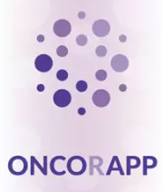

  

  <h1>Universidad Peruana de Ciencias Aplicadas</h1>
  
<strong>Carrera:</strong> Ingeniería de Software

  
<strong>Ciclo:</strong> 2025 - 1

  
<strong>Curso:</strong> Diseño de Experimentos de Ingeniería de Software

  
<strong>Sección:</strong> xx

  
<strong>Profesor:</strong> Juan Carlos Tinoco Licas

  
<strong>"Informe de Trabajo Final"</strong>

  
<strong>Startup:</strong> xxx

  
<strong>Producto:</strong> xxxx

<table align="center">
  <tr>
    <th>Integrantes</th>
    <th>Código</th>
  </tr>
  <tr>
    <td>Mallma Quispe, Ruben Elias</td>
    <td></td>
  </tr>
  <tr>
    <td>Martinez Villanueva, Paolo Del Carmen</td>
    <td></td>
  </tr>
  <tr>
    <td>Matos Fernandez, Christian Andre</td>
    <td>U202214162</td>
  </tr>
  <tr>
    <td>Paredes Zapata, Luiggi Gianfranco</td>
    <td>U202218996</td>
  </tr>
  <tr>
    <td>Ramos Mendoza, Juan Pablo</td>
    <td></td>
  </tr>
</table>

<b>Noviembre 2024</b>

# Registro de versiones

<table>
  <thead>
    <tr>
        <th>Versión</th>
        <th>Fecha</th>
        <th>Autor</th>
        <th>Descripción de modificación</th>
    </tr>
  </thead>
  <tbody>
  <tr>
      <td><strong>TB1</strong></td>
      <td>xxxx</td>
      <td>
        <ul>
          <li>Mallma Quispe, Ruben Elias</li>
          <li>Martinez Villanueva, Paolo Del Carmen</li>
          <li>Matos Fernandez, Christian Andre</li>
          <li>Paredes Zapata, Luiggi Gianfranco</li>
          <li>Ramos Mendoza, Juan Pablo</li>
        </ul>
      </td>
      <td>
        Se ha incluido el avance de los siguientes capítulos:
        <ul>
          <li>Capítulo 1: Introducción</li>
          <li>Capítulo 2: Requirements Elicitation & Analysis</li>
          <li>Capítulo 3: Requirements Specification</li>
          <li>Capítulo 4: Product Design</li>
          <li>Capítulo 5: Product Implementation</li>
        </ul>
      </td>
  </tr>
  </tbody>
</table>

# Project Report Collaboration Insights

# Tabla de Contenido

[Registro de Versiones del Informe](#registro-de-versiones-del-informe)

[Project Report Collaboration Insights](#project-report-collaboration-insights)

[Contenido](#contenido)

[Tabla de contenidos](#tabla-de-contenidos)

[Student Outcome](#student-outcome)

[Parte I: As-Is Software Project](#parte-i-as-is-software-project)

[Capítulo I: Introducción](#capítulo-i-introducción)  
  - [1.1. Startup Profile](#11-startup-profile)  
    - [1.1.1. Descripción de la Startup](#111-descripción-de-la-startup)  
    - [1.1.2. Perfiles de integrantes del equipo](#112-perfiles-de-integrantes-del-equipo)  
  - [1.2. Solution Profile](#12-solution-profile)  
    - [1.2.1. Antecedentes y problemática](#121-antecedentes-y-problemática)  
    - [1.2.2. Lean UX Process](#122-lean-ux-process)  
      - [1.2.2.1. Lean UX Problem Statements](#1221-lean-ux-problem-statements)  
      - [1.2.2.2. Lean UX Assumptions](#1222-lean-ux-assumptions)  
      - [1.2.2.3. Lean UX Hypothesis Statements](#1223-lean-ux-hypothesis-statements)  
      - [1.2.2.4. Lean UX Canvas](#1224-lean-ux-canvas)  
  - [1.3. Segmentos objetivo](#13-segmentos-objetivo)

[Capítulo II: Requirements Elicitation & Analysis](#capítulo-ii-requirements-elicitation--analysis)  
  - [2.1. Competidores](#21-competidores)  
    - [2.1.1. Análisis competitivo](#211-análisis-competitivo)  
    - [2.1.2. Estrategias y tácticas frente a competidores](#212-estrategias-y-tácticas-frente-a-competidores)  
  - [2.2. Entrevistas](#22-entrevistas)  
    - [2.2.1. Diseño de entrevistas](#221-diseño-de-entrevistas)  
    - [2.2.2. Registro de entrevistas](#222-registro-de-entrevistas)  
    - [2.2.3. Análisis de entrevistas](#223-análisis-de-entrevistas)  
  - [2.3. Needfinding](#23-needfinding)  
    - [2.3.1. User Personas](#231-user-personas)  
    - [2.3.2. User Task Matrix](#232-user-task-matrix)  
    - [2.3.3. User Journey Mapping](#233-user-journey-mapping)  
    - [2.3.4. Empathy Mapping](#234-empathy-mapping)  
    - [2.3.5. As-is Scenario Mapping](#235-as-is-scenario-mapping)  
  - [2.4. Ubiquitous Language](#24-ubiquitous-language)

[Capítulo III: Requirements Specification](#capítulo-iii-requirements-specification)  
  - [3.1. To-Be Scenario Mapping](#31-to-be-scenario-mapping)  
  - [3.2. User Stories](#32-user-stories)  
  - [3.3. Product Backlog](#33-product-backlog)  
  - [3.4. Impact Mapping](#34-impact-mapping)

[Capítulo IV: Product Design](#capítulo-iv-product-design)  
  - [4.1. Style Guidelines](#41-style-guidelines)  
    - [4.1.1. General Style Guidelines](#411-general-style-guidelines)  
    - [4.1.2. Web Style Guidelines](#412-web-style-guidelines)  
    - [4.1.3. Mobile Style Guidelines](#413-mobile-style-guidelines)  
      - [4.1.3.1. iOS Mobile Style Guidelines](#4131-ios-mobile-style-guidelines)  
      - [4.1.3.2. Android Mobile Style Guidelines](#4132-android-mobile-style-guidelines)  
  - [4.2. Information Architecture](#42-information-architecture)  
    - [4.2.1. Organization Systems](#421-organization-systems)  
    - [4.2.2. Labeling Systems](#422-labeling-systems)  
    - [4.2.3. SEO Tags and Meta Tags](#423-seo-tags-and-meta-tags)  
    - [4.2.4. Searching Systems](#424-searching-systems)  
    - [4.2.5. Navigation Systems](#425-navigation-systems)  
  - [4.3. Landing Page UI Design](#43-landing-page-ui-design)  
    - [4.3.1. Landing Page Wireframe](#431-landing-page-wireframe)  
    - [4.3.2. Landing Page Mock-up](#432-landing-page-mock-up)  
  - [4.4. Mobile Applications UX/UI Design](#44-mobile-applications-uxui-design)  
    - [4.4.1. Mobile Applications Wireframes](#441-mobile-applications-wireframes)  
    - [4.4.2. Mobile Applications Wireflow Diagrams](#442-mobile-applications-wireflow-diagrams)  
    - [4.4.3. Mobile Applications Mock-ups](#443-mobile-applications-mock-ups)  
    - [4.4.4. Mobile Applications User Flow Diagrams](#444-mobile-applications-user-flow-diagrams)  
  - [4.5. Mobile Applications Prototyping](#45-mobile-applications-prototyping)  
    - [4.5.1. Android Mobile Applications Prototyping](#451-android-mobile-applications-prototyping)  
    - [4.5.2. iOS Mobile Applications Prototyping](#452-ios-mobile-applications-prototyping)  
  - [4.6. Web Applications UX/UI Design](#46-web-applications-uxui-design)  
    - [4.6.1. Web Applications Wireframes](#461-web-applications-wireframes)  
    - [4.6.2. Web Applications Wireflow Diagrams](#462-web-applications-wireflow-diagrams)  
    - [4.6.3. Web Applications Mock-ups](#463-web-applications-mock-ups)  
    - [4.6.4. Web Applications User Flow Diagrams](#464-web-applications-user-flow-diagrams)  
  - [4.7. Web Applications Prototyping](#47-web-applications-prototyping)  
  - [4.8. Domain-Driven Software Architecture](#48-domain-driven-software-architecture)
    - [4.8.1. Software Architecture Context Diagram](#481-software-architecture-context-diagram)  
    - [4.8.2. Software Architecture Container Diagrams](#482-software-architecture-container-diagrams)  
    - [4.8.3. Software Architecture Components Diagrams](#483-software-architecture-components-diagrams)

- [4.9. Software Object-Oriented Design](#49-software-object-oriented-design)  
  - [4.9.1. Class Diagrams](#491-class-diagrams)  
  - [4.9.2. Class Dictionary](#492-class-dictionary)

- [4.10. Database Design](#410-database-design)  
  - [4.10.1. Relational/Non-Relational Database Diagram](#4101-relationalnon-relational-database-diagram)

- [Capítulo V: Product Implementation](#capítulo-v-product-implementation)  
  - [5.1. Software Configuration Management](#51-software-configuration-management)  
    - [5.1.1. Software Development Environment Configuration](#511-software-development-environment-configuration)  
    - [5.1.2. Source Code Management](#512-source-code-management)  
    - [5.1.3. Source Code Style Guide & Conventions](#513-source-code-style-guide--conventions)  
    - [5.1.4. Software Deployment Configuration](#514-software-deployment-configuration)

  - [5.2. Product Implementation & Deployment](#52-product-implementation--deployment)  
    - [5.2.1. Sprint Backlogs](#521-sprint-backlogs)  
    - [5.2.2. Implemented Landing Page Evidence](#522-implemented-landing-page-evidence)  
    - [5.2.3. Implemented Frontend-Web Application Evidence](#523-implemented-frontend-web-application-evidence)  
    - [5.2.4. Implemented Native-Mobile Application Evidence](#524-implemented-native-mobile-application-evidence)  
    - [5.2.5. Implemented RESTful API and/or Serverless Backend Evidence](#525-implemented-restful-api-andor-serverless-backend-evidence)  
    - [5.2.6. RESTful API documentation](#526-restful-api-documentation)  
    - [5.2.7. Team Collaboration Insights](#527-team-collaboration-insights)

  - [5.3. Video About-the-Product](#53-video-about-the-product)
  - [Conclusiones](#conclusiones)

[Conclusiones y recomendaciones](#conclusiones-y-recomendaciones)

[Bibliografía](#bibliografía)

[Anexos](#anexos)

# Student Outcome

ABET – EAC - Student Outcome 4: La capacidad de reconocer responsabilidades éticas y
profesionales en situaciones de ingeniería y hacer juicios informados, que deben
considerar el impacto de las soluciones de ingeniería en contextos globales, económicos,
ambientales y sociales.

<table>
  <thead>
    <tr>
      <th>Criterio específico</th>
      <th>Acciones realizadas</th>
      <th>Conclusiones</th>
    </tr>
  </thead>
  <tbody>
    <tr>
      <td><strong>4.c.1 Reconoce responsabilidad ética y profesional en situaciones de ingeniería de software</strong></td>
      <td>
        <strong>Jiménez Rosas, Arturo Eduardo</strong> <strong>TB1</strong>  <strong>Christian Andre Matos Fernandez</strong> <strong>TB1</strong>  <strong>Juan Pablo Ramos Mendoza</strong> <strong>TB1</strong>  <strong>Luiggi Gianfranco Paredes Zapata</strong> <strong>TB1</strong> He realizado investigaciones sobre la responsabilidad ética en el uso de tecnologías, asegurando que el producto final sea accesible, transparente y responsable en su impacto en los usuarios. <strong>Paolo Del Carmen Martinez Villanueva</strong> <strong>TB1</strong>  <strong>Ruben Elias Mallma Quispe</strong> <strong>TB1</strong> 
      </td>
      <td>…</td>
    </tr>
    <tr>
      <td><strong>4.c.2 Emite juicios informados considerando el impacto de las soluciones de ingeniería de software en contextos globales, económicos, ambientales y sociales</strong></td>
      <td>
        <strong>Jiménez Rosas, Arturo Eduardo</strong> <strong>TB1</strong>  <strong>Christian Andre Matos Fernandez</strong> <strong>TB1</strong>  <strong>Juan Pablo Ramos Mendoza</strong> <strong>TB1</strong>  <strong>Luiggi Gianfranco Paredes Zapata</strong> <strong>TB1</strong> He colaborado estrechamente con el equipo para garantizar que nuestras soluciones sean globalmente relevantes, adaptables a diferentes contextos culturales y accesibles a nivel internacional, de modo que nuestra aplicación pueda ser utilizada por personas de diferentes partes del mundo sin generar barreras económicas o sociales. <strong>Paolo Del Carmen Martinez Villanueva</strong> <strong>TB1</strong>  <strong>Ruben Elias Mallma Quispe</strong> <strong>TB1</strong> 
      </td>
      <td>…</td>
    </tr>
  </tbody>
</table>

# Capítulo 1: Introducción

## 1.1. Startup Profile

### 1.1.1. Descripción de la Startup

### 1.1.2. Perfiles de integrantes del equipo

## 1.2. Solution Profile

### 1.2.1. Antecedentes y problemática

### 1.2.2. Lean UX Process

#### 1.2.2.1. Lean UX Problem Statements

#### 1.2.2.2. Lean UX Assumptions

#### 1.2.2.3. Lean UX Hypothesis Statements

#### 1.2.2.4. Lean UX Canvas

## 1.3. Segmentos objetivo

# Capítulo II: Requirements Elicitation & Analysis

## 2.1. Competidores

### 2.1.1. Análisis competitivo
<table>
  <tr>
    <th colspan="6" valign="top"><b>Análisis Competitivo</b></th>
  </tr>
  <tr>
    <td colspan="1" rowspan="2" valign="top">¿Por qué llevar a cabo este Análisis?</td>
    <td colspan="5" valign="top">Este análisis nos ayudará a comprender mejor a nuestra competencia para así ver las debilidades y fortalezas de nuestra aplicación web. Esto nos permitirá desarrollar diversas estrategias para mejorar nuestro producto.</td>
  </tr>
  <tr></tr>
  <tr>
    <td colspan="2" valign="top"></td>
    <td colspan="1" valign="top">
OncorApp

</td>
    <td colspan="1" valign="top">
Outcome4Me
 

</td>
    <td colspan="1" valign="top">
My Cancer Coach

</td>
    <td colspan="1" valign="top">
Oncontigo
</td>
  </tr>
  <tr>
    <td colspan="1" rowspan="2" valign="top">

Perfil
</td>
    <td colspan="1" valign="top">Overview</td>
    <td colspan="1" valign="top">Aplicación móvil que ofrece información y consejos de cuidado emocional, nutricional y físico para pacientes que padecen cáncer.</td>
    <td colspan="1" valign="top">Aplicación que brinda apoyo personalizado a pacientes con cáncer.</td>
    <td colspan="1" valign="top">Aplicación que permite a los médicos monitorear sus pacientes mediante encuestas diarias.</td>
    <td colspan="1" valign="top">Aplicativo de ayuda y organización para
   pacientes oncológicos y médicos oncólogos.</td>
  </tr>
  <tr>
    <td colspan="1" valign="top">¿Qué valor ofrece a los clientes?</td>
    <td colspan="1" valign="top">
Brinda consejos y ejercicios para la salud física como mental para los pacientes que aún están en tratamiento.

</td>
    <td colspan="1" valign="top">
Ofrece un seguimiento de la salud del paciente y recomienda clínicas para realizar los tratamientos y exámenes adecuados.
</td>
    <td colspan="1" valign="top">
Ofrece herramientas y recursos para que los monitoreen su salud de forma continua.
</td>
    <td colspan="1" valign="top">
Ofrece diversos servicios que ayudan tanto a los pacientes y médicos como: Calendarios, asignación de medicamentos
</td>
  </tr>
  <tr>
    <td colspan="1" rowspan="2" valign="top">

Perfil de Marketing
</td>
    <td colspan="1" valign="top">Mercado objetivo</td>
    <td colspan="1" valign="top">
- Personas que empiezan o aún están en tratamiento.
</td>
    <td colspan="1" valign="top">
- Personas que buscan tratamiento o que ya empezaron a realizar sus exámenes.

</td>
    <td colspan="1" valign="top">
- Pacientes que padecen de cáncer que requieren ayuda a lo largo de su tratamiento.
</td>
    <td colspan="1" valign="top">
- Médicos y pacientes que quieran tener una comunicación directa entre ambos.
</td>
  </tr>
  <tr>
    <td colspan="1" valign="top">Estrategias de marketing</td>
    <td colspan="1" valign="top">
Promoción en su sitio web
</td>
    <td colspan="1" valign="top">
Realizan Webinars y videos para promocionar su app en su sitio web
</td>
    <td colspan="1" valign="top">
Incluyen una prueba gratis de la aplicación para que los usuarios después cambien de plan.
</td>
    <td colspan="1" valign="top">Los servicios que brinda son: Calendario, creación de citas, recetar medicamentes,  registrar tratamientos y chat directo entre médico y paciente.</td>
  </tr>
  <tr>
    <td colspan="1" rowspan="3" valign="top">

Perfil de Producto
</td>
    <td colspan="1" valign="top">Productos & Servicios</td>
    <td colspan="1" valign="top">
- Brinda consejos sobre la nutrición para los pacientes. Puedes obtener informacion importante sobre los tratamientos

- Recomienda ejercicios para la salud mental y fisica.
</td>
    <td colspan="1" valign="top">
- Ayuda a monitorear al paciente y brinda información útil sobre el tipo de cáncer que padezca

- Brinda las ubicaciones de clínicas recomendadas en base al tipo de tratamiento requerido.
</td>
    <td colspan="1" valign="top">
- Monitoreo continuo mediante preguntas personalizadas

- Consejos y recursos acerca de nutrición, ejercicio y manejo del estrés.

</td>
    <td colspan="1" valign="top">
Los servicios que brinda son: Calendario, creación de citas, recetar medicamentes,  registrar tratamientos y chat directo entre médico y paciente.
</td>
  </tr>
  <tr>
    <td colspan="1" valign="top">Precios y costos</td>
    <td colspan="1" valign="top">Es totalmente gratuita.</td>
    <td colspan="1" valign="top">Es de uso gratuito y sin restricciones</td>
    <td colspan="1" valign="top">Cuenta con suscripciones y contenido de paga. También hay una suscripción gratuita.</td>
    <td colspan="1" valign="top">
Nuestra plataforma contará con planes como: Free, Premium y Pro Service.
</td>
  </tr>
  <tr>
    <td colspan="1" valign="top">Canales de distribución </td>
    <td colspan="1" valign="top">Solo aplicación móvil (Google PlayStore y App Store)</td>
    <td colspan="1" valign="top">Solo aplicación móvil (Google Playstore y App Store) y Aplicación Web (Desde su sitio oficial)</td>
    <td colspan="1" valign="top">
Solo aplicación móvil (Google Playstore y App Store)
</td>
    <td colspan="1" valign="top">Landing Page que redirige a la Web Application</td>
  </tr>
  <tr>
    <td colspan="1" rowspan="4" valign="top">

Análisis SWOT
</td>
    <td colspan="1" valign="top">Fortalezas</td>
    <td colspan="1" valign="top">
      
- Ser parte de una asociación cientifica.

      
- Poseer con una variedad de información respaldada científicamente.

    </td>
    <td colspan="1" valign="top">
      
- Cuenta con ayuda de especialistas en el tema.

      
- Posee una gran cantidad de información de las clínicas que recomieda.

      
- Cuenta con los aportes de la comunidad.

    </td>
    <td colspan="1" valign="top">
      
- Posee una gran variedad de herramientas de ayuda.

      
- Gestión de sítomas incluído. Información útil acerca de los tratamientos.

    </td>
    <td colspan="1" valign="top">
      
- Las herramientas que proporciona son muy útiles ya que facilita la comunicación entre médico y paciente

      
- Además cuenta con un calendario interactivo para organizar las citas.

    </td>
  </tr>
  <tr>
    <td colspan="1" valign="top">Debilidades</td>
    <td colspan="1" valign="top">
      
- Carece de interaccion directa con el usuario

      
- Es un producto que no puede mantenerse por si mismo si es gratis.

    </td>
    <td colspan="1" valign="top">
      
- Solo se limitan a atender a unos ciertos tipos de cáncer.

    </td>
    <td colspan="1" valign="top">
      
- Falta un medio para comunicarse con un médico directamente..

    </td>
    <td colspan="1" valign="top">
      
- No tiene la característica de realizar videollamadas de consulta dentro de la plataforma.

      

    </td>
  </tr>
  <tr>
    <td colspan="1" valign="top">Oportunidades</td>
    <td colspan="1" valign="top">
      
- Muy pocas aplicaciones le dan la misma importancia a la salud mental y fisica.

    </td>
    <td colspan="1" valign="top">
      
- Cuentan con inversionistas grandes como instituciones relacionadas al área de la Oncología.

    </td>
    <td colspan="1" valign="top">
      
- Puede ser un buen complemento  necesario en los hospitales debido al buen recibimiento.

    </td>
    <td colspan="1" valign="top">
      
- Hay pocas plataformas que ofrecen herramientas que faciliten la comunicación entre médico-paciente

    </td>
  </tr>
  <tr>
    <td colspan="1" valign="top">Amenazas</td>
    <td colspan="1" valign="top">
      
-Surgimiento de otras aplicaciones multiplataformas (Web).

    </td>
    <td colspan="1" valign="top">
      
- Muchas personas padecen de otros tipos de cáncer que la aplicación no puede atender.

    </td>
    <td colspan="1" valign="top">
      
- Surgimiento de otras aplicaciones multiplataformas (Web).

    </td>
    <td colspan="1" valign="top">
      
- Aplicaciones de mensajería instantanea tradicionales: Whatsapp y Telegram.

      
- Aplicaciones de recordatorio: Google Calendar.

    </td>
  </tr>
</table>

### 2.1.2. Estrategias y tácticas frente a competidores
**Estrategias:**

**Desarrollo de una Interfaz de Usuario Intuitiva y Amigable:**  
**Estrategia:** Mejorar la interacción del usuario mediante una interfaz intuitiva y amigable, para contrarrestar la falta de interacción directa con el usuario identificada como una debilidad. 
**Táctica:** Realizar pruebas de usabilidad y obtener retroalimentación de los usuarios para iterar en el diseño de la interfaz y mejorar la experiencia del usuario.

**Modelo de Negocio Sostenible:**  
**Estrategia:** Explorar modelos de negocio que garanticen la sostenibilidad financiera a largo plazo, considerando la limitación de mantener la aplicación gratuita identificada como una debilidad. 
**Táctica:** Investigar la viabilidad de ofrecer servicios premium o suscripciones pagas con funciones adicionales y beneficios exclusivos.

**Tácticas:**

**Mejorar la Comunicación Médico-Paciente:** 
**Estrategia:** Mejorar la comunicación directa entre médicos y pacientes, que actualmente falta en la aplicación, para satisfacer mejor las necesidades de los usuarios. 
**Táctica:** Desarrollar una función de mensajería o chat en tiempo real dentro de la aplicación que permita a los usuarios comunicarse fácilmente con sus médicos para consultas y seguimiento.

**Aprovechar la Escasez de Plataformas de Comunicación Médico-Paciente:** 
**Estrategia:** Capitalizar la oportunidad identificada en la falta de plataformas que faciliten la comunicación entre médicos y pacientes. 
**Táctica:** Promocionar activamente la función de comunicación médico-paciente de la aplicación a través de campañas de marketing dirigidas.

**Invertir en Marketing y Promoción:** 
**Estrategia:** Incrementar las estrategias de marketing y promoción, como webinars y videos, para aumentar la visibilidad y la adopción de la aplicación. 
**Táctica:** Colaborar con médicos en el campo de la oncología para promover la aplicación y organizar eventos de lanzamiento y charlas informativas.

## 2.2. Entrevistas

### 2.2.1. Diseño de entrevistas
### PREGUNTAS GENERALES

#### Información Demográfica
<ul>
<li>¿Podría decirme su edad y distrito de residencia?</li>
<li>¿Cuál es su estado civil y composición familiar (número de hijos, personas a cargo, etc.)?</li>
<li>¿A qué se dedica actualmente? (Estudiante, profesión, jubilado, etc.)</li>
</ul>

#### Hábitos y Preferencias Digitales
<ul>
<li>¿Qué dispositivos digitales utiliza con más frecuencia (smartphone, tablet, computadora, etc.)?</li>
<li>¿Cuáles son sus aplicaciones o servicios en línea favoritos y por qué?</li>
<li>¿Cómo prefiere comunicarse digitalmente con profesionales de la salud o servicios médicos (correo electrónico, mensajes de texto, llamadas, videoconferencias)?</li>
</ul>

#### Objetivos y Frustraciones
<ul>
<li>¿Cuáles son sus principales objetivos al buscar una aplicación relacionada con la salud o el cuidado oncológico?</li>
<li>¿Ha experimentado frustraciones o dificultades al usar aplicaciones o servicios en línea de salud? Por favor, descríbalas.</li>
</ul>

#### Experiencia Personal
<ul>
<li>Relacionado con su salud o la gestión del cuidado oncológico, ¿podría compartir alguna experiencia positiva o negativa que haya tenido?</li>
<li>¿Qué características considera indispensables en una aplicación de salud?</li>
</ul>

#### Expectativas y Necesidades Específicas
<ul>
<li>En términos de ayuda y organización para el cuidado oncológico, ¿qué es lo que más valora o necesitaría?</li>
<li>¿Cómo cree que una aplicación podría mejorar su experiencia o la gestión del cuidado oncológico?</li>
</ul>

### PREGUNTAS ESPECÍFICAS PARA MÉDICOS ONCÓLOGOS

#### Gestión de Pacientes
<ul>
<li>¿Cuál es su método actual para organizar la información y los horarios de sus pacientes?</li>
<li>¿Qué desafíos enfrenta al asignar y hacer seguimiento de los medicamentos y procedimientos para sus pacientes?</li>
</ul>

#### Comunicación y Recordatorios
<ul>
<li>¿Cómo se comunica actualmente con sus pacientes para recordatorios o información importante?</li>
<li>¿Qué funcionalidades considera clave en una aplicación para mejorar la comunicación con sus pacientes?</li>
</ul>

#### Herramientas Digitales
<ul>
<li>¿Utiliza actualmente alguna herramienta o software de gestión de pacientes? Si es así, ¿qué le gusta y qué le falta a estas herramientas?</li>
</ul>

### PREGUNTAS ESPECÍFICAS PARA PACIENTES ONCOLÓGICOS Y SUS FAMILIARES

#### Gestión de la Información Médica
<ul>
<li>¿Cómo lleva registro de los medicamentos, citas y procedimientos actualmente?</li>
<li>¿Cuáles son las principales fuentes de información que utiliza para obtener información sobre su cáncer y su tratamiento?</li>
<li>¿Qué recursos y servicios de apoyo le han sido útiles durante el tratamiento y recuperación?</li>
<li>¿Ha tenido dificultades para entender o recordar las indicaciones médicas y los detalles de los medicamentos?</li>
</ul>

#### Comunicación con Profesionales de la Salud
<ul>
<li>¿Qué tan fácil o difícil ha sido para usted comunicarse con su médico oncólogo o encontrar nuevos especialistas cuando lo necesita?</li>
<li>¿Qué características valoraría en una aplicación que le facilite el contacto con profesionales de la salud o servicios de apoyo oncológico?</li>
</ul>

#### Experiencias y Mejoras
<ul>
<li>¿Qué información te hubiera gustado tener cuando usted o su familiar pasó por el proceso de tratamiento oncológico?</li>
<li>¿Qué recomendaciones tiene para mejorar la experiencia de los pacientes con cáncer en el sistema de atención médica?</li>
<li>Basándose en su experiencia, ¿qué aspectos cree que podrían mejorar en la gestión del cuidado oncológico a través de una aplicación?</li>
<li>¿Cómo cree que una aplicación podría ayudarle a sentirse más apoyado y menos abrumado en su proceso de cuidado oncológico?</li>
</ul>

### 2.2.2. Registro de entrevistas

### 2.2.3. Análisis de entrevistas

## 2.3. Needfinding

### 2.3.1. User Personas

En esta sección, se presentan personajes ficticios, uno para cada segmento objetivo. La información empleada en la elaboración de los User personas proviene de entrevistas previas realizadas a cada segmento objetivo. El propósito de estas entrevistas fue comprender mejor a las personas a las que está dirigida la aplicación. Entre la información extraída de las entrevistas se incluyen datos demográficos, metas, motivaciones, frustraciones, marcas relacionadas con el tema de la aplicación, canales digitales más utilizados, entre otros. La creación de esta sección se llevó a cabo utilizando la plataforma UXPressia.

Segmento objetivo: Pacientes y familiares

Link de UXPressia: https://uxpressia.com/w/mDdvz/p/tViVP

Segmento objetivo: Oncólogos

Link de UXPressia: https://uxpressia.com/w/mDdvz/p/mxqb4

### 2.3.2. User Task Matrix

<table>
  <tr>
    <th>Tareas</th>
    <th>Paciente: Frecuencia</th>
    <th>Paciente: Importancia</th>
    <th>Doctor: Frecuencia</th>
    <th>Doctor: Importancia</th>
  </tr>
  <tr>
    <td>Buscar información sobre el cáncer</td>
    <td>Alta</td>
    <td>Alta</td>
    <td>Media</td>
    <td>Alta</td>
  </tr>
  <tr>
    <td>Gestionar citas médicas</td>
    <td>Alta</td>
    <td>Alta</td>
    <td>Alta</td>
    <td>Alta</td>
  </tr>
  <tr>
    <td>Comunicarse con especialistas</td>
    <td>Alta</td>
    <td>Alta</td>
    <td>Alta</td>
    <td>Alta</td>
  </tr>
  <tr>
    <td>Registrar y monitorear medicamentos</td>
    <td>Alta</td>
    <td>Alta</td>
    <td>Alta</td>
    <td>Alta</td>
  </tr>
   <tr>
    <td>Seguimiento del progreso del paciente	</td>
    <td>Media</td>
    <td>Alta</td>
    <td>Alta</td>
    <td>Alta</td>
  </tr>
   <tr>
    <td>Coordinar con otros especialistas	</td>
    <td>Baja</td>
    <td>Media</td>
    <td>Alta</td>
    <td>Alta</td>
  </tr>
   <tr>
    <td>Gestionar pagos y citas especiales</td>
    <td>Media</td>
    <td>Media</td>
    <td>Media</td>
    <td>Media</td>
  </tr>
   <tr>
    <td>Buscar apoyo psicológico	</td>
    <td>Media</td>
    <td>Alta</td>
    <td>Baja</td>
    <td>Alta</td>
  </tr>
   <tr>
    <td>Revisar tratamientos anteriores	</td>
    <td>Baja</td>
    <td>Alta</td>
    <td>Alta</td>
    <td>Alta</td>
  </tr>
   <tr>
    <td>Acceder a recordatorios de tratamientos	</td>
    <td>Alta</td>
    <td>Alta</td>
    <td>Alta</td>
    <td>Alta</td>
  </tr>
  <!-- Agrega más filas según sea necesario -->
</table>

### 2.3.3. User Journey Mapping

En el proceso de desarrollo de OnContigo, realizamos un detallado user journey mapping para comprender las experiencias y necesidades tanto de pacientes oncológicos como de médicos oncólogos. Exploramos cada etapa, desde el diagnóstico hasta el tratamiento continuo, identificando obstáculos y oportunidades de mejora. Este enfoque nos permitió diseñar una aplicación que se integra de manera efectiva en la vida diaria de los usuarios, mejorando la calidad de la atención médica en el sector de la salud peruano.
Segmento objetivo: Pacientes y familiares

Link de UXPressia: https://uxpressia.com/w/mDdvz/m/FDtCu

Segmento objetivo: Oncólogos

Link de UXPressia: https://uxpressia.com/w/mDdvz/m/196Tw

### 2.3.4. Empathy Mapping

En esta parte, se exhibirán los Empathy maps basados en los user personas creados, considerando los dos segmentos objetivos. La utilización de estos mapas de empatía será beneficiosa, ya que nos permitirá comprender con mayor profundidad a nuestros clientes, lo que a su vez nos posibilitará mejorar diversos aspectos de la aplicación.

Segmento objetivo: Pacientes y familiares

Link de UXPressia: https://uxpressia.com/w/mDdvz/p/JzlFH

Segmento objetivo: Oncólogos

Link de UXPressia: https://uxpressia.com/w/mDdvz/p/lg65v

### 2.3.5. As-is Scenario Mapping

**Segmento:Pacientes**

**Segmento:Doctor Oncologo**

## 2.4. Ubiquitous Language

Esta es la parte donde se explicará el Ubiquitous Language. Este término hace referencia a un lenguaje común entre los desarrolladores y el dominio. En esta ocasión se va presentar un glosario con conceptos y términos comunes que se emplean en el ámbito de la oncología.

1. **Tumor:** Una masa anormal de tejido que puede ser benigna o maligna.

2. **Cáncer:** Un término general para enfermedades caracterizadas por el crecimiento descontrolado de células anormales que pueden invadir tejidos y propagarse a otras partes del cuerpo.

3. **Metástasis:** La propagación del cáncer desde su sitio original a otro órgano del cuerpo.

4. **Quimioterapia:** un tratamiento que utiliza medicamentos para destruir células cancerosas mediante el uso de fármacos.

5. **Radioterapia:** Tratamiento que usa altas dosis de radiación para destruir células cancerosas.

6. **Oncólogo:** Médico especializado en el diagnóstico y tratamiento del cáncer.

7. **Biopsia:** Extracción de tejido para realizar exámenes bajo un microscopio con el fin de diagnósticar el cáncer.

8. **Cuidados paliativos:** Atención médica que se centra en proporcionar alivio del dolor y otros síntomas de una enfermedad grave, como el cáncer.

# Capítulo III: Requirements Specification

## 3.1. To-Be Scenario Mapping

## 3.2. User Stories

## 3.3. Product Backlog

## 3.4. Impact Mapping

# Capítulo IV: Product Design

## 4.1. Style Guidelines

### 4.1.1. General Style Guidelines

### 4.1.2. Web Style Guidelines

### 4.1.3. Mobile Style Guidelines

#### 4.1.3.1. iOS Mobile Style Guidelines

#### 4.1.3.2. Android Mobile Style Guidelines

## 4.2. Information Architecture

### 4.2.1. Organization Systems

### 4.2.2. Labeling Systems

### 4.2.3. SEO Tags and Meta Tags

### 4.2.4. Searching Systems

### 4.2.5. Navigation Systems

## 4.3. Landing Page UI Design

### 4.3.1. Landing Page Wireframe

### 4.3.2. Landing Page Mock-up

## 4.4. Mobile Applications UX/UI Design

### 4.4.1. Mobile Applications Wireframes

### 4.4.2. Mobile Applications Wireflow Diagrams

### 4.4.3. Mobile Applications Mock-ups

### 4.4.4. Mobile Applications User Flow Diagrams

## 4.5. Mobile Applications Prototyping

### 4.5.1. Android Mobile Applications Prototyping

### 4.5.2. iOS Mobile Applications Prototyping

## 4.6. Web Applications UX/UI Design

### 4.6.1. Web Applications Wireframes

### 4.6.2. Web Applications Wireflow Diagrams

### 4.6.3. Web Applications Mock-ups

### 4.6.4. Web Applications User Flow Diagrams

## 4.7. Web Applications Prototyping

## 4.8. Domain-Driven Software Architecture

### 4.8.1. Software Architecture Context Diagram

### 4.8.2. Software Architecture Container Diagrams

### 4.8.3. Software Architecture Components Diagrams

## 4.9. Software Object-Oriented Design

### 4.9.1. Class Diagrams

### 4.9.2. Class Dictionary

## 4.10. Database Design

### 4.10.1. Relational/Non-Relational Database Diagram

# Capítulo V: Product Implementation

## 5.1. Software Configuration Management

### 5.1.1. Software Development Environment Configuration

### 5.1.2. Source Code Management

### 5.1.3. Source Code Style Guide & Conventions

### 5.1.4. Software Deployment Configuration

## 5.2. Product Implementation & Deployment

### 5.2.1. Sprint Backlogs

### 5.2.2. Implemented Landing Page Evidence

### 5.2.3. Implemented Frontend-Web Application Evidence

### 5.2.4. Implemented Native-Mobile Application Evidence

### 5.2.5. Implemented RESTful API and/or Serverless Backend Evidence

### 5.2.6. RESTful API documentation

### 5.2.7. Team Collaboration Insights

## 5.3. Video About-the-Product

# Conclusiones y recomendaciones

# Bibliografía

# Anexos
